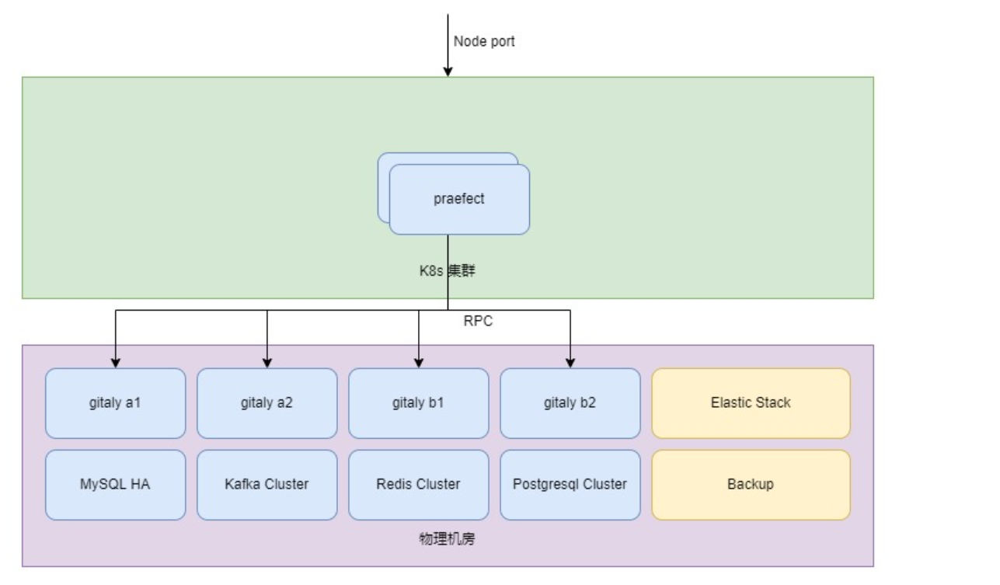
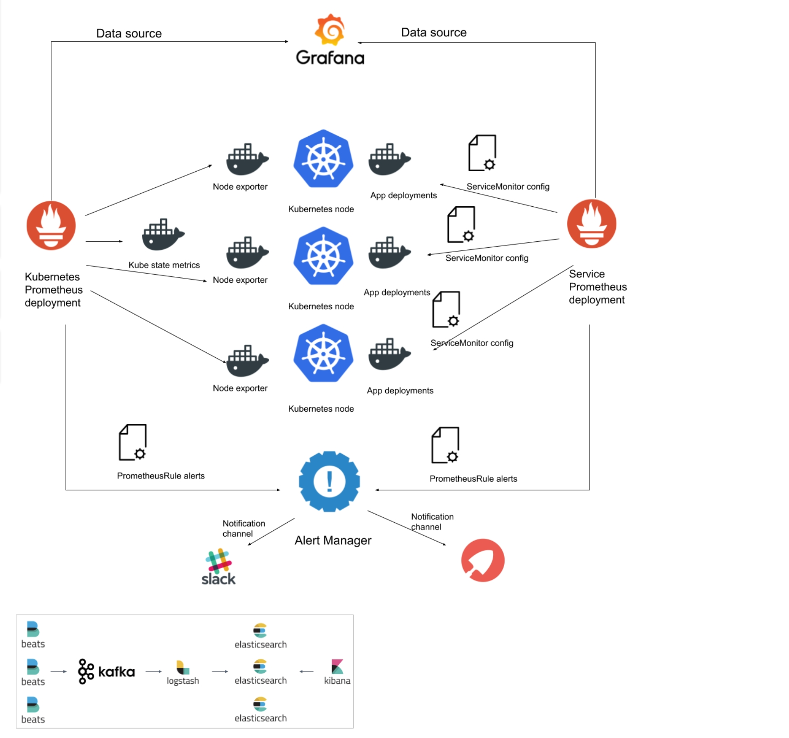

# Russia Gitee Pass Overall Architecture Description

## 1. Gitee Russia Pass Overall Topology

## 2. Gitee Russia Pass Service Distribution

## 3. Gitee Platform Architecture

### 3.1 Gitee Technical Architecture Advantages

To ensure that the system has no single point of failure, ensure the continuity and robustness of the business, Gitee platform establishes a load-balanced and highly available cluster based on K8s and self-developed distributed git storage architecture. When a code repository management node fails, the service will automatically migrate to other management nodes, ensuring high availability of the platform and uninterrupted operation of applications 7*24 hours.

The Gitee platform adopts a hybrid cloud deployment approach with separation of compute and storage. The compute nodes deploy a K8s cluster to run Gitee platform's business code that is unrelated to storage. The deployment controller in the K8s cluster achieves multiple instances redundancy and fault self-healing of the business code, ensuring the stability of the platform services. The storage nodes deploy a self-developed distributed git storage architecture that supports multiple shards and replicas to ensure repository data security.

### 3.2 System High Availability and Scalability

To ensure there is no single point of failure and to guarantee the continuity and robustness of the business system, the architecture of Gitee products is based on K8s to establish a load-balanced cluster. When a business application instance fails, the traffic is automatically scheduled to other healthy instances, and the failed instance is automatically restarted. Once the instance recovers, it is added back to the load-balanced scheduling backend to ensure the high availability of the platform services. When the business load is high, dynamic scaling of business instances can be achieved through the dynamic scaling capabilities of K8s to ensure the scalability of the business system.

In order to ensure that the git repository storage has no single point of failure and to ensure the reliability of repository data, Gitee platform has independently developed a distributed git storage architecture. The git storage is distributed and stored on multiple nodes through the independently developed storage sharding rules, which can expand the capacity of the entire storage architecture by increasing the number of shards, ensuring the scalability of git repository storage. At the same time, each shard supports the deployment of multiple replicas to achieve repository data redundancy and ensure high reliability of git repository storage.

The platform architecture is as follows:

### 3.3 High availability and scalability implementation on Gitee platform

3.3.1 Implementation of high availability and scalability of business systems

[sshtunnelweb: A ssh tunnel web forwarding system based on user IP for permission control, written in Go. It is mainly used within the company for R&D access to production environment services, without exposing the production IP to the R&D team. Only access to the company's internal host port is required.](URL-b282645f32)

K8s cluster deployment architecture is as follows:

The business system of the Gitee platform ensures the healthy operation of the business system Pod resources through the Deployment controller.

Application access is through upper layer LB reverse proxy to multiple nodes in K8s cluster. Business instances are exposed ports in the K8s cluster in the form of NodePort, allowing access to business instances through ports of any node.

Pods in the K8s cluster's Deployment controller support dynamic scaling. When the workload of a business system is high, the number of pods can be adjusted to increase the system's capacity to handle traffic.

The deployment architecture of the business system is as follows:

#### 3.3.2 High Availability and Scalable Implementation of Git Repository Storage

Gitee's git repository storage on the platform is implemented using a self-developed distributed git repository storage architecture, providing repository-level high availability and scalability.

Each repository storage node deploys the gitaly service. The entire storage pool is divided into multiple shards using upper-level sharding rules. Increasing the number of shards can expand the storage capacity of git repositories.

The praefect service is deployed on top of each shard, which is used to synchronize data replicas and perform health checks on replica data. When a replica in a shard fails, the healthy replicas within the shard will continue to provide services, ensuring high availability of the git repository storage. The architecture diagram of the git repository storage deployment is as follows:

#### 3.3.3 High availability implementation of databases and middleware

Gitee platform uses various open source databases and middleware, and these components all use official or community-recognized high availability deployment solutions to ensure the high availability and scalability of the middleware.

##### MySQL High Availability

The high availability solution for MySQL is to use keepalived for primary and secondary traffic access. When the primary node in keepalived fails, the cluster VIP will switch to the backup node to provide uninterrupted service. The primary and secondary MySQL achieve bidirectional master-master synchronization through binlog. Each of the two primary nodes is also mounted with a backup node to implement data backup, ensuring high availability and data security of the MySQL service.

##### Redis High Availability

Redis achieves high availability through the official redis cluster solution. The cluster consists of 6 nodes, including 3 master nodes and 3 replica nodes. Data is stored in different shard groups based on the cluster sharding protocol. Each shard group runs two instances, one as the master and the other as the replica. When the master instance fails, the replica instance takes over the traffic of the master instance and continues to provide services. By scaling the number of shard groups and rebalancing the distribution of slots in the cluster, horizontal scaling of the cluster can be achieved.

etcd high availability

etcd is a highly available distributed key-value database used for service discovery and system configuration. It serves as the metadata storage database for the K8s cluster on the Gitee platform. High availability of etcd is achieved by deploying a 3-node etcd cluster. When a node in the cluster fails, a new master node is elected through the Raft algorithm by voting among the majority of healthy nodes. The new master node takes over the traffic of the failed node and continues to provide services.

##### PostgreSQL High Availability

PostgreSQL adopts the high availability cluster deployment solution provided by Zalando called Patroni. The cluster metadata is stored in the high availability etcd cluster. Multiple PostgreSQL instances synchronize data through the streaming replication of PostgreSQL. When the primary node in the cluster fails, the Patroni template reads the metadata from etcd and selects a new primary node to take over the traffic and provide continuous service.

##### Kafka High Availability

Kafka uses the method of multiple partitions and replicas to achieve high availability deployment. Each partition has replication

### 3.4 Observable implementation on Gitee platform

Gitee platform Prometheus monitors the status of all nodes and applications, including node performance indicators, service status, application load, K8s cluster pod status and performance indicators, etc.; collects application logs through Elastic Stack and provides aggregation queries and analysis.

### 3.5 Gitee platform information security implementation

Due to the physical isolation between data centers and the public network environment, for the management of data center nodes, operations personnel connect to the data center's bastion host through a virtual private network (VPN) and then manage the data center nodes through the bastion host.

All accounts logging into the bastion host have two-factor authentication enabled and are only allowed to connect via a virtual private network to ensure protection against network attacks.

## 4. Detailed implementation of the Gitte platform

[Appendix - IAAS Resource Application](./Appendix-IAAS-Resource-Application.md)

[Appendix - Format and Mount Data Disk](./Appendix-Format-Mount-Data-Disk.md)

[Attachment - Internal DNS configuration for all server nodes](./Attachment-InternalDNS.md)

### 4.1 Deploying High Availability Kubernetes Cloud Platform

[Install_ha_k8s](./russia-gitee-prod/Install_ha_k8s.md)

### 4.2 Deploying Highly Available gitee-git-service

[Install_gitee-git-service](./gitee-git-service/README.md)

### 4.3 Deploy sre (primary and backup)

[Install_sre-service](./sre-base/README.md)

### 4.4 Deploy MySQL semi-synchronous master-slave replication

[Install_MySQL](./sre-base/mysql-replication/README.md)

### 4.5 Deploy PostgreSQL Master-Slave Streaming Replication

[Install_PostgreSQL](./sre-base/postgresql/README.md)

### 4.6 Deploy highly available MinIO 4 nodes

[Install_MinIO](./sre-base/minio/README.md)

### 4.7 Deploy High Availability Kafka Cluster

[Install_Kafka](./sre-base/kafka-cluster/README.md)

### 4.8 Deploy Highly Available Elasticsearch Cluster

[Install_Elasticsearch](./sre-base/es-cluster/README.md)

### 4.9 Deploy Highly Available Redis Cluster

[Install_Redis-cluster](./russia-gitee-prod/install_redis_cluster.md)

### 4.10 Deploy hot standby haproxy load balancer

[Install_haproxy_haproxy](./haproxy/README.md)

### 4.11 Deploy Varnish cdn acceleration service

[Install_Varnish-service](./varnish/README.md)

### 4.12 Deploy Gitee Core Services (Frontend and Backend)

[Install_Gitee-service](./russia-gitee-prod/README.md)

### 4.13 Gitee continuous integration and continuous deployment

[Install_Gitee-service](./russia-gitee-prod/README.md)

## 5. Data Backup Plan

jenkins --- scheduled task ----- backup data uploaded to Minio
// TODO Add a diagram

### 5.1 MySQL Data Backup

[Backup MySQL data and upload it to minio](./backup/mysql_backup/README.md)

### 5.2 PostgreSQL Data Backup

[Backup PostgreSQL Data and Upload to Minio](./backup/postgresql_backup/README.md)