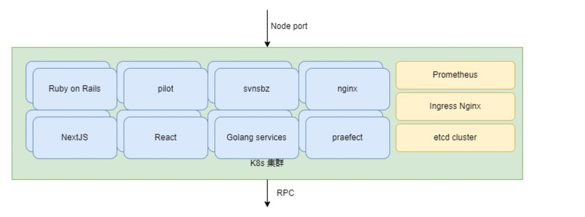

# Описание общей архитектуры Russia Gitee Pass* 

## 1. Общая топология Gitee Russia Pass

## 2. Служба распространения Gitee Russia Pass

## 3.  Архитектуры платформы Gitee

### 3.1 Преимущества технической архитектуры Gitee

Чтобы гарантировать отсутствие у системы единой точки отказа, а также обеспечить непрерывность и надежность бизнеса, платформа Gitee создает на основе K8s и самостоятельно разработанной архитектуры распределенного репозитория git кластер с распределенной нагрузкой и высокой доступностью. В случае выхода из строя узла управления репозиторием кода сервис автоматически переносится на другие узлы управления, обеспечивая высокую доступность платформы и бесперебойную работу приложений в режиме 24/7.

Платформа Gitee использует подход развертывания гибридного облака с разделением вычислений и хранения данных. Вычислительные узлы развертывают кластер K8s для запуска бизнес-кода платформы Gitee, не связанного с хранилищем. Контроллер развертывания в кластере K8s обеспечивает резервирование нескольких экземпляров и самовосстановление бизнес-кода после сбоев, что гарантирует стабильность сервисов платформы. На узлах хранения развернута самостоятельно разработанная архитектура распределенного git-хранилища, поддерживающая множество сегментов и реплик для обеспечения безопасности данных репозитория.

### 3.2 Высокая доступность и масштабируемость системы

Чтобы гарантировать отсутствие у системы единой точки отказа и гарантировать непрерывность и устойчивость бизнес-системы, архитектура продуктов Gitee основана на K8s для создания кластера с балансировкой нагрузки. В случае выхода из строя экземпляра бизнес-приложения, трафик автоматически планируется на другие рабочие экземпляры, а вышедший из строя экземпляр автоматически перезапускается. Как только экземпляр восстанавливается, он снова добавляется в бэкэнд планирования сбалансированной нагрузки, чтобы обеспечить высокую доступность сервисов платформы. При высокой бизнес-нагрузке можно обеспечить динамическое масштабирование экземпляров с помощью возможностей динамического масштабирования K8s для обеспечения масштабируемости бизнес-системы.

Чтобы гарантировать отсутствие у хранилища git-репозитория единой точки отказа и обеспечить надежность данных репозитория, платформа Gitee самостоятельно разработала архитектуру распределенного git-хранилища. Хранилище git распределяется и хранится на нескольких узлах с помощью самостоятельно разработанных правил сегментирования  хранилища, что позволяет увеличить емкость всей архитектуры хранения за счет увеличения количества сегментов, обеспечивая масштабируемость хранилища git-репозитория. В то же время каждый сегмент поддерживает развертывание нескольких реплик для достижения избыточности данных репозитория и обеспечения высокой надежности хранения git-репозитория.

Архитектура платформы выглядит следующим образом:

### 3.3 Реализация высокой доступности и масштабируемости на платформе Gitee

3.3.1 Обеспечение высокой доступности и масштабируемости бизнес-систем

[sshtunnelweb: Система веб-переадресации ssh-туннелей, основанная на IP-адрес пользователя для контроля прав доступа, написанная на Go. В основном используется внутри компании для доступа R&D к сервисам производственной среды, не раскрывая производственный IP-адрес для команды НИОКР. Требуется только доступ к внутреннему порту хоста компании.](URL-b282645f32)

Архитектура развертывания кластера K8s выглядит следующим образом:

Бизнес-система платформы Gitee обеспечивает исправное функционирование ресурсов подов бизнес-системы с помощью контроллера развертывания.

Доступ к приложениям осуществляется через обратный прокси-сервер верхнего уровня LB к нескольким узлам кластера K8s. Бизнес-экземпляры имеют открытые порты в кластере K8s в виде NodePort, что позволяет получить доступ к бизнес-экземплярам через порты любого узла.

Поды в контроллере развертывания кластера K8s поддерживают динамическое масштабирование. При высокой нагрузке на бизнес-систему количество подов может быть изменено для увеличения мощности системы по обработке трафика.

Архитектура развертывания бизнес-системы выглядит следующим образом:

#### 3.3.2 Реализация высокой доступности и масштабируемости хранилища репозиториев Git

Для хранения git-репозиториев на платформе Gitee используется самостоятельно разработанная архитектура распределенного хранения git-репозиториев, обеспечивающая высокую доступность и масштабируемость на уровне репозиториев.

На каждом узле хранения репозитория развернут сервис gitaly. Весь пул хранилища делится на несколько сегментов с помощью правил сегментирования верхнего уровня. Увеличение количества сегментов позволяет расширить объем памяти git-репозиториев.

Поверх каждого сегмента развернут сервис praefect, который используется для синхронизации реплик данных и проверки состояния данных реплики. Если реплика в сегменте выходит из строя, исправные реплики в этом сегменте продолжают функционировать, обеспечивая высокую доступность хранилища git-репозитория. Архитектурная схема развертывания хранилища репозитория git выглядит следующим образом:

#### 3.3.3 Реализация высокой доступности баз данных и промежуточного программного обеспечения

Платформа Gitee использует различные базы данных и промежуточное ПО с открытым исходным кодом, и все эти компоненты используют официальные или признанные сообществом решения для развертывания высокой доступности, чтобы обеспечить высокую доступность и масштабируемость промежуточного ПО.

##### Высокая доступность MySQL

Решение, обеспечивающее высокую доступность MySQL, заключается в использовании keepalived для первичного и вторичного доступа к трафику. В случае выхода из строя основного узла keepalived кластер VIP переключится на резервный узел для обеспечения бесперебойного обслуживания. Первичный и вторичный MySQL обеспечивают двунаправленную синхронизацию master-master через binlog. Каждый из двух основных узлов также подключен к резервному узлу для осуществления резервного копирования данных, что обеспечивает высокую доступность и безопасность данных службы MySQL.

##### Высокая доступность Redis

Высокая доступность Redis достигается за счет официального кластерного решения Redis. Кластер состоит из 6 узлов, в том числе 3 мастер-узлов и 3 узлов-реплик. Данные хранятся в различных группах сегментов на основе протокола сегментирования кластера. В каждой группе сегментов работают два экземпляра, один из которых является ведущим, а другой - репликой. В случае отказа основного экземпляра реплика продолжает функционировать, принимая на себя трафик основного экземпляра. Масштабирование числа групп сегментов и перераспределение слотов в кластере позволяет добиться горизонтального масштабирования кластера.

##### Высокая доступность etcd

etcd - это высокодоступная распределенная база данных "ключ-значение", используемая для обнаружения сервисов и настройки системы. Она служит базой данных для хранения метаданных в кластере K8s на платформе Gitee. Высокая доступность etcd достигается за счет развертывания 3-узлового кластера etcd. В случае выхода из строя одного из узлов кластера новый ведущий узел выбирается с помощью алгоритма Raft путем отбора из числа большинства исправных узлов. Новый ведущий узел продолжает функционировать, принимая на себя трафик вышедшего из строя узла.

##### Высокая доступность PostgreSQL

PostgreSQL использует предоставляемое компанией Zalando решение для развертывания кластеров высокой доступности под названием Patroni. Метаданные кластера хранятся в высокодоступном кластере etcd. Несколько экземпляров PostgreSQL синхронизируют данные с помощью потоковой репликации PostgreSQL. В случае выхода из строя основного узла кластера шаблон Patroni считывает метаданные из etcd и выбирает новый основной узел, который продолжает функционировать, принимая на себя трафик вышедшего из строя узла.

##### Высокая доступность Kafka

В Kafka для достижения высокой доступности развертывания используется метод нескольких разделов и реплик. Каждый раздел имеет репликацию

### 3.4 Реализация Observable на платформе Gitee

Gitee-платформа Prometheus отслеживает состояние всех узлов и приложений, включая показатели производительности узлов, состояние сервисов, загрузку приложений, состояние и показатели производительности стручков кластера K8s и т. д.; собирает журналы приложений через Elastic Stack и обеспечивает агрегирование запросов и анализ.

### 3.5 Реализация информационной безопасности платформы Gitee

В силу физической изолированности дата-центров от общедоступной сетевой среды, для осуществления управления узлами дата-центров эксплуатационный персонал подключается к бастионному хосту дат-центра через виртуальную частную сеть (VPN) и затем управляет узлами дата-центра через бастионный хост.

В целях исключения возможности сетевых атак все учетные записи, входящие на бастионный хост, проходят двухфакторную аутентификацию и могут подключиться только через виртуальную частную сеть. 

## 4. Детальная реализация платформы Gitte

[Appendix - IAAS Resource Application](./Appendix-IAAS-Resource-Application.md)

[Appendix - Format and Mount Data Disk](./Appendix-Format-Mount-Data-Disk.md)

[Attachment - Internal DNS configuration for all server nodes](./Attachment-InternalDNS.md)

### 4.1 Развертывание высокодоступной облачной платформы Kubernetes

[Install_ha_k8s](./russia-gitee-prod/Install_ha_k8s.md)

### 4.2 Развертывание высокодоступного gitee-git-service

[Install_gitee-git-service](./gitee-git-service/README.md)

### 4.3 Развертывание sre (основного и резервного)

[Install_sre-service](./sre-base/README.md)

### 4.4 Развертывание полусинхронной репликации MySQL master-slave 

[Install_MySQL](./sre-base/mysql-replication/README.md)

### 4.5 Развертывание потоковой репликации PostgreSQL master-slave

[Install_PostgreSQL](./sre-base/postgresql/README.md)

### 4.6 Развертывание высокодоступной 4-узловой MinIO 

[Install_MinIO](./sre-base/minio/README.md)

### 4.7 Развертывание высокодоступного кластера Kafka

[Install_Kafka](./sre-base/kafka-cluster/README.md)

### 4.8 Развертывание высокодоступного кластера Elasticsearch

[Install_Elasticsearch](./sre-base/es-cluster/README.md)

### 4.9 Развертывание высокодоступного кластера Redis

[Install_Redis-cluster](./russia-gitee-prod/install_redis_cluster.md)

### 4.10 Развертывание балансировщика нагрузки haproxy в режиме горячего резервирования

[Install_haproxy_haproxy](./haproxy/README.md)

### 4.11 Развертывание службы ускорения Varnish cdn

[Install_Varnish-service](./varnish/README.md)

### 4.12 Развертывание основных служб Gitee (фронтенд и бэкенд)

[Install_Gitee-service](./russia-gitee-prod/README.md)

### 4.13 Непрерывная интеграция и непрерывное развертывание Gitee

[Install_Gitee-service](./russia-gitee-prod/README.md)

## 5. План резервного копирования данных

jenkins --- запланированная задача ----- выполнить резервное копирование данных, загруженных на Minio
// ПРИМЕЧАНИЕ РАЗРАБОТЧИКА Необходимо добавить схему

### 5.1 Резервное копирование данных MySQL

[Backup MySQL data and upload it to minio](./backup/mysql_backup/README.md)

### 5.2 Резервное копирование данных PostgreSQL

[Backup PostgreSQL Data and Upload to Minio](./backup/postgresql_backup/README.md)

*Название ПО