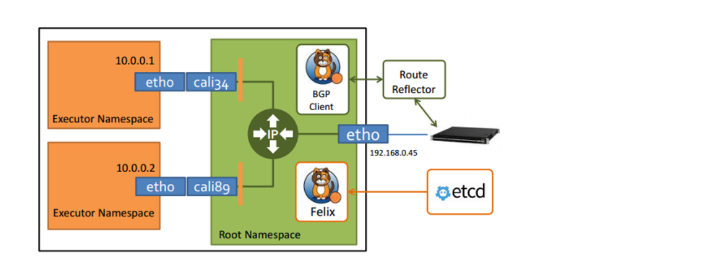
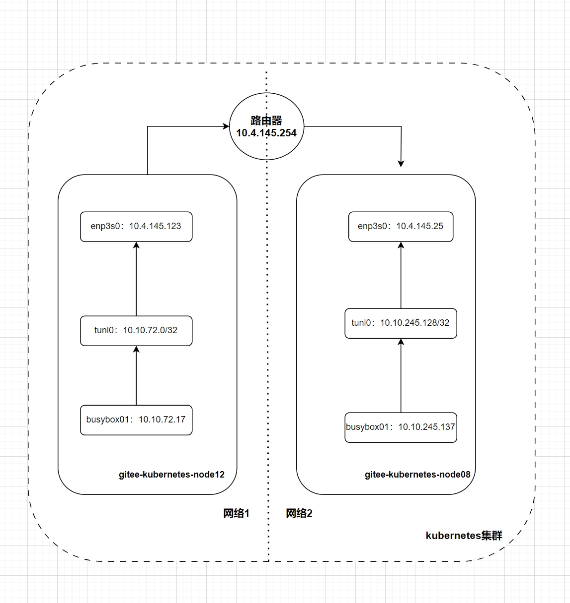

Сетевой плагин Calico-cni

Сетевой плагин Calico — еще одно популярное сетевое решение с открытым исходным кодом в экосистеме Kubernetes. Calico — это сетевое решение уровня 3, поддерживающее режим протокола пограничного шлюза (BGP) и режим IPIP.

Calico использует очень гибкую модульную архитектуру. Пользователи могут выбирать необходимые модули для установки и развертывания в соответствии со своими реальными потребностями. Calico в основном состоит из следующих модулей.

- Плагин сетевого интерфейса контейнера: обеспечивает эффективное управление сетью модулей и IP-адресами для контейнерной платформы Kubernetes.
- Felix: Механизм политики, также известный как агент Calico, должен работать на каждом рабочем узле и отвечает за настройку политик маршрутизации и контроля доступа для обеспечения ограничений подключения и безопасности между рабочими узлами.
- BIRD: отвечает за распространение информации о маршрутизации от Felix, записанной в ядре Linux, по всей сети Calico, обеспечивая связь между модулями.
- EEtcd: распределенное хранилище значений ключей, в основном отвечающее за обеспечение согласованности сетевых метаданных и точность состояния сети Calico.
- Calico/node: упаковывает Felix, Bird и другие компоненты в единый компонент и отвечает за инициализацию и подготовку среды для других компонентов.
- Typha: По умолчанию Felix взаимодействует с Etcd через API-сервер кластера Kubernetes. Однако в случае большого количества узлов кластера мы можем снизить нагрузку на API-сервер, напрямую взаимодействуя с Etcd через Typha.
- calicocli: инструмент командной строки Calico, используемый для управления конфигурациями сети и сетевыми политиками Calico.

Архитектура Calico показана на следующей схеме.



Calico поддерживает множество сетевых режимов, которые можно условно разделить на типы сетей с наложением и типы сетей без наложения. Типы оверлейных сетей включают сетевой режим VXLAN и сетевой режим IPIP, а типы сетей без оверлея включают полносвязный режим BGP и режим отражения маршрута BGP.

## 1. Режим IPIP

В режиме IPIP Calico, который представляет собой модель наложенной сети IP-в-IP, Calico создает сетевую карту tunl0 на каждом вычислительном узле в кластере. Все пакеты, которые необходимо перенаправить на другие узлы в кластере, должны пройти через устройство сетевой карты tunl0 для инкапсуляции и декапсуляции, что приводит к значительной потере производительности сети в режиме IPIP.

Конфигурацией Calico 3.x по умолчанию является транспортный режим IPIP вместо режима BGP. Режим IPIP имеет более низкие требования к базовой сети, но, как и режим Flannel VXLAN, этот режим имеет более высокие сетевые издержки и не подходит для сценариев с высокими требованиями к производительности для контейнерных сетей.

Мы можем развернуть компоненты Calico в кластере Kubernetes и использовать режим IPIP, выполнив следующие действия:

```sh
$ curl -LO https://docs.projectcalico.org/manifests/calico.yaml
$ kubectl apply -f calico.yaml
```

Состояние работы компонента Calico следующее:

```
$ kubectl -nkube-system get po |grep calico-node
calico-node-2mcj7                                  1/1     Running   0               5d18h
calico-node-2t646                                  1/1     Running   0               27d
calico-node-4wxzt                                  1/1     Running   0               27d
calico-node-5fx6g                                  1/1     Running   0               27d
calico-node-74jjs                                  1/1     Running   0               27d
calico-node-bfvpk                                  1/1     Running   0               27d
calico-node-bv6zm                                  1/1     Running   0               27d
calico-node-c2p4d                                  1/1     Running   0               5d18h
calico-node-cbj5g                                  1/1     Running   0               27d
calico-node-cwqw6                                  1/1     Running   0               27d
calico-node-ggc54                                  1/1     Running   0               27d
calico-node-gkdzn                                  1/1     Running   0               27d
calico-node-lk9tc                                  1/1     Running   0               27d
calico-node-qg6qh                                  1/1     Running   0               27d
calico-node-rb7hn                                  1/1     Running   0               27d
calico-node-tkjwr                                  1/1     Running   0               27d
calico-node-vwn57                                  1/1     Running   0               27d
calico-node-xmbs6                                  1/1     Running   0               5d19h
```

Статус узла кластера следующий:

```sh
$ kubectl get no -o wide
NAME                       STATUS   ROLES           AGE     VERSION   INTERNAL-IP    EXTERNAL-IP   OS-IMAGE             KERNEL-VERSION      CONTAINER-RUNTIME
gitee-kubernetes-master1   Ready    control-plane   27d     v1.26.3   10.4.145.92    <none>        Ubuntu 20.04.6 LTS   5.4.0-169-generic   containerd://1.6.20
gitee-kubernetes-master2   Ready    control-plane   27d     v1.26.3   10.4.145.129   <none>        Ubuntu 20.04.6 LTS   5.4.0-169-generic   containerd://1.6.20
gitee-kubernetes-master3   Ready    control-plane   27d     v1.26.3   10.4.145.169   <none>        Ubuntu 20.04.6 LTS   5.4.0-169-generic   containerd://1.6.20
gitee-kubernetes-node01    Ready    <none>          27d     v1.26.3   10.4.145.107   <none>        Ubuntu 20.04.6 LTS   5.4.0-169-generic   containerd://1.6.20
gitee-kubernetes-node02    Ready    <none>          27d     v1.26.3   10.4.145.32    <none>        Ubuntu 20.04.6 LTS   5.4.0-169-generic   containerd://1.6.20
gitee-kubernetes-node03    Ready    <none>          27d     v1.26.3   10.4.145.79    <none>        Ubuntu 20.04.6 LTS   5.4.0-169-generic   containerd://1.6.20
gitee-kubernetes-node04    Ready    <none>          27d     v1.26.3   10.4.145.37    <none>        Ubuntu 20.04.6 LTS   5.4.0-169-generic   containerd://1.6.20
gitee-kubernetes-node05    Ready    <none>          27d     v1.26.3   10.4.145.168   <none>        Ubuntu 20.04.6 LTS   5.4.0-169-generic   containerd://1.6.20
gitee-kubernetes-node06    Ready    <none>          27d     v1.26.3   10.4.145.113   <none>        Ubuntu 20.04.6 LTS   5.4.0-169-generic   containerd://1.6.20
gitee-kubernetes-node07    Ready    <none>          27d     v1.26.3   10.4.145.34    <none>        Ubuntu 20.04.6 LTS   5.4.0-169-generic   containerd://1.6.20
gitee-kubernetes-node08    Ready    <none>          27d     v1.26.3   10.4.145.25    <none>        Ubuntu 20.04.6 LTS   5.4.0-169-generic   containerd://1.6.20
gitee-kubernetes-node09    Ready    <none>          27d     v1.26.3   10.4.145.57    <none>        Ubuntu 20.04.6 LTS   5.4.0-169-generic   containerd://1.6.20
gitee-kubernetes-node10    Ready    <none>          27d     v1.26.3   10.4.145.116   <none>        Ubuntu 20.04.6 LTS   5.4.0-169-generic   containerd://1.6.20
gitee-kubernetes-node11    Ready    <none>          27d     v1.26.3   10.4.145.26    <none>        Ubuntu 20.04.6 LTS   5.4.0-169-generic   containerd://1.6.20
gitee-kubernetes-node12    Ready    <none>          27d     v1.26.3   10.4.145.123   <none>        Ubuntu 20.04.6 LTS   5.4.0-169-generic   containerd://1.6.20
gitee-kubernetes-node13    Ready    <none>          5d19h   v1.26.3   10.4.145.144   <none>        Ubuntu 20.04.6 LTS   5.4.0-169-generic   containerd://1.6.20
gitee-kubernetes-node14    Ready    <none>          5d18h   v1.26.3   10.4.145.53    <none>        Ubuntu 20.04.6 LTS   5.4.0-169-generic   containerd://1.6.20
gitee-kubernetes-node15    Ready    <none>          5d18h   v1.26.3   10.4.145.52    <none>        Ubuntu 20.04.6 LTS   5.4.0-169-generic   containerd://1.6.20
```

Затем мы развертываем два модуля: busybox01 и busybox02 соответственно.

```sh
$ kubectl run busybox01 --image=busybox --restart=Never -- sleep 1d
$ kubectl run busybox02 --image=busybox --restart=Never -- sleep 1d
```

Узлы busybox01 и busybox02 распределены на разных хостах, и им назначены разные IP-адреса, как показано ниже.

```
$ kubectl get po -o wide
NAME        READY   STATUS    RESTARTS   AGE     IP              NODE                      NOMINATED NODE   READINESS GATES
busybox01   1/1     Running   0          3m14s   10.10.72.17     gitee-kubernetes-node12   <none>           <none>
busybox02   1/1     Running   0          8s      10.10.245.137   gitee-kubernetes-node08   <none>           <none>
```

Проверьте подключение от busybox01 к busybox02.

```sh
root@gitee-sre2:/home/ubuntu/workdir/kubernetes-test# k exec -it pod/busybox01 -- sh
/ #
/ # ping 10.10.245.137
PING 10.10.245.137 (10.10.245.137): 56 data bytes
64 bytes from 10.10.245.137: seq=0 ttl=62 time=1.238 ms
64 bytes from 10.10.245.137: seq=1 ttl=62 time=0.971 ms
```

Просмотр информации о маршрутизации на вычислительном узле gitee-kubernetes-node12, как показано ниже.

```
$ route -n
Kernel IP routing table
Destination     Gateway         Genmask         Flags Metric Ref    Use Iface
0.0.0.0         10.4.145.254    0.0.0.0         UG    100    0        0 enp3s0
10.0.0.0        10.4.145.1      255.0.0.0       UG    100    0        0 enp3s0
10.4.145.0      0.0.0.0         255.255.255.0   U     0      0        0 enp3s0
10.10.33.128    10.4.145.37     255.255.255.192 UG    0      0        0 tunl0
10.10.56.64     10.4.145.52     255.255.255.192 UG    0      0        0 tunl0
10.10.72.0      0.0.0.0         255.255.255.192 U     0      0        0 *
10.10.72.5      0.0.0.0         255.255.255.255 UH    0      0        0 calic9794644568
10.10.72.6      0.0.0.0         255.255.255.255 UH    0      0        0 calia7efe363e11
10.10.72.7      0.0.0.0         255.255.255.255 UH    0      0        0 calic55f229dc12
10.10.72.9      0.0.0.0         255.255.255.255 UH    0      0        0 cali53110add79b
10.10.72.10     0.0.0.0         255.255.255.255 UH    0      0        0 cali4c5dc10ef75
10.10.72.11     0.0.0.0         255.255.255.255 UH    0      0        0 cali6d4db38382a
10.10.72.17     0.0.0.0         255.255.255.255 UH    0      0        0 cali62b1ad91c8d
10.10.72.46     0.0.0.0         255.255.255.255 UH    0      0        0 cali3a91edd0921
10.10.72.47     0.0.0.0         255.255.255.255 UH    0      0        0 calif3e423643c7
10.10.72.61     0.0.0.0         255.255.255.255 UH    0      0        0 cali179c17c1158
10.10.72.128    10.4.145.168    255.255.255.192 UG    0      0        0 tunl0
10.10.91.128    10.4.145.113    255.255.255.192 UG    0      0        0 tunl0
10.10.92.0      10.4.145.53     255.255.255.192 UG    0      0        0 tunl0
10.10.97.64     10.4.145.34     255.255.255.192 UG    0      0        0 tunl0
10.10.107.64    10.4.145.116    255.255.255.192 UG    0      0        0 tunl0
10.10.115.64    10.4.145.26     255.255.255.192 UG    0      0        0 tunl0
10.10.116.192   10.4.145.57     255.255.255.192 UG    0      0        0 tunl0
10.10.135.64    10.4.145.32     255.255.255.192 UG    0      0        0 tunl0
10.10.189.192   10.4.145.129    255.255.255.192 UG    0      0        0 tunl0
10.10.190.64    10.4.145.92     255.255.255.192 UG    0      0        0 tunl0
10.10.196.0     10.4.145.79     255.255.255.192 UG    0      0        0 tunl0
10.10.210.0     10.4.145.144    255.255.255.192 UG    0      0        0 tunl0
10.10.218.64    10.4.145.107    255.255.255.192 UG    0      0        0 tunl0
10.10.228.192   10.4.145.169    255.255.255.192 UG    0      0        0 tunl0
10.10.245.128   10.4.145.25     255.255.255.192 UG    0      0        0 tunl0
169.254.169.254 10.4.145.2      255.255.255.255 UGH   100    0        0 enp3s0
172.16.0.0      10.4.145.1      255.240.0.0     UG    100    0        0 enp3s0
192.168.0.0     10.4.145.1      255.255.0.0     UG    100    0        0 enp3s0

$ route -n|grep 10.10.245
10.10.245.128   10.4.145.25     255.255.255.192 UG    0      0        0 tunl0
```

Просмотр информации о маршрутизации на вычислительном узле gitee-kubernetes-node08, как показано ниже.

```sh
$ route -n
Kernel IP routing table
Destination     Gateway         Genmask         Flags Metric Ref    Use Iface
0.0.0.0         10.4.145.254    0.0.0.0         UG    100    0        0 enp3s0
10.0.0.0        10.4.145.1      255.0.0.0       UG    100    0        0 enp3s0
10.4.145.0      0.0.0.0         255.255.255.0   U     0      0        0 enp3s0
10.10.33.128    10.4.145.37     255.255.255.192 UG    0      0        0 tunl0
10.10.56.64     10.4.145.52     255.255.255.192 UG    0      0        0 tunl0
10.10.72.0      10.4.145.123    255.255.255.192 UG    0      0        0 tunl0
10.10.72.128    10.4.145.168    255.255.255.192 UG    0      0        0 tunl0
10.10.91.128    10.4.145.113    255.255.255.192 UG    0      0        0 tunl0
10.10.92.0      10.4.145.53     255.255.255.192 UG    0      0        0 tunl0
10.10.97.64     10.4.145.34     255.255.255.192 UG    0      0        0 tunl0
10.10.107.64    10.4.145.116    255.255.255.192 UG    0      0        0 tunl0
10.10.115.64    10.4.145.26     255.255.255.192 UG    0      0        0 tunl0
10.10.116.192   10.4.145.57     255.255.255.192 UG    0      0        0 tunl0
10.10.135.64    10.4.145.32     255.255.255.192 UG    0      0        0 tunl0
10.10.189.192   10.4.145.129    255.255.255.192 UG    0      0        0 tunl0
10.10.190.64    10.4.145.92     255.255.255.192 UG    0      0        0 tunl0
10.10.196.0     10.4.145.79     255.255.255.192 UG    0      0        0 tunl0
10.10.210.0     10.4.145.144    255.255.255.192 UG    0      0        0 tunl0
10.10.218.64    10.4.145.107    255.255.255.192 UG    0      0        0 tunl0
10.10.228.192   10.4.145.169    255.255.255.192 UG    0      0        0 tunl0
10.10.245.128   0.0.0.0         255.255.255.192 U     0      0        0 *
10.10.245.129   0.0.0.0         255.255.255.255 UH    0      0        0 cali45b04ae9cf6
10.10.245.131   0.0.0.0         255.255.255.255 UH    0      0        0 cali96e57390261
10.10.245.135   0.0.0.0         255.255.255.255 UH    0      0        0 cali5cce408a2d7
10.10.245.137   0.0.0.0         255.255.255.255 UH    0      0        0 calif801f1b8d31
10.10.245.165   0.0.0.0         255.255.255.255 UH    0      0        0 cali2cc1bcfc5c7
10.10.245.166   0.0.0.0         255.255.255.255 UH    0      0        0 cali79bedb1c9ec
10.10.245.180   0.0.0.0         255.255.255.255 UH    0      0        0 calif2b11c394dd
10.10.245.186   0.0.0.0         255.255.255.255 UH    0      0        0 cali34c6341b899
10.10.245.187   0.0.0.0         255.255.255.255 UH    0      0        0 cali2e337dd6027
10.10.245.188   0.0.0.0         255.255.255.255 UH    0      0        0 cali0564d85b9a0
10.10.245.191   0.0.0.0         255.255.255.255 UH    0      0        0 cali84896e6f48c
169.254.169.254 10.4.145.2      255.255.255.255 UGH   100    0        0 enp3s0
172.16.0.0      10.4.145.1      255.240.0.0     UG    100    0        0 enp3s0
192.168.0.0     10.4.145.1      255.255.0.0     UG    100    0        0 enp3s0

$ route -n|grep 10.10.72
10.10.72.0      10.4.145.123    255.255.255.192 UG    0      0        0 tunl0
10.10.72.128    10.4.145.168    255.255.255.192 UG    0      0        0 tunl0

$ route -n|grep 10.10.245
10.10.245.128   0.0.0.0         255.255.255.192 U     0      0        0 *
10.10.245.129   0.0.0.0         255.255.255.255 UH    0      0        0 cali45b04ae9cf6
10.10.245.131   0.0.0.0         255.255.255.255 UH    0      0        0 cali96e57390261
10.10.245.135   0.0.0.0         255.255.255.255 UH    0      0        0 cali5cce408a2d7
10.10.245.137   0.0.0.0         255.255.255.255 UH    0      0        0 calif801f1b8d31
10.10.245.165   0.0.0.0         255.255.255.255 UH    0      0        0 cali2cc1bcfc5c7
10.10.245.166   0.0.0.0         255.255.255.255 UH    0      0        0 cali79bedb1c9ec
10.10.245.180   0.0.0.0         255.255.255.255 UH    0      0        0 calif2b11c394dd
10.10.245.186   0.0.0.0         255.255.255.255 UH    0      0        0 cali34c6341b899
10.10.245.187   0.0.0.0         255.255.255.255 UH    0      0        0 cali2e337dd6027
10.10.245.188   0.0.0.0         255.255.255.255 UH    0      0        0 cali0564d85b9a0
10.10.245.191   0.0.0.0         255.255.255.255 UH    0      0        0 cali84896e6f48c
```

Процесс пересылки пакетов данных, как показано на рисунке.



Процесс пересылки пакетов данных в режиме Calico IPIP

1) Пакет данных ping 10.10.245.137 отправляется из модуля busybox01. На узле gitee-kubernetes-node12 он будет соответствовать записи маршрута «10.10.245.128 10.4.145.25 255.255.255.192 UG 0 0 0 tunl0». Этот маршрут означает, что бизнес-система платформы Gitee развертывается в кластере K8s вычислительного узла. Высокая доступность кластера K8s достигается за счет нескольких мастер-узлов и балансировки нагрузки с помощью LB верхнего уровня. Узлы в кластере K8s поддерживают динамическое масштабирование, при котором узел под управлением Ubuntu можно инициализировать и добавить в кластер K8s для расширения вычислительной мощности кластера.
Все пакеты, предназначенные для сегмента сети 10.10.245.128/32, пересылаются на шлюз 10.4.145.254 через устройство tunl0, а затем пересылаются на другие вычислительные узлы через eth0.

Узел gitee-kubernetes-node08 получает пакет и обнаруживает, что IP-адрес назначения пакета — 10.10.245.137. В соответствии с правилом маршрутизации «10.10.245.137 0.0.0.0 255.255.255.255 UH 0 0 0 Calif801f1b8d31» пакет пересылается на устройство «calif801f1b8d31». Устройство «calif801f1b8d31» — это хост-сторона пары Veth Pod busybox02.


## 2. Режим BGP

В настоящее время этот режим не используется в производственной среде, но следует иметь его в виду на случай необходимости.

## 3. Сетевая политика

Сеть Calico также поддерживает ряд политик сетевой безопасности, основанных на iptables. В зависимости от конкретных бизнес-требований пользователи могут ограничивать или разрешать сетевое подключение между модулями. Здесь мы создаем сетевую политику по умолчанию, не пропускающую входящий трафик для всех модулей в пространство имен по умолчанию.

```sh
$ kubectl apply -f - <<EOF
apiVersion: networking.k8s.io/v1
kind: NetworkPolicy
metadata:
  name: default-deny
spec:
  podSelector:
    matchLabels: {}
EOF
```

`calico-NetworkPolicy-ns-deny.yaml`

```yaml
apiVersion: networking.k8s.io/v1
kind: NetworkPolicy
metadata:
  name: default-deny
spec:
  podSelector:
    matchLabels: {}
```

Убедитесь, что сетевое соединение между busybox01 и busybox02 изолировано, что доказывает, что сетевая политика вступила в силу.

```sh
$ kubectl exec -it busybox01 sh
/ # ping 10.10.245.137
PING 10.10.245.137 (10.10.245.137): 56 data bytes
```

Далее мы дополнительно настраиваем busybox02, чтобы разрешить доступ только busybox01.

```sh
$ kubectl apply -f - <<EOF
apiVersion: networking.k8s.io/v1
kind: NetworkPolicy
metadata:
  name: bysubox02-network-policy
  namespace: default
spec:
  podSelector:
    matchLabels:
      run: busybox02
  policyTypes:
  - Ingress
  ingress:
  - from:
    - podSelector:
        matchLabels:
          run: busybox01
EOF
```

`calico-NetworkPolicy-ns-allow.yaml`

```
apiVersion: networking.k8s.io/v1
kind: NetworkPolicy
metadata:
  name: bysubox02-network-policy
  namespace: default
spec:
  podSelector:
    matchLabels:
      run: busybox02
  policyTypes:
  - Ingress
  ingress:
  - from:
    - podSelector:
        matchLabels:
          run: busybox01
```

Ограничение сетевого обмена между busybox01 и busybox02 снова открыто для проверки.

```sh
$ kubectl exec -it busybox01 sh
/ # ping 10.10.245.137
PING 10.100.241.5 (10.100.241.5): 56 data bytes
64 bytes from 10.100.241.5: seq=0 ttl=62 time=0.399 ms
64 bytes from 10.100.241.5: seq=1 ttl=62 time=0.272 ms
```

Создайте busybox03, поскольку мы установили сетевую политику, разрешающую доступ к busybox02 только для busybox01, при этом сетевое соединение между busybox03 и busybox02 по-прежнему ограничено.

```sh
$ kubectl exec -it busybox03 sh
/ # ping 10.100.241.5
PING 10.100.241.5 (10.100.241.5): 56 data bytes
```

## 4. Сравнение плагинов контейнерной сети

Сравнение плагинов контейнерной сети, как показано в таблице.

| Сетевой режим | Производительность сети | Кластерный масштаб | Стратегия сетевой безопасности
| Поддержка облачной платформы | Описание поддержки облачной платформы |
| -------------------- | -------------- | -------- | ------------ | ---------- | ---------------------------------------- |
Flannel VXLAN
| Flannel host-wg | Маршрутизация, уровень 3 | Высокий | Не поддерживается
| Calicao IPIP | Оверлей (Наложение), уровень 2 | Низкий | Поддерживается
  \ | Малый и средний | Любая платформа |
| Режим полного соединения Calicao | Переадресация маршрутизации, уровень 3 | Высокий | Поддерживается | Малый и средний | Поддерживается в облачных средах с поддержкой BGP, за исключением сред Alibaba Cloud VPC |
| Режим отражения маршрута Calicao  | Переадресация маршрутизации, уровень 3 | Высокий | Поддерживается | Большой | Поддерживается в облачных средах с поддержкой BGP, за исключением сред Alibaba Cloud VPC |
| Ресничка VXLAN | Оверлей (Наложение), уровень 2 | Низкий | Поддерживается
  \ | Малый и средний | Любая платформа |
| Маршрутизация BGP Cilium | Маршрутизация уровня 3 | Высокий | Поддерживается | Большой | Поддерживается в облачных средах с поддержкой BGP, за исключением сред Alibaba Cloud VPC |

Справочная документация

[10 диаграмм, иллюстрирующих принципы и функции сетевой модели K8S CNI Calico — технический специалист Ян Лян — Cnblogs (cnblogs.com)] (https://www.cnblogs.com/cheyunhua/p/17126430.html)