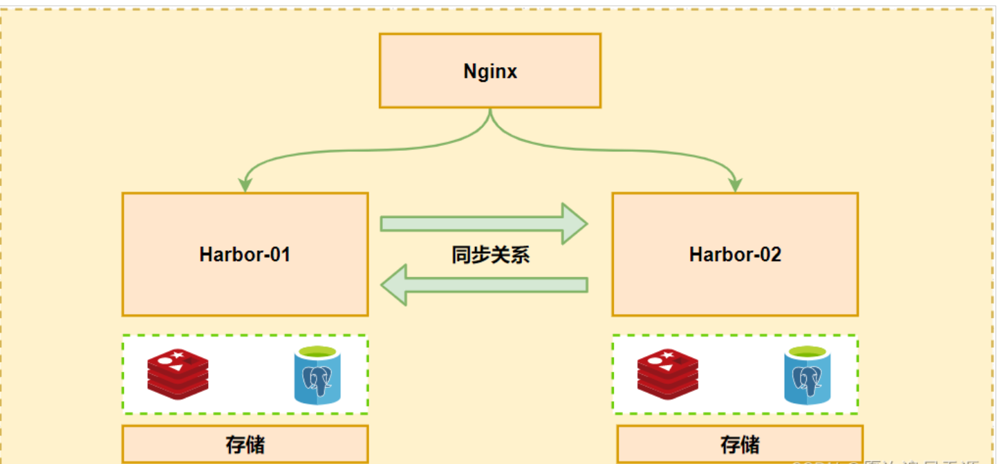
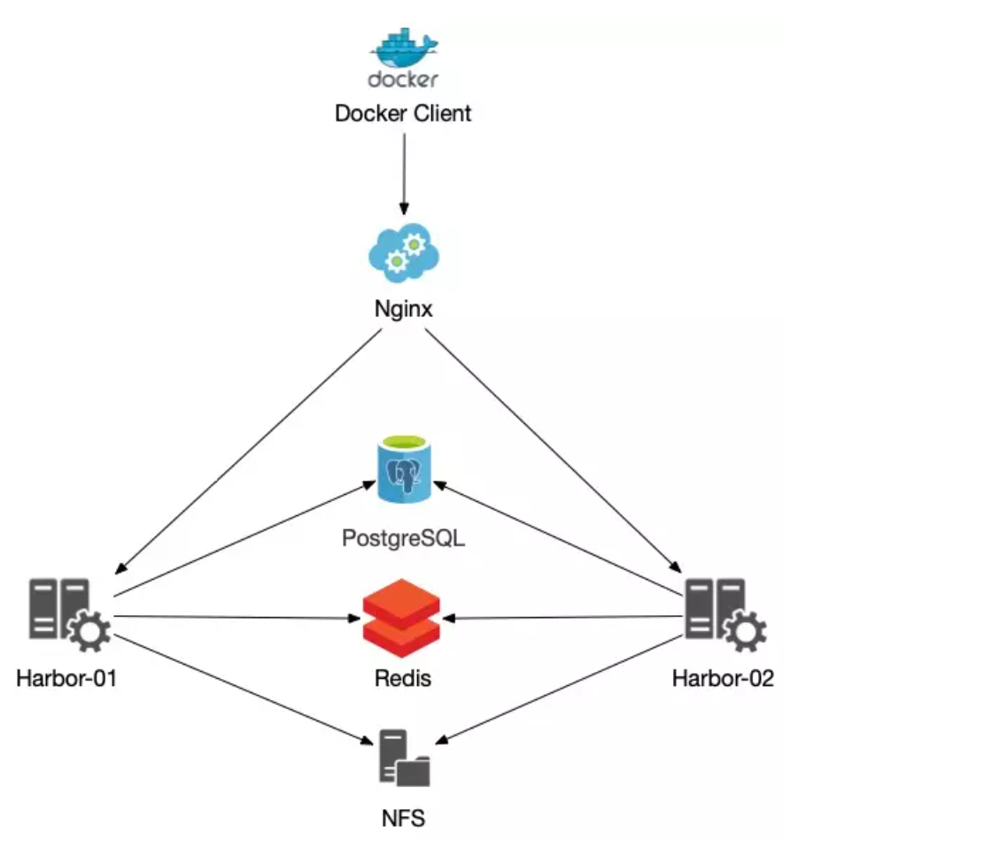

# Deploying harbor high availability





## 1. Install nfs

```sh
# fdisk /dev/vdb
# pvcreate /dev/vdb1
  Physical volume "/dev/vdb1" successfully created.

# vgcreate vg_nfs_server /dev/vdb1
# vgdisplay

# lvcreate -n lvm_nfs_server -L 499.9G vg_nfs_server
# lvdisplay
# mkfs.xfs /dev/vg_nfs_server/lvm_nfs_server

# blkid
.....
/dev/vdb1: UUID="3RLoDW-Usxc-ddFT-ZkwV-WSmk-Qkhz-3M3RIw" TYPE="LVM2_member" PARTUUID="d1e1c968-01"
/dev/mapper/vg_git_server-lvm_git_server: UUID="630ea5a8-6612-46f6-ae08-a973fd71deb8" TYPE="xfs"

# mkdir /data/nfs -p
# echo 'UUID="630ea5a8-6612-46f6-ae08-a973fd71deb8" /data/nfs     xfs    defaults  0  0 ' >> /etc/fstab
# mount -a
# lsblk
```

[nfs-docker: nfs-docker (gitee.com)](https://gitee.com/k8s-devops/nfs-docker)

## 2. Install redis

Steps omitted

## 3. Install PostgreSQL

Steps omitted

## 4. Deploy High Availability 'harbor' Cluster

### 4.1 Single-node deployment

> Deploy temporary standalone `harbor` host node execute `10.4.145.135` host

```sh
$ wget https://github.com/goharbor/harbor/releases/download/v2.4.2/harbor-online-installer-v2.4.2.tgz
$ tar -zxf harbor-online-installer-v2.4.2.tgz
$ diff harbor.yml harbor.yml.tmpl
5c5
< hostname: hub.gitee.com
---
> hostname: reg.mydomain.com
10c10
<   port: 8000
---
>   port: 80
13c13
< #https:
---
> https:
15c15
<   #  port: 8443
---
>   port: 443
17,18c17,18
<   #certificate: /your/certificate/path
<   #private_key: /your/private/key/path
---
>   certificate: /your/certificate/path
>   private_key: /your/private/key/path
29,30c29
< #external_url: https://reg.mydomain.com:8433
< external_url: https://hub.gitee.com
---
> # external_url: https://reg.mydomain.com:8433
48c47
< data_volume: /data/harbor
---
> data_volume: /data
```

Create data persistence directory

```sh
$ mkdir -p /data/harbor
```

Begin deployment

```sh
# Enable Helm Charts and Image Vulnerability Scanning in Harbor
$ sudo ./install.sh --with-trivy --with-chartmuseum
```

### 4.2 Mounting NFS Service

```sh
root@gitee-sre1: ~# apt -y install nfs-common
root@gitee-sre1: ~# mkdir /data/harbor -p
root@gitee-sre1: ~# chmod 755 /data/harbor
root@gitee-sre1: ~# echo '10.4.145.105:/data/nfs /data/harbor  nfs defaults  0 0 ' >> /etc/fstab
root@gitee-sre1: ~# mount -a
```

### 4.3 Exporting postgres data

```sh
# Create user and database examples
root@gitee-postgresql1:~# su - postgres
postgres@gitee-postgresql1:~$ psql
psql (12.17 (Ubuntu 12.17-0ubuntu0.20.04.1))
Type "help" for help.
postgres=# \password
Enter new password for user "postgres":
Enter it again:

postgres=# CREATE DATABASE registry;
CREATE DATABASE
postgres=# CREATE DATABASE notarysigner;
CREATE DATABASE
postgres=# CREATE DATABASE notaryserver;
CREATE DATABASE


# Import PostgreSQL data, you can also skip exporting the data.
# Deploy temporary single-node harbor host on 10.4.145.135 host

Host: 10.4.145.135
## Enter the temporary harbor-db container to export related tables and data
# docker exec -it -u postgres harbor-db bash

Export data
# pg_dump -U postgres registry > /tmp/registry.sql
# pg_dump -U postgres notarysigner > /tmp/notarysigner.sql
# pg_dump -U postgres notaryserver > /tmp/notaryserver.sql

Import data into a separately deployed PostgreSQL database
# psql -h 10.4.145.105 -U postgres registry -W < /tmp/registry.sql
# psql -h 10.4.145.105 -U postgres notarysigner -W < /tmp/notarysigner.sql
# psql -h 10.4.145.105 -U postgres notaryserver -W < /tmp/notaryserver.sql
```

### 4.4 Deploying `harbor` for High Availability

#### 1. Clean up `harbor` data and configuration files

```sh
## Stop service
# cd /home/ubuntu/workdir/docker-compose/harbor
# docker-compose down
# cd /root/

## Initialize and clean up local storage space
# rm -rf /data/harbor
```

#### 2. Recreate Configuration File

```sh
root@gitee-sre2:/home/ubuntu/workdir/docker-compose/harbor# diff  harbor.yml harbor.yml.tmpl
5c5
< hostname: hub.gitee.com
---
> hostname: reg.mydomain.com
10c10
<   port: 8000
---
>   port: 80
13c13
< #https:
---
> https:
15c15
<   #  port: 8443
---
>   port: 443
17,18c17,18
<   #certificate: /your/certificate/path
<   #private_key: /your/private/key/path
---
>   certificate: /your/certificate/path
>   private_key: /your/private/key/path
30d29
< external_url: https://hub.gitee.com
35c34
< harbor_admin_password: oschina123
---
> harbor_admin_password: Harbor12345
38c37
< #database:
---
> database:
40c39
<   #  password: oschina123
---
>   password: root123
42c41
<   #max_idle_conns: 100
---
>   max_idle_conns: 100
45c44
<   #max_open_conns: 900
---
>   max_open_conns: 900
48c47
< data_volume: /data/harbor
---
> data_volume: /data
144,167c143,166
< external_database:
<   harbor:
<     host: 10.4.145.105
<     port: 5432
<     db_name: registry
<     username: postgres
<     password: oschina123
<     ssl_mode: disable
<     max_idle_conns: 50
<     max_open_conns: 1000
<   notary_signer:
<     host: 10.4.145.105
<     port: 5432
<     db_name: notarysigner
<     username: postgres
<     password: oschina123
<     ssl_mode: disable
<   notary_server:
<     host: 10.4.145.105
<     port: 5432
<     db_name: notaryserver
<     username: postgres
<     password: oschina123
<     ssl_mode: disable
---
> # external_database:
> #   harbor:
> #     host: harbor_db_host
> #     port: harbor_db_port
> #     db_name: harbor_db_name
> #     username: harbor_db_username
> #     password: harbor_db_password
> #     ssl_mode: disable
> #     max_idle_conns: 2
> #     max_open_conns: 0
> #   notary_signer:
> #     host: notary_signer_db_host
> #     port: notary_signer_db_port
> #     db_name: notary_signer_db_name
> #     username: notary_signer_db_username
> #     password: notary_signer_db_password
> #     ssl_mode: disable
> #   notary_server:
> #     host: notary_server_db_host
> #     port: notary_server_db_port
> #     db_name: notary_server_db_name
> #     username: notary_server_db_username
> #     password: notary_server_db_password
> #     ssl_mode: disable
170c169
< external_redis:
---
> # external_redis:
175,176c174,175
<   host: 10.4.145.105:6379
<   password:
---
> #   host: redis:6379
> #   password:
180,184c179,183
<     registry_db_index: 1
<     jobservice_db_index: 2
<     chartmuseum_db_index: 3
<     trivy_db_index: 5
<     idle_timeout_seconds: 30
---
> #   registry_db_index: 1
> #   jobservice_db_index: 2
> #   chartmuseum_db_index: 3
> #   trivy_db_index: 5
> #   idle_timeout_seconds: 30
```

#### 3. Deploy the first node `harbor`

```sh
# cd /home/ubuntu/workdir/docker-compose/harbor

## Open helm charts in harbor
# ./prepare --with-trivy --with-chartmuseum

## Installation
# ./install.sh --with-trivy --with-chartmuseum

## View
# docker-compose ps
```

#### 4. Deploy the second node `harbor`

```sh
# cd /home/ubuntu/workdir/docker-compose/harbor

## Open helm charts in harbor
# ./prepare --with-trivy --with-chartmuseum

## Installation
# ./install.sh --with-trivy --with-chartmuseum

## View
# docker-compose ps
```

### 4.5 Deploying keepalived

Access using keepalived's vip

Reference documentation

[Harbor Highly Available Deployment - evescn - 博客园 (cnblogs.com)](https://www.cnblogs.com/evescn/p/16175819.html)

「开源摘星计划」Harbor 高可用集群设计及部署（实操+视频），基于离线安装方式_51CTO 博客_harbor 集群搭建

[Yan Shicheng - Blog | Focus on automation operation and maintenance technology (cnblogs.com)](https://www.cnblogs.com/yanshicheng/p/15756591.html#autoid-1-3-0)

[Harbor High-Availability Deployment and Configuration (Master-Slave)\_harbor Master-Slave Manual Push-CSDN Blog](https://blog.csdn.net/weixin_45308292/article/details/107248788)

[DevOps/ops/Building High Availability Shared Storage Backend for Harbor.md at master · yangpeng14/DevOps (github.com)](https://github.com/yangpeng14/DevOps/blob/master/ops/Building High Availability Shared Storage Backend for Harbor.md)

Kubernetes Container Cluster - Harbor Repository Highly Available Cluster Deployment Instructions_51CTO Blog_Kubernetes Cluster Deployment

"[harbor high availability case (shared storage directory) solution 1-White Eyebrow Dashu (baimeidashu.com)](http://www.baimeidashu.com/10894.html)"

"[Install and configure high availability Harbor image repository | Gang updates (wangfanggang.com)](https://wangfanggang.com/Docker/harbor/)"