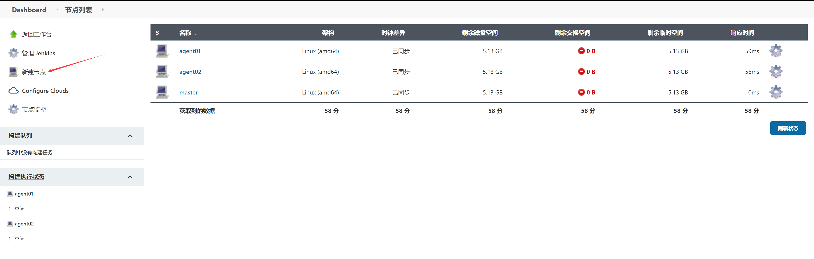
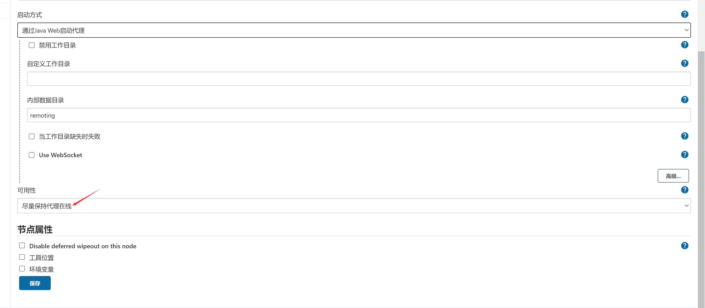

Deploy Jenkins quickly locally

Environment preparation

Prepare a host with docker and docker-compose installed.


"[Custom Jenkins Image Description - Varden - 博客园 (cnblogs.com)](https://www.cnblogs.com/varden/p/15183883.html)"


Component parts

- The master receives webhooks and schedules tasks
- Agent executes build tasks
- Build dind image

## Start deployment

### Deploy master

- Change the owner of the persistent directory to 1000:1000

```shell

cd jenkins/master

docker pull jenkinsci/blueocean:1.25.7
docker tag jenkinsci/blueocean:1.25.7 hub.gitee.com/kube-ops/blueocean:1.25.7
docker push hub.gitee.com/kube-ops/blueocean:1.25.7

chown -R 1000:1000 jenkins_home
chown -R 1000:1000 init.groovy.d
```

- Execute the docker-compose command to complete the deployment

```shell
# Create docker network
docker network create -d bridge jenkins-cluster
docker-compose up -d
```

- Complete Initialization and Install Plugins

The blueocean image already includes common plugins. When accessing Jenkins for the first time, choose to install recommended plugins.

After initialization, log in to Jenkins, go to "Manage Jenkins -> Manage Plugins -> Available Plugins" and search for "gitee" in the search box, select and install the gitee plugin.


- Configure Gitee plugin

After completing the installation of the gitee plugin, go to "System Management->System Configuration", locate the "Gitee Configuration" section, create a certificate token (you need to create a private token for Gitee API V5 in [Gitee](https://gitee.com/profile/personal_access_tokens)), and complete the configuration.


- Create new agent

Go to 'System Management -> Node List', and click on 'New Node'

Create two 'fixed nodes', with node configuration as follows






After creation, click on the node to view the node connection information, which is required when deploying the agent.


### Deploy Agent

- Build Custom Agent Image

Download kubectl, docker, and helm binary files

```
cd jenkins/agent/bin
curl -LO "https://storage.googleapis.com/kubernetes-release/release/v1.21.6/bin/linux/amd64/kubectl"
Or download from https://cowtransfer.com/s/564949f6d62b43.
```

Prepare .kube and .docker folders for authorized access to the Kubernetes api-server and Harbor image repository

Get `.kube/config` from the kubernetes cluster

Create `.docker/config.json`

```json
harbor_addr=hub.gitee.com
harbor_username=admin
harbor_password=oschinaxxx
auth_str=$(echo -ne "$harbor_username:$harbor_password" | base64)
cat > .docker/config.json <<EOF
{
        "auths": {
                "$harbor_addr": {
                        "auth": "$auth_str"
                }
        }
}
EOF
```

docker build agent image

```shell
docker build -t hub.gitee.com/kube-ops/inbound-agent:alpine-jdk11 .
docker push hub.gitee.com/kube-ops/inbound-agent:alpine-jdk11

```

- Execute the docker-compose command to complete the deployment

Modify the 'agent_name' secret in the 'docker-compose.yml' file, corresponding to the node connection information created in the 'master' section.

```shell
cd agent

# Modify agent-secrets in docker-compose.yaml with your own value.
docker-compose up -d
```

### Deploy dind

- Create daemon.json

```shell
cd dind
harbor_addr=hub.atompi.cc
dns_addr=172.18.0.39
cat > etc/daemon.json <<EOF
{
  "registry-mirrors": ["https://gfty7g09.mirror.aliyuncs.com"],
  "insecure-registries": ["$harbor_addr"],
  "live-restore": true,
  "default-shm-size": "128M",
  "max-concurrent-downloads": 10,
  "oom-score-adjust": -1000,
  "log-driver": "json-file",
  "log-opts": {
    "max-size": "100m"
  },
  "dns": [
    "$dns_addr"
  ]
}
EOF
```

- Execute the docker-compose command to complete the deployment

```shell
docker-compose up -d
```

The Agent node can pass the current Job's Workspace path by setting environment variables.

This can be easily used in Jenkins Job without manual configuration.

The specific operation steps are as follows:

In Jenkins management interface, click on "Node Management" to enter the "Node Management" page.

Find the Agent node that needs to be configured, click on the node name to enter the node configuration page.

In the node configuration page, find the "Environment Variables" section, and click the "Add Environment Variable" button.

In the pop-up dialog box, fill in the environment variable name as WORKSPACE and the value as ${JENKINS_HOME}/workspace/${JOB_NAME}.

${JENKINS_HOME} is the root directory path of Jenkins

${JOB_NAME} is the name of the current job.

Click the "Add" button to save the environment variable configuration.

Restart the Agent node to make the environment variables take effect.

In Jenkins Job, you can access this environment variable using ${WORKSPACE}, for example:

```sh
pipeline {
    agent {
        node {
            label 'my-agent'
        }
    }
    stages {
        stage('Test') {
            steps {
                sh 'echo ${WORKSPACE}'
            }
        }
    }
}
```

In this example, we set an environment variable named WORKSPACE with a value of ${JENKINS_HOME}/workspace/${JOB_NAME} in the node configuration's 'Environment Variables'. Then, we access this environment variable as ${WORKSPACE} in the Pipeline Job.

By the above method, we can automatically register the Workspace path environment variable of the Jenkins Agent node for the current Job, making it convenient to use in Jenkins Job.

Completion

## Reference

[Customize Jenkins Agent Integration with Docker and kubectl Tools - Maruko Yuji](URL)

[AutoM Studio/simple-jenkins (gitee.com)](https://gitee.com/autom-studio/simple-jenkins)

[How to customize Jenkins jnlp docker image | Flying Ice Sugar (lyc7456.com)](https://www.lyc7456.com/jenkins/20230505072617.html)