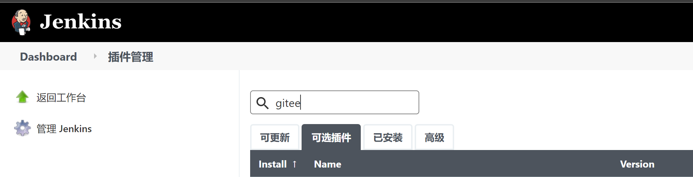
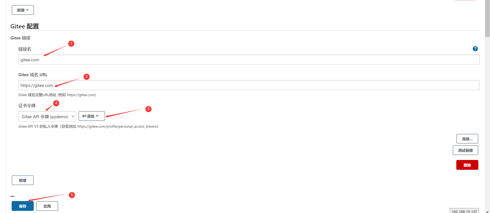
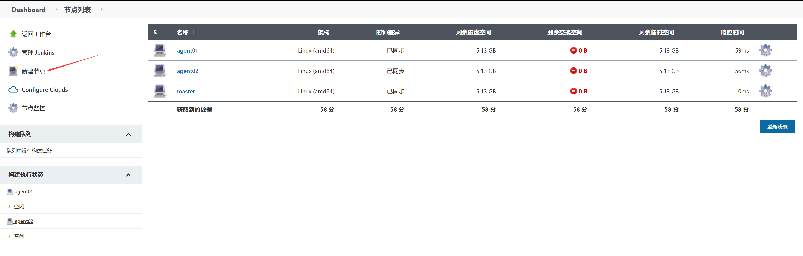
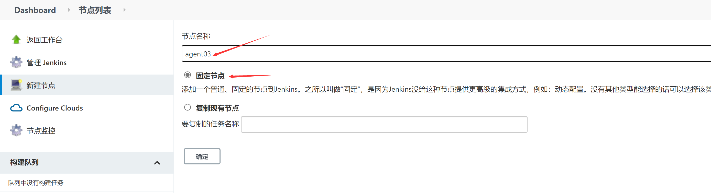
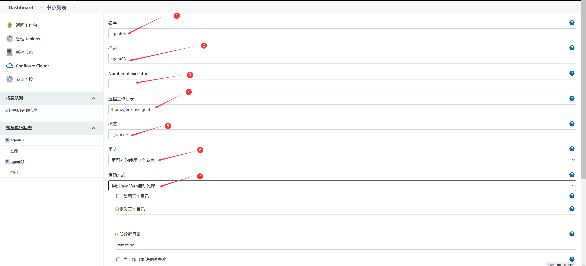
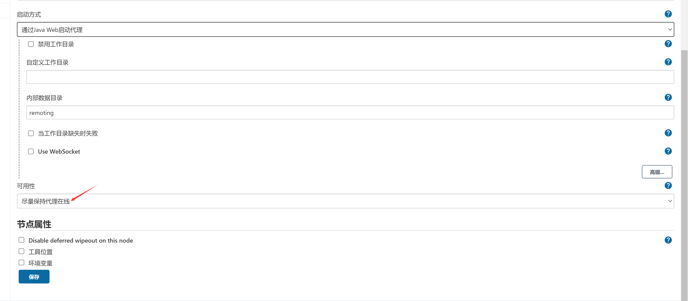
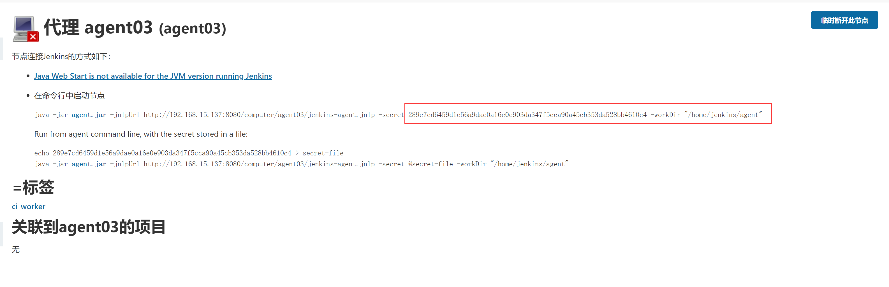

Быстрое локальное развертывание Jenkins

Подготовка среды

Подготовьте хост с установленными docker и docker-compose.


"[Пользовательское описание изображения Jenkins — Varden — Blog Park (cnblogs.com)](https://www.cnblogs.com/varden/p/15183883.html)"


Составные части

- Мастер получает веб-крючки и планирует задания
- Агент выполняет задания по сборке
- Сборка образа dind

## Начать развертывание

### Развертывание мастера

- Измените владельца постоянной директории на 1000:1000

```shell

cd jenkins/master

docker pull jenkinsci/blueocean:1.25.7
docker tag jenkinsci/blueocean:1.25.7 hub.gitee.com/kube-ops/blueocean:1.25.7
docker push hub.gitee.com/kube-ops/blueocean:1.25.7

chown -R 1000:1000 jenkins_home
chown -R 1000:1000 init.groovy.d
```

- Выполните команду docker-compose, чтобы завершить развертывание

```shell
# Создать сеть докеров
docker network create -d bridge jenkins-cluster
docker-compose up -d
```

- Завершите инициализацию и установите плагины

Образ blueocean уже включает в себя общие плагины. При первом обращении к Jenkins выберите установку рекомендуемых плагинов.

После инициализации войдите в Jenkins, перейдите в "Управление Jenkins -> Управление плагинами -> Доступные плагины" и найдите в поисковой строке "gitee", выберите и установите плагин gitee.




- Настройте плагин Gitee

После завершения установки плагина gitee перейдите в "Управление системой->Конфигурация системы", найдите раздел "Конфигурация Gitee", создайте токен сертификата (вам нужно создать приватный токен для Gitee API V5 в [Gitee](https://gitee.com/profile/personal_access_tokens)) и завершите настройку.



- Создайте нового агента

Перейдите в 'Управление системой -> Список узлов' и нажмите на 'Новый узел'.

Создайте два "фиксированных узла", с конфигурацией узлов следующим образом









После создания щелкните на узле, чтобы просмотреть информацию о подключении узла, которая необходима при развертывании агента.



### Развертывание агента

- Создание образа агента

Загрузите бинарные файлы kubectl, docker и helm

```
cd jenkins/agent/bin
curl -LO "https://storage.googleapis.com/kubernetes-release/release/v1.21.6/bin/linux/amd64/kubectl"
Or download from https://cowtransfer.com/s/564949f6d62b43.
```

Подготовьте папки .kube и .docker для авторизованного доступа к api-серверу Kubernetes и репозиторию образов Harbor

Получите файл `.kube/config` из кластера kubernetes

Создайте `.docker/config.json`.

```json
harbor_addr=hub.gitee.com
harbor_username=admin
harbor_password=oschinaxxx
auth_str=$(echo -ne "$harbor_username:$harbor_password" | base64)
cat > .docker/config.json <<EOF
{
        "auths": {
                "$harbor_addr": {
                        "auth": "$auth_str"
                }
        }
}
EOF
```

Образ агента сборки docker

```shell
docker build -t hub.gitee.com/kube-ops/inbound-agent:alpine-jdk11 .
docker push hub.gitee.com/kube-ops/inbound-agent:alpine-jdk11

```

- Выполните команду docker-compose, чтобы завершить развертывание.

Измените секрет 'agent_name' в файле 'docker-compose.yml', соответствующий информации о подключении узла, созданной в разделе 'master'.

```shell
cd agent

# Измените agent-secrets в docker-compose.yaml на свое собственное значение.
docker-compose up -d
```

### Развертывание dind

- Создайте файл daemon.json

```shell
cd dind
harbor_addr=hub.atompi.cc
dns_addr=172.18.0.39
cat > etc/daemon.json <<EOF
{
  "registry-mirrors": ["https://gfty7g09.mirror.aliyuncs.com"],
  "insecure-registries": ["$harbor_addr"],
  "live-restore": true,
  "default-shm-size": "128M",
  "max-concurrent-downloads": 10,
  "oom-score-adjust": -1000,
  "log-driver": "json-file",
  "log-opts": {
    "max-size": "100m"
  },
  "dns": [
    "$dns_addr"
  ]
}
EOF
```

- Выполните команду docker-compose, чтобы завершить развертывание

```shell
docker-compose up -d
```

Узел агента может передавать путь к рабочему пространству текущего задания, задавая переменные окружения.

Это может быть легко использовано в Jenkins Job без ручной настройки.

Ниже приведены конкретные действия:

В интерфейсе управления Jenkins нажмите на "Node Management", чтобы перейти на страницу "Node Management".

Найдите узел агента, который необходимо настроить, нажмите на имя узла, чтобы перейти на страницу конфигурации узла.

На странице конфигурации узла найдите раздел "Переменные среды" и нажмите кнопку "Добавить переменную среды".

Во всплывающем диалоговом окне введите имя переменной среды WORKSPACE и значение ${JENKINS_HOME}/workspace/${JOB_NAME}.

${JENKINS_HOME} - это путь к корневому каталогу Jenkins

${JOB_NAME} - имя текущего задания.

Нажмите кнопку "Добавить", чтобы сохранить конфигурацию переменной окружения.

Перезапустите узел агента, чтобы переменные окружения вступили в силу.

В задании Jenkins вы можете получить доступ к этой переменной окружения, например, с помощью ${WORKSPACE}:

```sh
pipeline {
    agent {
        node {
            label 'my-agent'
        }
    }
    stages {
        stage('Test') {
            steps {
                sh 'echo ${WORKSPACE}'
            }
        }
    }
}
```

В этом примере мы задаем переменную окружения WORKSPACE со значением ${JENKINS_HOME}/workspace/${JOB_NAME} в разделе "Переменные окружения" конфигурации узла. Затем мы обращаемся к этой переменной окружения как к ${WORKSPACE} в задании конвейера.

Описанный выше метод позволяет автоматически зарегистрировать переменную окружения пути к рабочему пространству узла Jenkins Agent для текущего задания, что делает ее удобной для использования в задании Jenkins.

Завершение

## Ссылки

[Настройка интеграции агента Jenkins с Docker и инструментами kubectl - Маруко Юдзи](URL)

[AutoM Studio/simple-jenkins (gitee.com)](https://gitee.com/autom-studio/simple-jenkins)

[Как настроить докер-образ Jenkins jnlp | Flying Ice Sugar (lyc7456.com)](https://www.lyc7456.com/jenkins/20230505072617.html)