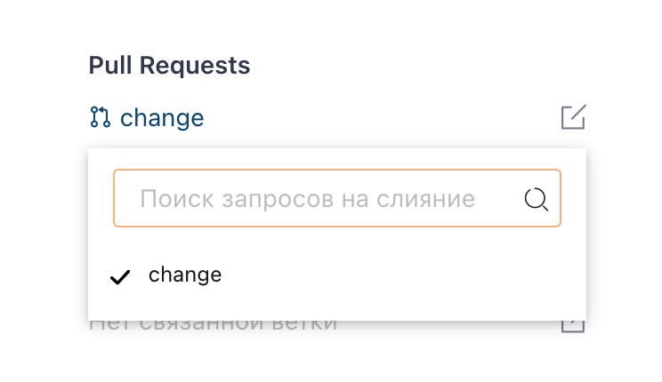
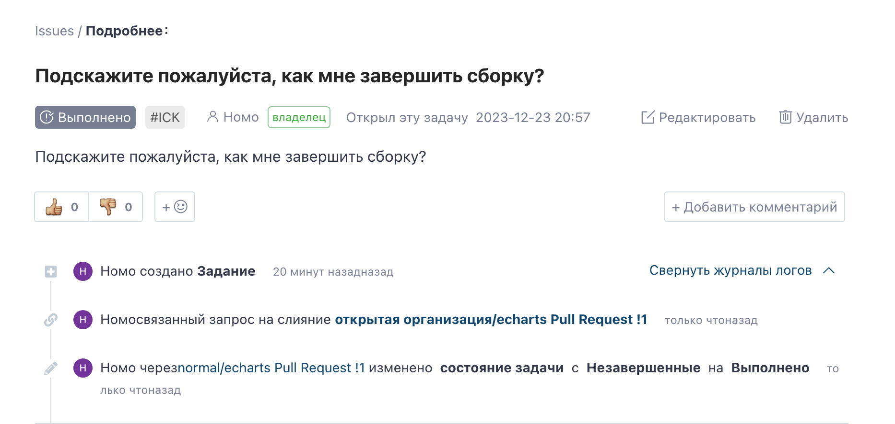

Issue associated with Pull Request, users can close the Issue when closing the Pull Request. The associated feature has the following characteristics:

1. A PR can be associated with multiple issues, for example, simultaneously associated with issue1, issue2 in the format: `#issue1ident, #issue2dent`
2. After PR is associated with an issue, the status of the issue will automatically change to 'In Progress'. When the PR is merged, the issue will be closed.
3. Difference between Personal and Enterprise versions:
   > - Personal edition, PR can only be associated with tasks in the current repository
> - Enterprise edition, PP can associate tasks from all enterprises

## The specific operation of associating Issue with Pull Request is as follows

#### 1. Specify the PR to be associated in the Issue details page

#### 2. When the PR is merged and its associated Issue is closed

