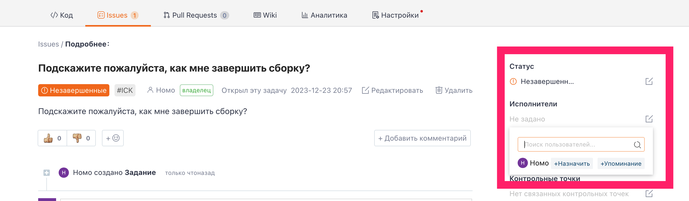

## Issue assignment

Click on the details page of the issue you want to assign, find the 'Assignee' option in the right sidebar, click the edit icon button on its right, and find the repository member you want to assign in the dropdown menu. You can assign them as 'Assignee' or 'Collaborator'.

