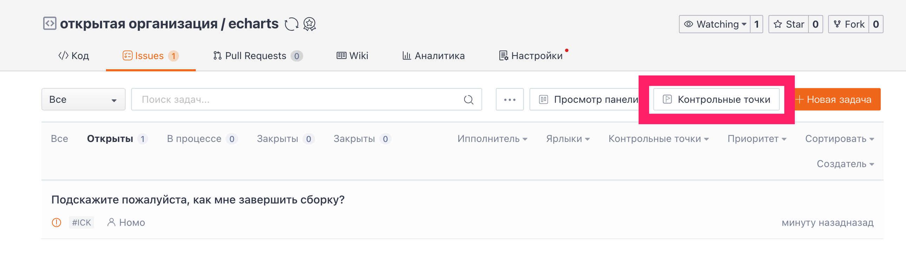
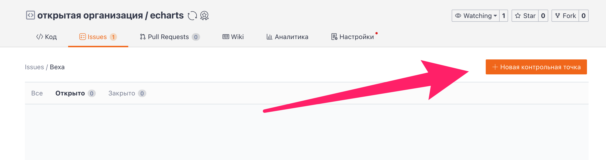
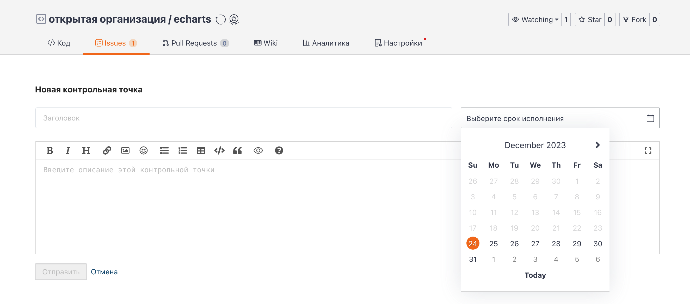
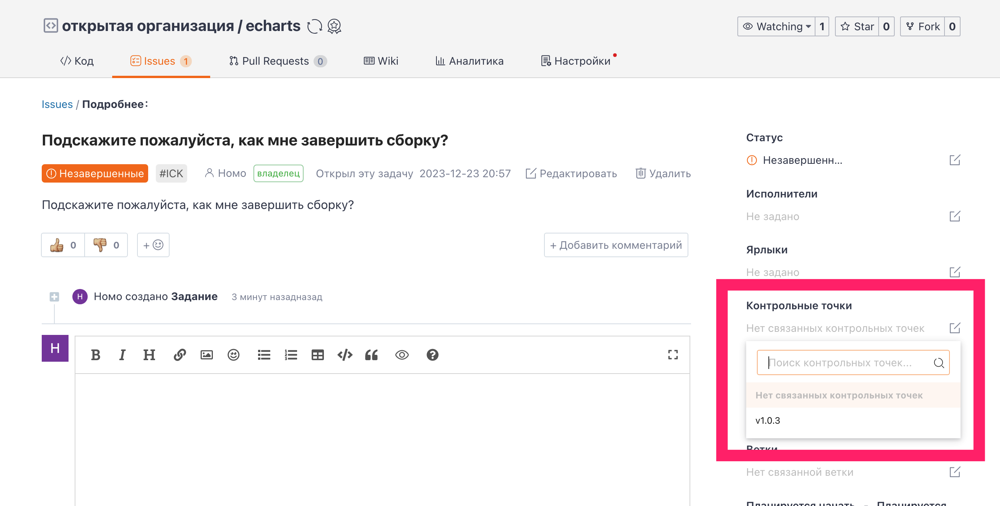

> Milestones are a project planning tool used to centrally manage the progress of issues and pull requests.

During project planning, we can design small milestones for different tasks, marking the desired completion deadline for each task. Try to complete all tasks at each time milestone.

## Milestone Management

In the Pull Request page and Issue page of the repository, we can easily find the 'Milestones' button in the upper right corner. Clicking on it will take you to the repository's milestone management page.

## Create Milestone

Here, you can find all the milestones of this repository. Click on the 'New Milestone' button at the top right of the page to create a new milestone.

On the new milestone page, you can add `Title`, `Due Date`, and `Description` for your newly created milestone.

Once the milestone is created, you can associate the issues managed under this repository with the milestone.

