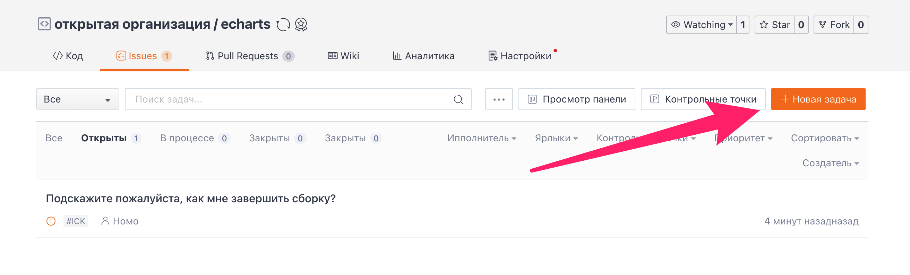
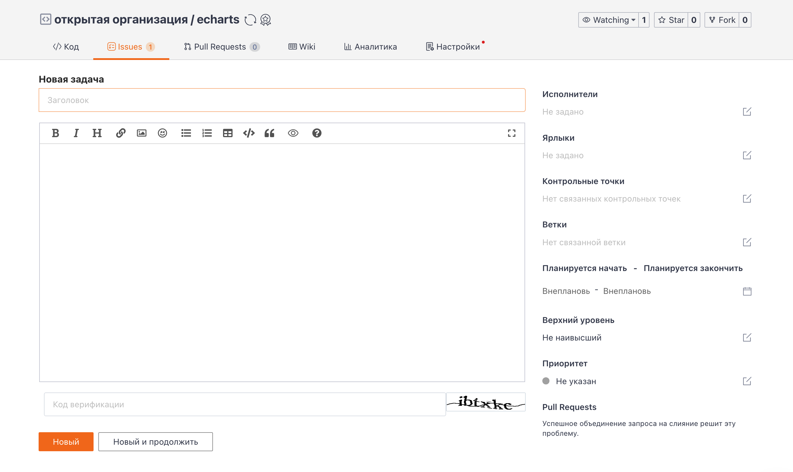
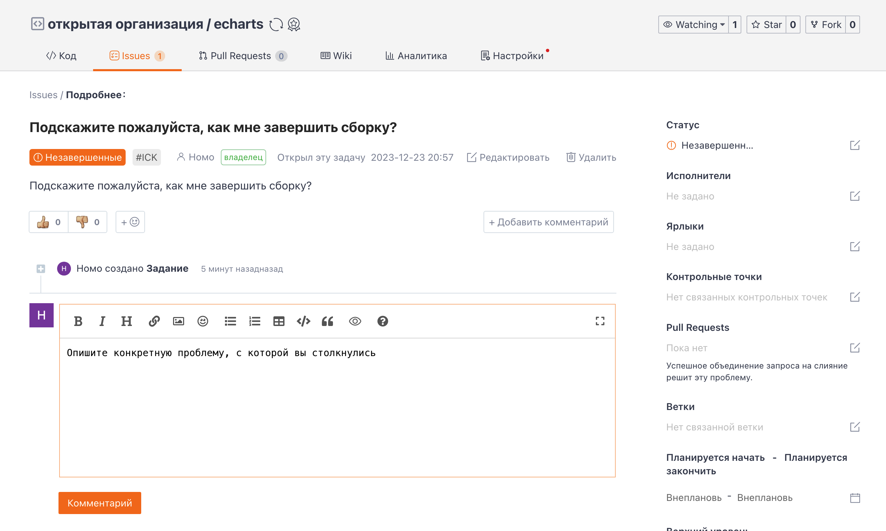

## Создание задачи в репозитории

Перейдите в свой репозиторий и нажмите кнопку "Задача" в верхней части домашней страницы репозитория для перехода на страницу задач. Здесь вы можете просмотреть все существующие "задачи" репозитория вместе с соответствующими им "статусом", "исполнителем" и "номером задачи".
Для создания новой задачи нажмите кнопку "Создать задачу" в правом верхнем углу страницы.

Добавьте "название" новой задачи и "содержание задачи". Щелкните соответствующий значок редактирования на боковой панели, чтобы добавить "исполнителей", "ярлыки", "контрольные точки", "филиалы", "дата начала - срок выполнения", "параметры закрепления" и "приоритет" для задачи. После редактирования нажмите "Создать", и новая задача будет создана!

После успешного создания задачи будет автоматически выполнен переход на страницу сведений о задаче, и люди, просмотревшие задачу, смогут оставлять свои комментарии.

