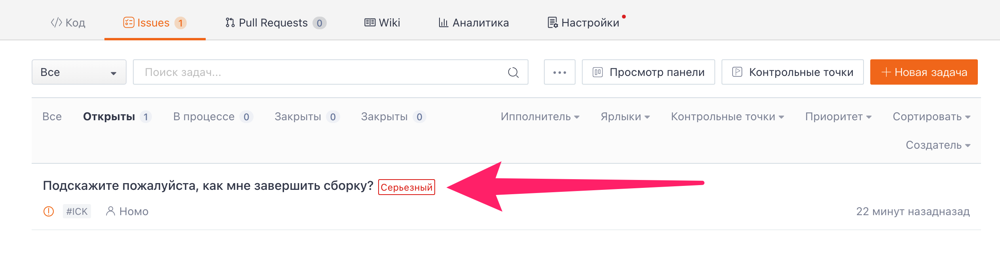
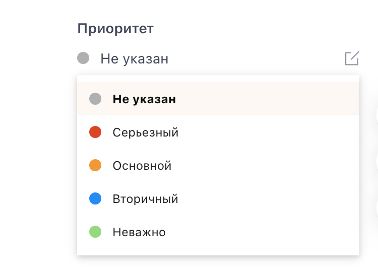

## Знакомство с приоритетностью тикетов задач

Назначение приоритетности тикетов задач позволяет членам репозитория четко и наглядно видеть срочность всех текущих задач, чтобы лучше координировать задания команды по разработке. После назначения приоритетности задачи рядом с названием задачи в списке задач загорится значок отображения приоритетности.

## Назначение приоритетности тикетов задач

На странице создания задач или детализации задач найдите в правой боковой панели опцию "Приоритетность", нажмите на кнопку с изображением значка редактирования справа от нее и выберите в выпадающем меню приоритетность для данной задачи. Приоритетность задачи позволяет участникам репозитория четко и интуитивно понимать срочность всех задач и лучше координировать заданий команды по разработке.

