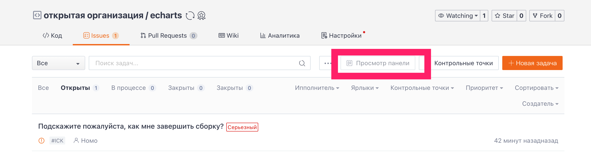
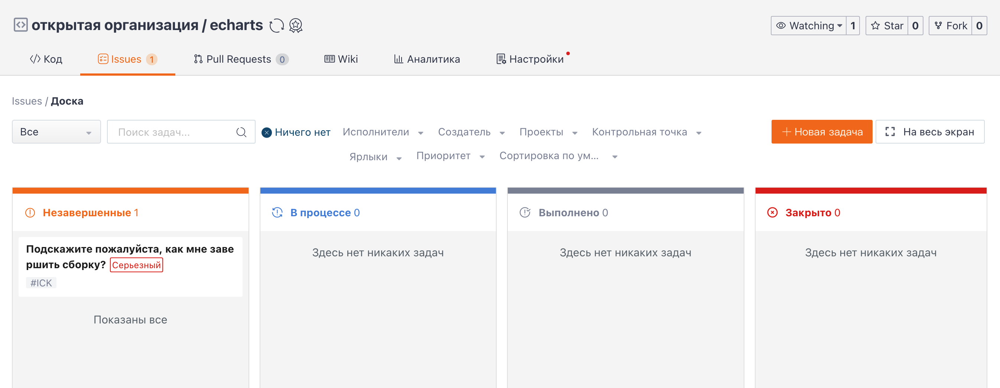

## Introduction to Task Board Functionality

The Task Board is a way to visualize and organize issue tasks. It arranges tasks in a visual manner so that every member of the repository knows the status of any issue and can quickly find any issue.

On the task board page, Issues are presented according to their progress status. With the filtering function on the top, you can achieve efficient Issue management more easily.

