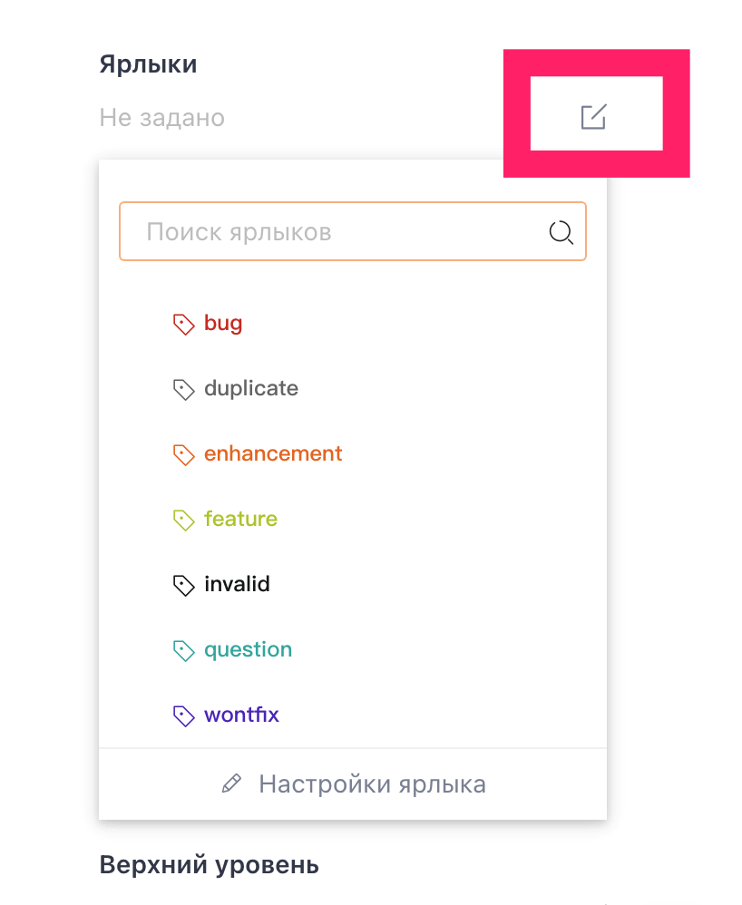
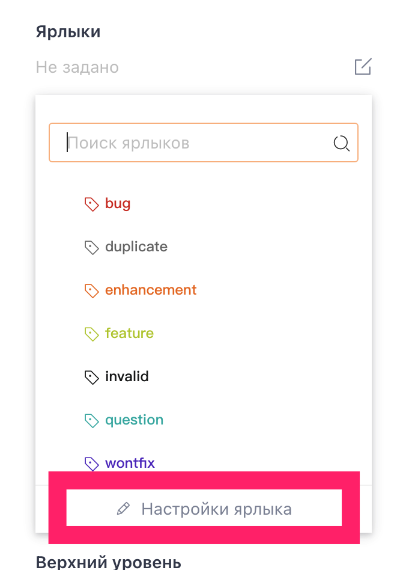
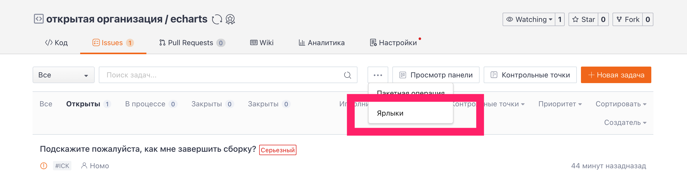
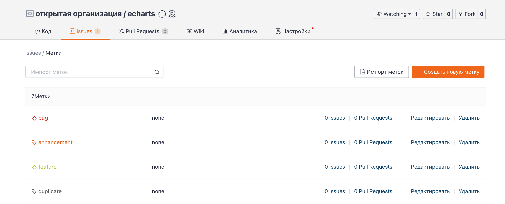
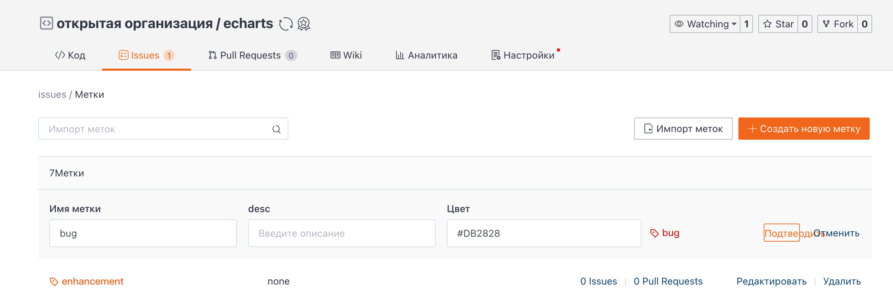

## Добавление тегов

Автор задачи может добавлять теги к задаче при её создании, а исполнители, соавторы и владельцы репозитория могут добавлять теги после её создания.

В созданной задаче или на правой боковой панели страницы сведений о задаче найдите опцию "Теги", нажмите кнопку со значком редактирования справа от нее и выберите ярлыки для этой задачи из выпадающего меню. Можно установить несколько тегов.

Управление тегами

Чтобы перейти на страницу управления тегами и развернуть все теги репозитория, администратор репозитория может нажать кнопку "Управление тегами" в раскрывающемся списке под тегом. Он также может нажать на значок "Три точки" на странице задач репозитория, найти и в раскрывающемся списке нажать кнопку "Управление тегами".

Менеджеры репозиториев могут "редактировать" и "удалять" существующие теги, а также выполнять операции "создание тегов" и "импорт тегов", причем импорт тегов позволяет менеджеру импортировать в текущий репозиторий теги из других управляемых им репозиториев.

Вы можете создавать и редактировать теги, в том числе `название`, `описание` и `цветовой код`.

