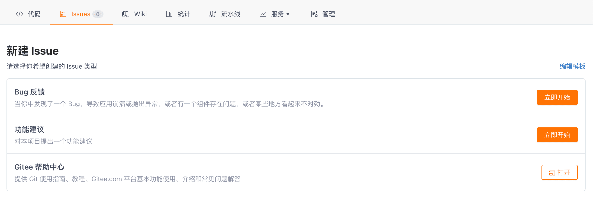
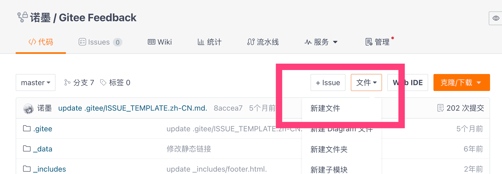
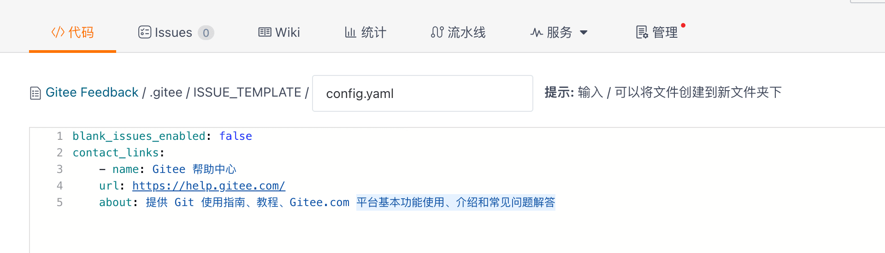
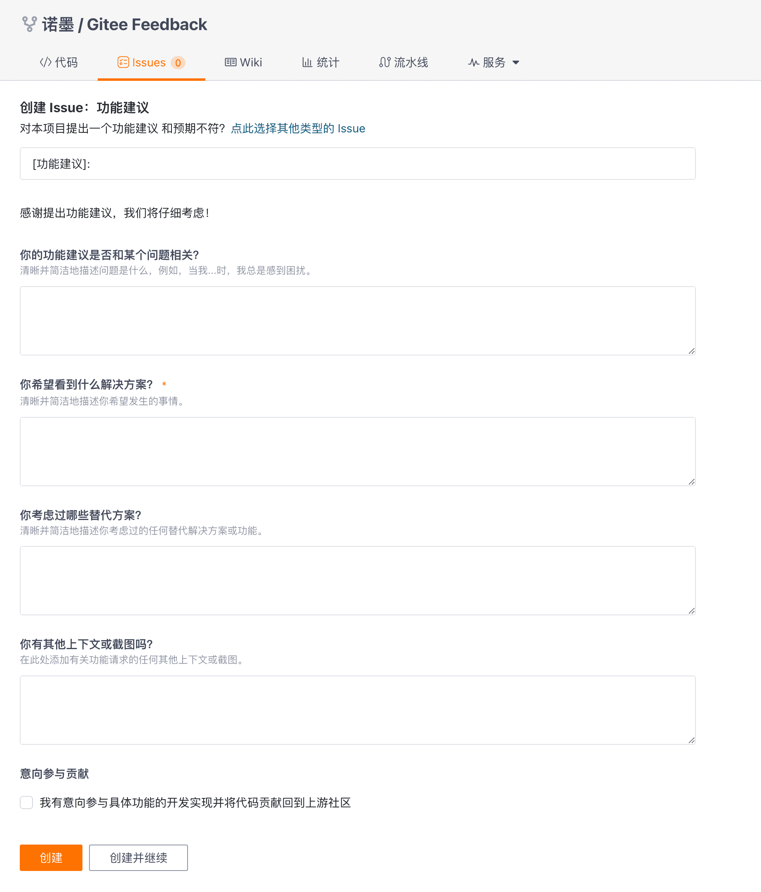
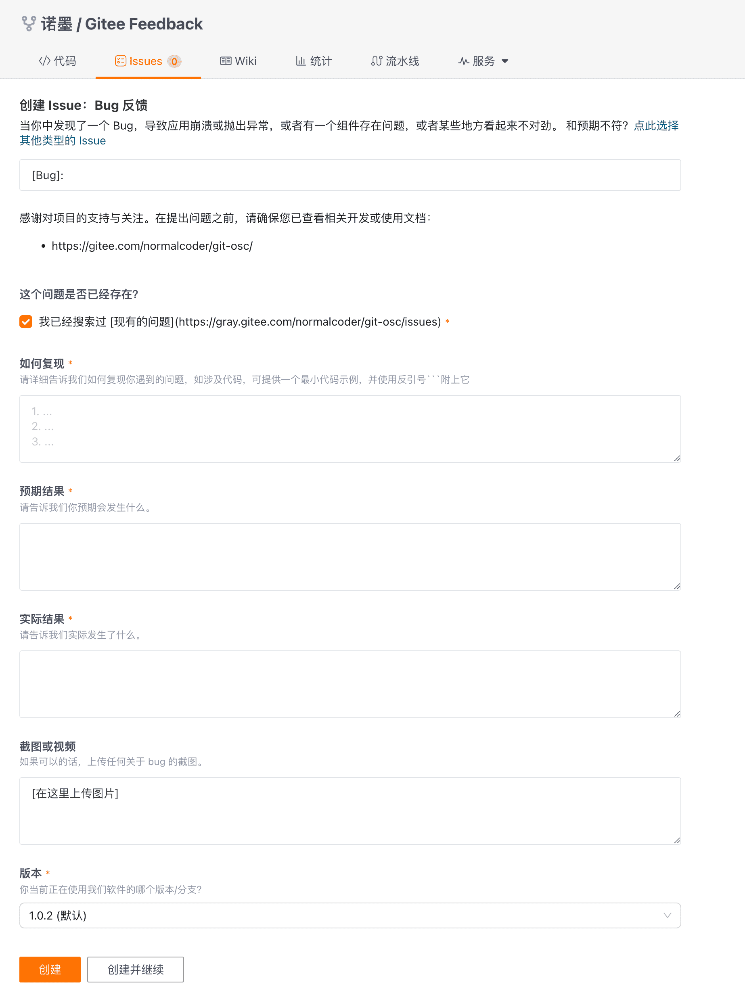

Gitee 为 Issue 提供了模板能力支持，支持仓库通过模板配置预设不同内容的 Issue 模板，以提升改进用户提出特性建议、反馈问题的互动体验。

## 目录和配置结构

:::tip Gitee Issue 模板支持 `使用 Markdown 编写` 或 `使用表单填写` 两种形式

- `使用 Markdown 编写`：传统的 Issue 模板，由若干 `.md` 文件组成。支持标题和使用 Markdown 编写的 Issue 正文。
- `使用表单填写`：基于表单交互的 Issue 模板，由若干 `yaml` 模板和 `config.yml` 文件 (可选) 组成，支持默认指派用户/自动关联标签（label），支持自定义表单类型（输入/下拉/单选/多选/代码块等），并设置表单项是否必填。
:::

Gitee Issue 模板配置存储于仓库的**默认分支**下 `.gitee/ISSUE_TEMPLATE` 隐藏目录中。

以下是一个完整 Issue 模板配置和对应的目录结构参考：

```bash showLineNumbers
➜ git:(master) tree -L 2 .
.
├── .gitee  # 兼容 .github 目录（优先选择 .gitee 目录）
│   ├── ISSUE_TEMPLATE    # Issue 模板配置目录
│   │   ├── feature.yml   # 适用于 Feature 建议的 Issue 表单模板
│   │   ├── bug.yml       # 适用于 Bug 反馈的 Issue 表单模板
│   │   └── config.yaml   # 模板选择器配置
│   └── issue_template.md # Issue 空白模板（可选）
├── LICENSE
├── ...
└── README.md

7 directories, 20 files
```

:::caution 注意
如果你在另一个分支中创建模板，配置将不会生效，相关的功能协作用户将无法使用该功能。
:::

Issue 模板文件名不区分大小写，文件以 `.md` / `.yml` / `.yaml` 扩展名结尾，其中：

- `.md` 文件用于普通（传统）的 Issue 模板和 Issue 空白模板使用。
- `.yml` / `.yaml` 文件用于 Issue 模板中自动指派功能和表单项配置使用。

:::tip 一个结构完整的 Issue 模板配置，需满足以下条件：

- 当使用 Markdown 定义时：<br />`.md` 文件头部使用 YAML 前置块（`front matter`）来定义 Markdown 元数据，并且包含有效 `name:` 和 `about:` 键。
- 当使用 YAML 定义时：<br />YAML 配置需包含有效的 `name:` 和 `description:` 键。

:::

当使用 YAML 格式的 Gitee Issue 模板功能时，相关配置由以下两部分组成：

- **模板选择器**：文件名为 `config.yml`，用于自定义用户在仓库新建 Issue 时看到的模板选择器。
- **Issue 模板表单配置**：YAML 配置文件，结合 [Gitee 表单范式 (Gitee’s Form Schema)](../syntax-for-gitees-form-schema.mdx) 配置定义 Issue 正文，用于定义具体 Issue 的表单内容。

## 模板选择器配置（`config.yml`）

通过在默认分支 `.gitee/ISSUE_TEMPLATE` 目录添加 `config.yml` 文件，可以自定义扩充 Issue 模板列表的内容。

以下是使用 `config.yml` 自定义 Issue 模板列表选择项的示例：

import Tabs from "@theme/Tabs";
import TabItem from "@theme/TabItem";

<Tabs>
  <TabItem value="config-yaml" label="Config.yml 配置文件" default>

```yaml showLineNumbers
blank_issues_enabled: false
contact_links:
  - name: Gitee 帮助中心
    url: https://help.gitee.ru/
    about: 提供 Git 使用指南、教程、gitee.ru 平台基本功能使用、介绍和常见问题解答
```

  </TabItem>

  <TabItem value="config-yaml-preview" label="效果预览">



  </TabItem>
</Tabs>

具体字段释义如下：

- `blank_issues_enabled`：你可通过将 `blank_issues_enabled` 设置为 `false` 来鼓励用户使用 Issue 模板（不允许用户创建空白 Issue）。如果你将 `blank_issues_enabled` 设置为 `true`，则用户可以选择打开并创建一个空白的 Issue。
- `contact_links`：如果你希望在 Gitee 之外接收某些报告，或引导用户浏览相关文档，可使用 `contact_links` 将用户引导到外部网站。
  - `name`：外部网站名称
  - `url`：跳转的外部网站目标地址
  - `about`：跳转外部网站的描述说明

在仓库默认分支页面，选择「文件」->「新建文件」，新建文件位置输入 `.gitee/ISSUE_TEMPLATE/config.yaml`，填写具体的模板选择器配置，保存提交到仓库以完成模板选择器配置。





## Issue 模板配置字段

模板配置支持预设默认指派的用户和标签 (label)，支持自定义表单类型（输入/下拉/单选/多选/代码块等），并设置表单项是否必填。以下是 Issue 模板配置的示例：

```yaml showLineNumbers
name: 功能建议
description: 对本项目提出一个功能建议
title: "[功能建议]: "
labels: ["enhancement"]
assignees:
  - gitee
body:
    ...
```

具体字段释义如下：

- `name`：模板名称，必填项，用于定义模板的名称
- `description`：模板描述，必填项，用于解释模板的用途
- `title`：可选项，预设填充的 Issue 标题前缀。
- `labels`：可选项，预设指定关联的标签（label），使用逗号分隔。在 Issue 创建同时为 Issue 关联指定的标签（label）仅针对仓库下存在的标签有效。当指定的 label 不存在时，默认忽略。
- `assignees`：可选项，预设被指派用户的用户名，使用列表或使用逗号分隔。在 Issue 创建同时将 Issue 指派给具体用户。被指派用户必须存在于仓库名单，当被指派的用户不在仓库成员名单内，默认忽略。
- `body`：必填列表项，Issue 模板表单配置，使用 [Gitee 表单范式 (Gitee’s Form Schema)](../syntax-for-gitees-form-schema.mdx) 进行定义。

## 空白 Issue 模板

空白 Issue 模板是一个特定的模板文件，文件路径为 `.gitee/issue_template.md`，内容为 Markdown 格式内容。

:::caution 注意
如果使用在 `.gitee` 文件夹中手动创建 `issue_template.md` 文件，并在 `config.yml` 文件中启用空白 Issue，则当用户选择打开空白 Issue 时，将使用 `issue_template.md` 中的模板。如果你禁用空白 Issue，将永远不会使用模板。
:::

## 模板功能兼容说明

`Gitee Issue 模板` 兼容 `GitHub Issue Template`，同时兼容以下目录的识别（识别优先顺序从上到下）：

- 当前仓库默认分支上的 `.gitee/ISSUE_TEMPLATE` 目录
- 当前仓库默认分支上的 `.github/ISSUE_TEMPLATE` 目录
- 与仓库同一空间下的 `.gitee` 仓库
  - 默认分支上的 `.gitee/ISSUE_TEMPLATE` 目录
  - 默认分支上的 `.github/ISSUE_TEMPLATE` 目录

## Issue 模板参考样例

以下是常见的 Issue 表单模板推荐样例：

<Tabs>
  <TabItem value="enhancement-feature" label="功能建议" default>

```yaml showLineNumbers
name: 功能建议
description: 对本项目提出一个功能建议
title: "[功能建议]: "
labels: ["enhancement"]
body:
  - type: markdown
    attributes:
      value: |
        感谢提出功能建议，我们将仔细考虑！
  - type: textarea
    id: related-problem
    attributes:
      label: 你的功能建议是否和某个问题相关？
      description: 清晰并简洁地描述问题是什么，例如，当我...时，我总是感到困扰。
    validations:
      required: false
  - type: textarea
    id: desired-solution
    attributes:
      label: 你希望看到什么解决方案？
      description: 清晰并简洁地描述你希望发生的事情。
    validations:
      required: true
  - type: textarea
    id: alternatives
    attributes:
      label: 你考虑过哪些替代方案？
      description: 清晰并简洁地描述你考虑过的任何替代解决方案或功能。
    validations:
      required: false
  - type: textarea
    id: additional-context
    attributes:
      label: 你有其他上下文或截图吗？
      description: 在此处添加有关功能请求的任何其他上下文或截图。
    validations:
      required: false
  - type: checkboxes
    attributes:
      label: 意向参与贡献
      options:
        - label: 我有意向参与具体功能的开发实现并将代码贡献回到上游社区
          required: false
```

  </TabItem>

  <TabItem value="enhancement-feature-preview" label="功能建议（预览）">



  </TabItem>

  <TabItem value="bug-report" label="反馈 Bug">

```yaml showLineNumbers
name: Bug 反馈
description: 当你在代码中发现了一个 Bug，导致应用崩溃或抛出异常，或者有一个组件存在问题，或者某些地方看起来不对劲。
title: "[Bug]: "
labels: ["bug"]
body:
  - type: markdown
    attributes:
      value: |
        感谢对项目的支持与关注。在提出问题之前，请确保你已查看相关开发或使用文档：
        - https://...
  - type: checkboxes
    attributes:
      label: 这个问题是否已经存在？
      options:
        - label: 我已经搜索过现有的问题 (https://gitee.ru/../../issues)
          required: true
  - type: textarea
    attributes:
      label: 如何复现
      description: 请详细告诉我们如何复现你遇到的问题，如涉及代码，可提供一个最小代码示例，并使用反引号```附上它
      placeholder: |
        1. ...
        2. ...
        3. ...
    validations:
      required: true
  - type: textarea
    attributes:
      label: 预期结果
      description: 请告诉我们你预期会发生什么。
    validations:
      required: true
  - type: textarea
    attributes:
      label: 实际结果
      description: 请告诉我们实际发生了什么。
    validations:
      required: true
  - type: textarea
    attributes:
      label: 截图或视频
      description: 如果可以的话，上传任何关于 bug 的截图。
      value: |
        [在这里上传图片]
  - type: dropdown
    id: version
    attributes:
      label: 版本
      description: 你当前正在使用我们软件的哪个版本/分支？
      options:
        - 1.0.2 (默认)
        - 1.0.3 (最新)
    validations:
      required: true
```

预览效果如下：

  </TabItem>

  <TabItem value="bug-report-preview" label="反馈 Bug（预览）">



  </TabItem>
</Tabs>
