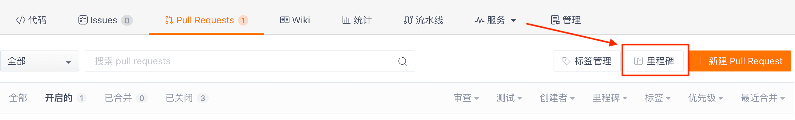
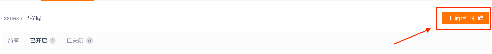
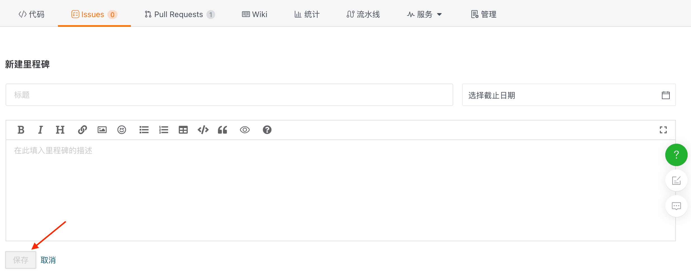
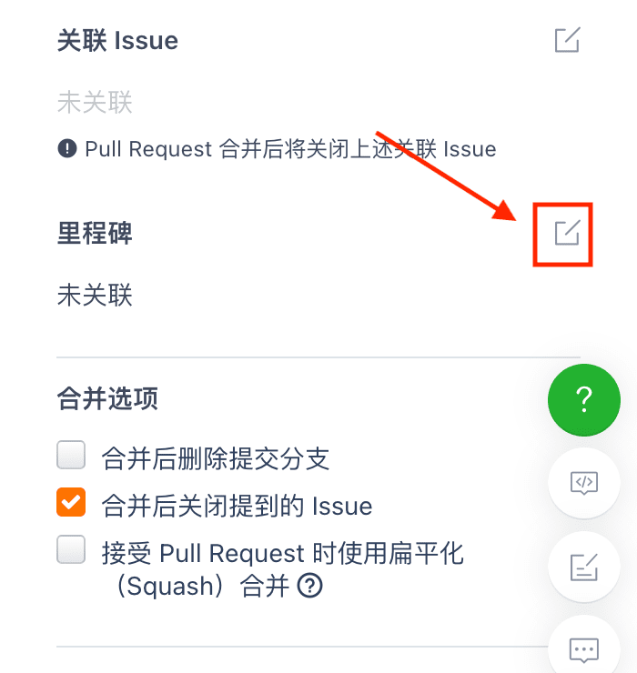

> Контрольные точки - это инструмент планирования проекта, используемый для централизованного управления ходом решения проблем и запросов на слияние.

Во время планирования проекта можно разработать небольшие контрольные точки для различных задач, отметив желаемый срок завершения для каждой задачи. Старайтесь выполнять все задачи на каждой контрольной точке.

## Как добавлять контрольные точки и управлять контрольными точками в запросах на слияние?

В правом верхнем углу страницы запроса на слияние и страницы задач репозитория можно легко найти кнопку "Контрольные точки". Нажав на нее, вы перейдете на страницу управления контрольными точками репозитория.

Здесь вы можете найти все контрольные точки этого репозитория. Для создания новой контрольной точки нажмите на кнопку "Создать контрольную точку" в правом верхнем углу страницы.

На странице новой контрольной точки вы можете добавить "Название", "Срок выполнения" и "Описание" для вашей недавно созданной контрольной точки.

После успешного создания контрольной точки вы можете связать с ней запрос на слияние, который вы создаете или которым управляете в этом репозитории.

