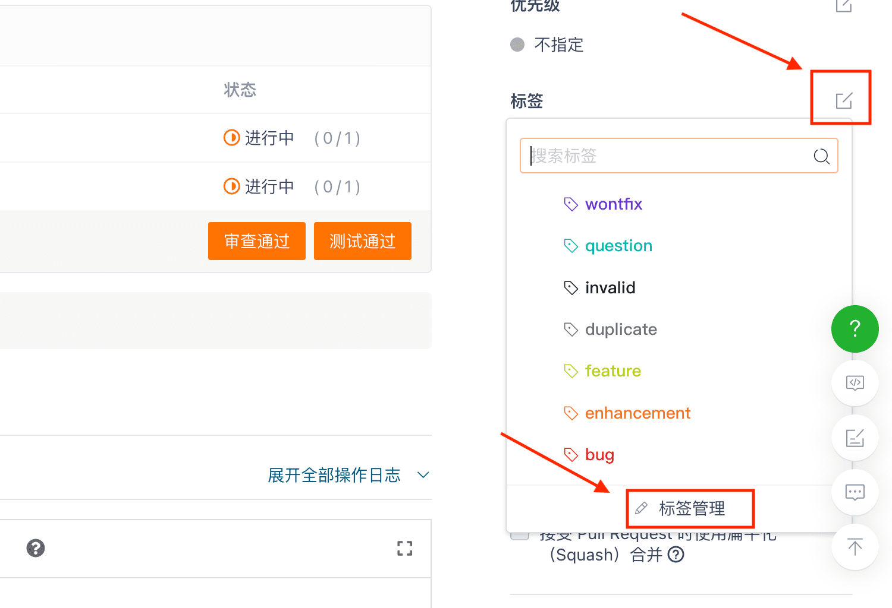

## Как добавлять теги и управлять тегами для запросов на слияние?

Создатели запросов на слияние и менеджеры целевых репозиториев могут добавлять метки к запросам на слияние.

1. Создатель запроса на слияние может добавить существующие метки в запроса на слияние, щелкнув значок редактирования рядом с функцией метки в правой части новой страницы запроса на слияние.

2. Менеджер целевого репозитория запроса на слияние может найти функцию тегов в правой части страницы сведений о запросе на слияние, щелкнуть значок редактирования рядом с ним и выбрать существующие теги репозитория для добавления в запрос на слияние.

Согласно подсказке на рисунке выше, менеджер репозитория может нажать кнопку "Управление тегами" в раскрывающейся панели ярлыка, чтобы перейти на страницу Управления тегами и развернуть все теги репозитория. В качестве альтернативы вы можете найти и нажать кнопку "Управление тегами" на странице запроса на извлечение репозитория.

Менеджеры репозиториев могут "редактировать" и "удалять" существующие теги, а также выполнять операции "создать теги" и "импортировать теги", где импорт тегов позволяет менеджеру импортировать в текущий репозиторий теги из других репозиториев, которыми они управляют.

Управление тегами 

Вы можете создавать и редактировать теги, включая `название`, `описание` и `цветовой код`.

