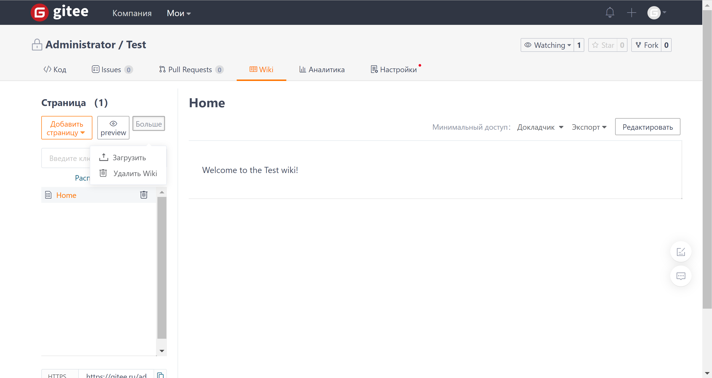
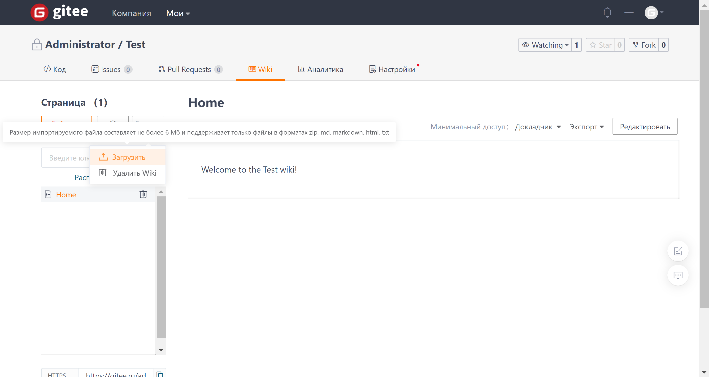

## Document Import/Export

### Document Import

Click the 'More' button on the left side of the Wiki page, select 'Upload' from the dropdown menu, and upload a zip/html/txt/markdown file to import the document into the Wiki knowledge base.

Please note the conditions for importing documents into the Wiki knowledge base:

### Document Export

Select and click on the document you want to export, then click the 'Export' button in the upper right corner of the document page to export the document in different formats.

