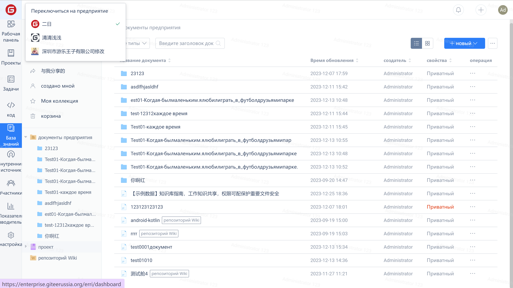

> Gitee Wiki is a knowledge base that allows multiple people to store, share, and collaborate on content, helping teams achieve shared learning.

Gitee Wiki caters to the convenient and efficient needs of team collaboration. It allows users to perform "add/delete/modify/search" operations on the wiki at any time. It supports Markdown format writing and provides functions such as version control, file comparison, hierarchical expansion, and quick search, assisting teams in knowledge accumulation and management.

In the repository main page, you can easily find the wiki module page for repository wiki management.

