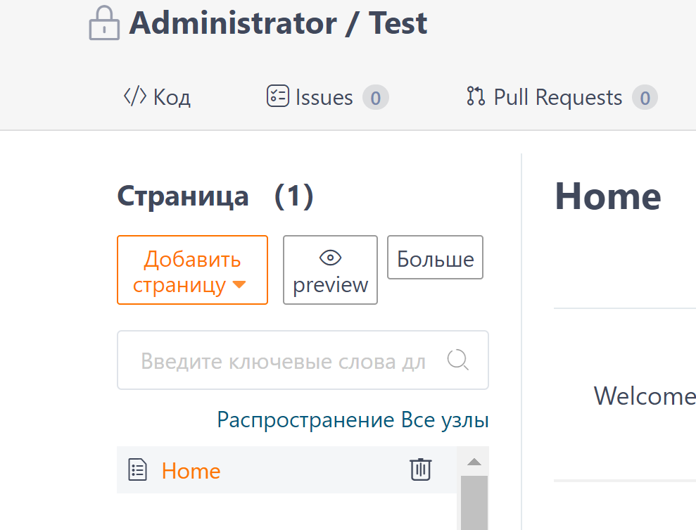
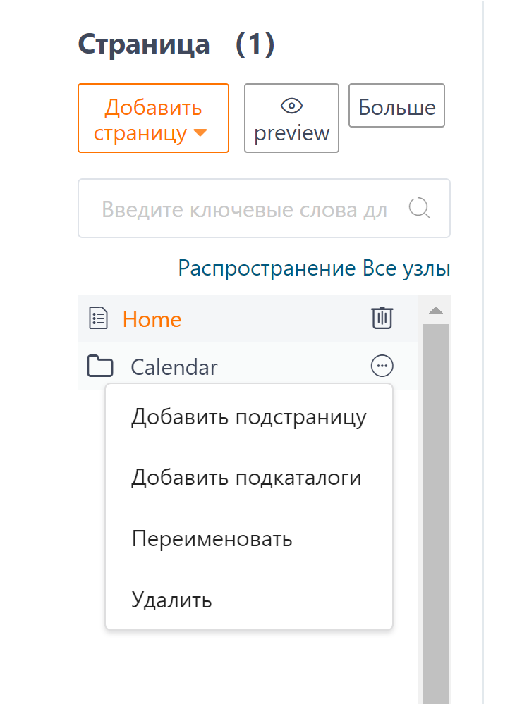
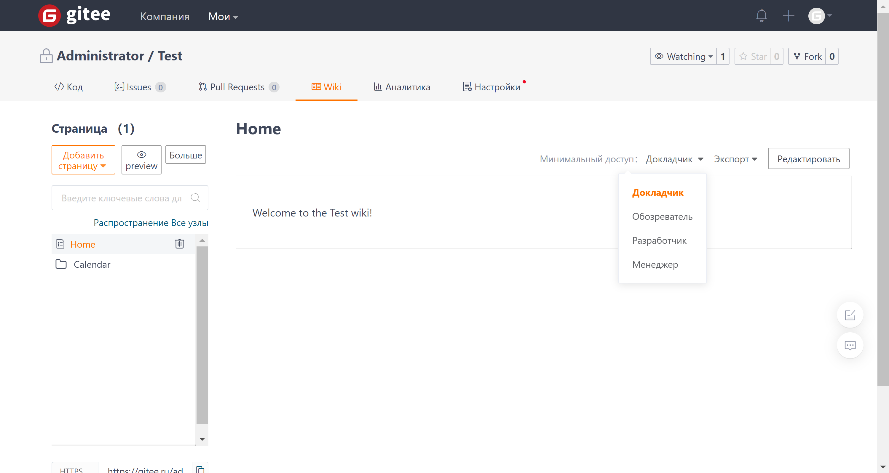

Document Management

### Document/Directory Deletion

#### Document deletion

Click the `trash can` icon button on the right side of the document to delete the document.

#### Directory deletion

Click on the 'three dots' icon next to the directory, and select 'Delete' from the dropdown menu to delete the directory.

### Document/Directory Renaming

#### Document Rename

In the document editing page, you can rename the document.

Rename Directory

Click on the 'three dots' icon on the directory's right side, and select 'Rename' from the dropdown menu to rename the directory.

### Document Migration

Long press and drag the document to place it in the target directory.

Document Access Control Management

Click the 'Select Permissions' button on the document page on the right side, and you can select the minimum access permission for the document in the dropdown.
