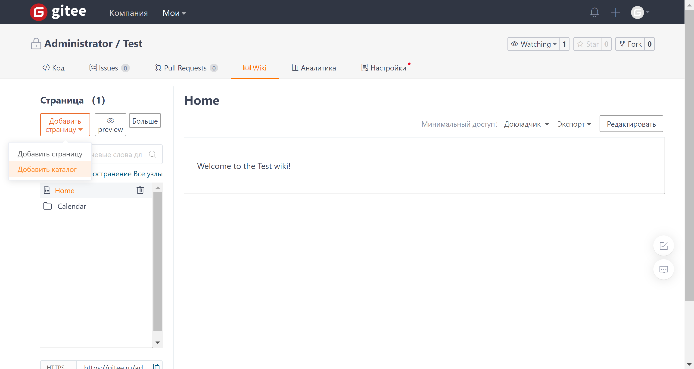
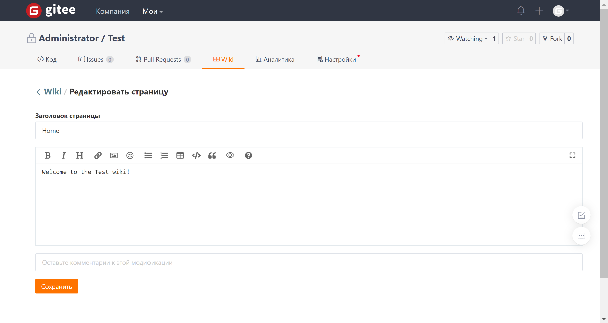
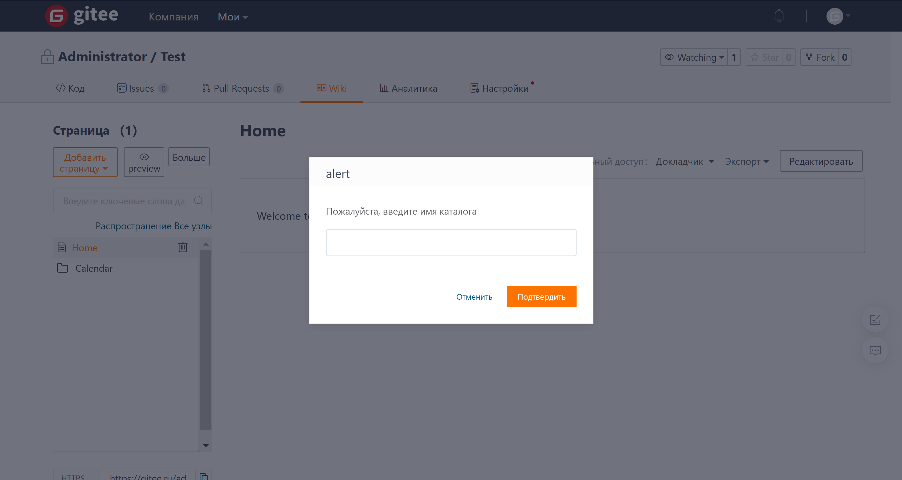
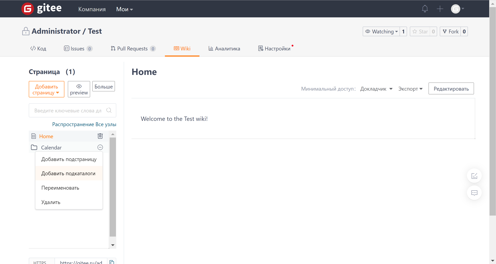

Создать новую страницу или директорию

После входа на wiki-страницу репозитория нажмите кнопку "Добавить страницу" в левом верхнем углу страницы. Чтобы создать новую страницу или  директорию, выберите в выпадающем меню "Добавить страницу" или "Добавить директорию".

### Добавление страницы

Добавьте наименование и контент страницы, затем нажмите "Сохранить" для завершения создания страницы

### Добавление директории

Добавьте наименование директории, затем нажмите "Сохранить" для завершения создания директории.

В существующей директории в Wiki вы можете нажать на значок "три точки" справа от названия директории, чтобы продолжить добавление подстраницы или директории.

