---
title: Модуль бессерверных приложений SAE для AlibabaCloud
---

Бессерверный Модуль приложений SAE (Serverless App Engine) - это полностью управляемая платформа с преобразованием зеро-кода, простая в использовании и адаптивно-гибкая для приложений. SAE позволяет развертывать онлайн-приложения (такие как веб/микросервисы/рабочие задания) за считанные секунды из исходного кода /пакетов кода/образов Docker без операций IaaS и K8s и автоматически масштабировать экземпляры в зависимости от использования для выставления счетов. Поставляется с такими возможностями, как ведение журналов, мониторинг и балансировка нагрузки "из коробки".

## Основные преимущества

| Функционал | Основные преимущества |
| --- | ------ |
| Упрощенный опыт | <ul><li>Развертывание с нулевыми изменениями, отсутствие затрат на обучение, мгновенное создание и публикация приложений</li>
| Открытые стандарты | <ul><li>Сборка на основе контейнерных стандартов, основные возможности программного обеспечения с открытым исходным кодом, отсутствие привязки к поставщику</li> <li>Rich platform engineering capabilities, helping to improve development and operation efficiency
| Чрезвычайная гибкость | <ul><li>Гибкое масштабирование на миллисекундном уровне, адаптирующее количество экземпляров приложения в зависимости от трафика</li> <li>Эффективный "холодный" запуск приложений, поддержка масштабирования до 0</li></ul> |

## Примеры использования

| Сценарий | Функционал |
|:---:|:------:|
| Универсальный хостинг веб-приложений | Сравним с Google  Run, обеспечивает универсальное и быстрое развертывание веб-приложений в облаке:   В том числе не требует обслуживания IaaS, предусмотрены автоматическое гибкое масштабирование, готовый брандмауэр веб-приложений, глобальное ускорение CDN, постоянное хранилище с операционными системами, управление журналами, балансировка нагрузки, база данных RDS и другие возможности, подходящие для личных блогов /форумов, корпоративных веб-сайтов, приложений для развертывания на нескольких сайтах, фоновой работы потоки, запланированные задачи и т.д. |
| Хостинг микросервисных приложений | Просто итерируйте каждое микросервисное приложение на основе спецификаций разработки Spring /Dubbo, а Alibaba  SAE предоставит базовое планирование ресурсов, развертывание, серый релиз, управление микросервисами, а также возможности мониторинга и диагностики. |
| Сценарий внезапных всплесков трафика | В новых отраслях розничной торговли/электронной коммерции, онлайн-образования, развлечений и других отраслях часто наблюдаются неожиданные всплески трафика. SAE предлагает набор высокодоступных решений для решения этой проблемы, включая точную пропускную способность, исключительную гибкость, а также управление потоками и замедление. |

## Руководство для начала работы

> Подготовка: Зарегистрируйтесь и войдите в учетную запись Alibaba .

1. Перейдите на домашнюю страницу продукта SAE (https://www.aliyun.com/product/sae).
2. Нажмите `Бесплатная Активация`.

    
    
3. Нажмите "Получить пакет и открыть Оплату по факту" и следуйте инструкциям по оплате (этот пакет является бесплатным пробным пакета, поэтому оплата не требуется).

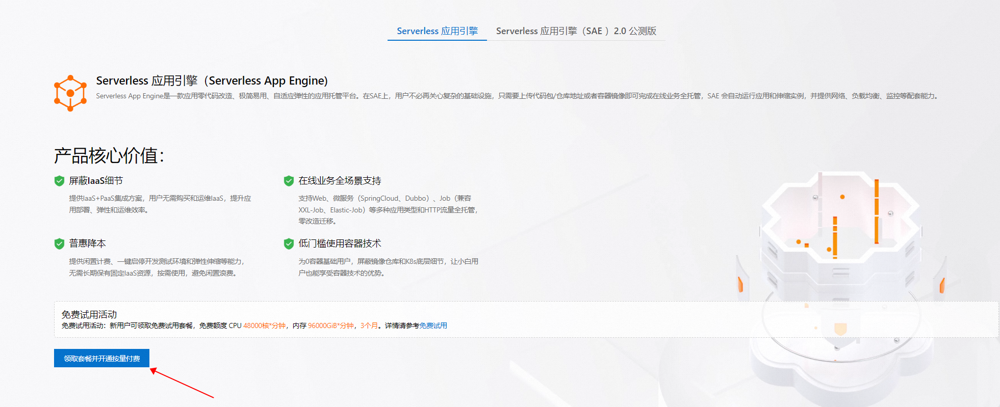
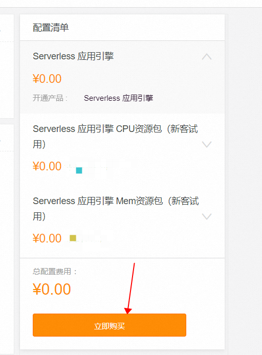
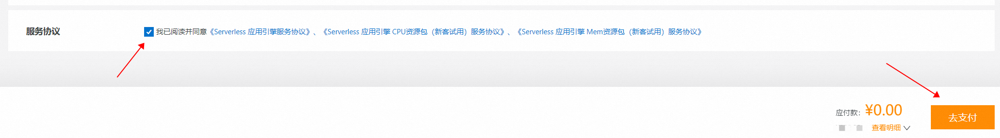
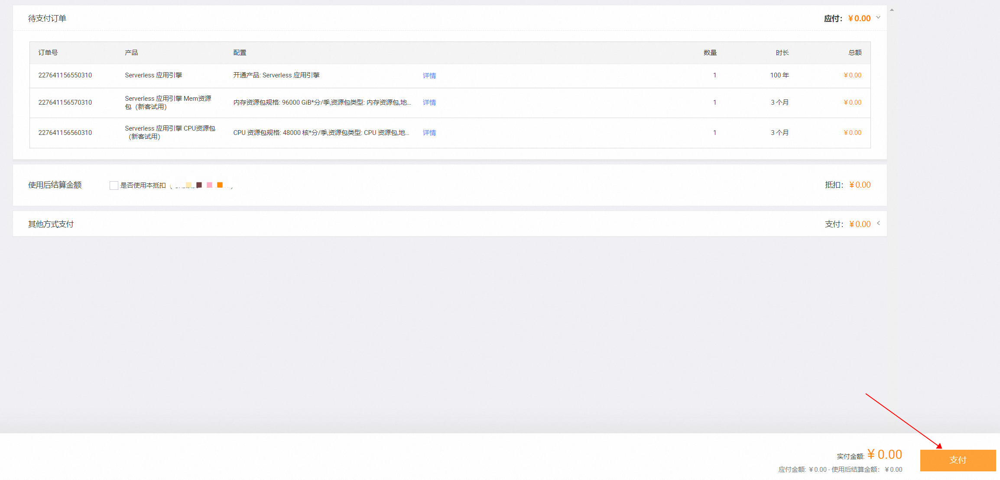

4. Нажмиет на `Консоль управления`

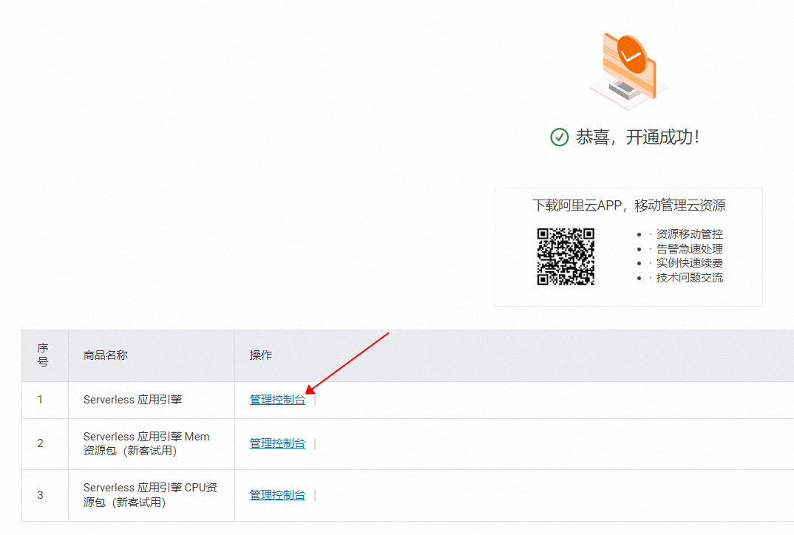

5. Нажмите "Попробовать", чтобы войти в SAE 2.0.

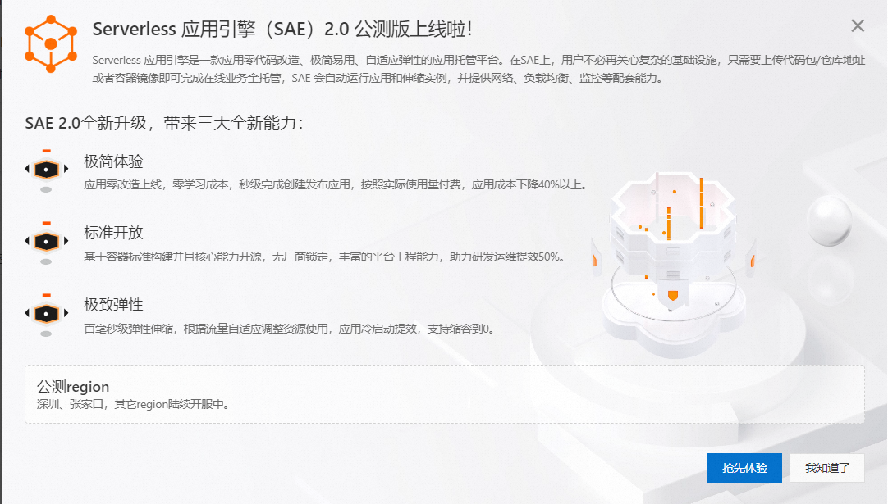

6. 6. Во всплывающем диалоговом окне "Добро пожаловать в Модуль бессерверных приложений SAE" нажмите "Подтвердить создание".

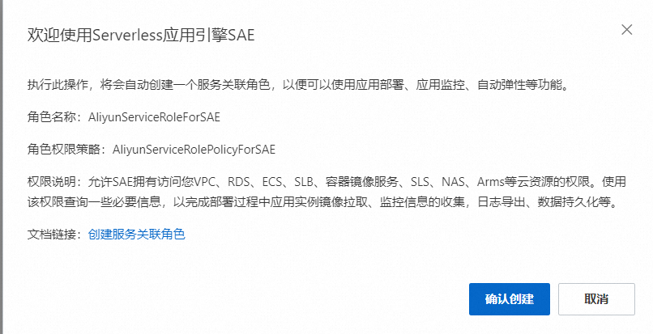

## Руководство по развертыванию приложений

1. Войдите в консоль SAE (https://sae.console.aliyun.com/#/Overview?regionId=cn-zhangjiakou), нажмите на "Управление приложениями" - "Список приложений" и выберите регион "Северный Китай 3 (Чжанцзякоу)" или "Южный Китай 1 (Шэньчжэнь)". (Если вы уже находитесь в консоли SAE 2.0, переходите к шагу 3)

    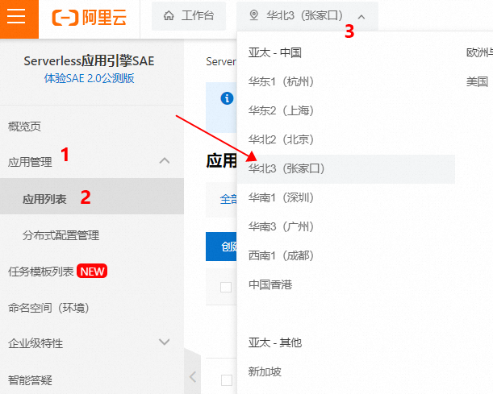

2. Нажмите `Experience SAE 2.0 Beta` для входа в консоль SAE2.0

    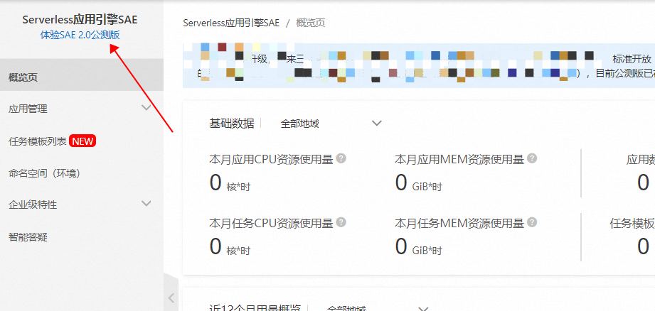

3. Нажмите 'Управление приложениями' - 'Создать приложение'

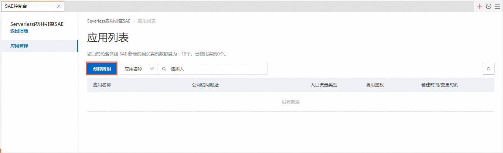

4. Настройте соответствующую информацию на странице 'Создать приложение'. Выберите "Непрерывное развертывание из хранилища исходного кода" и нажмите "Настроить непрерывное развертывание".

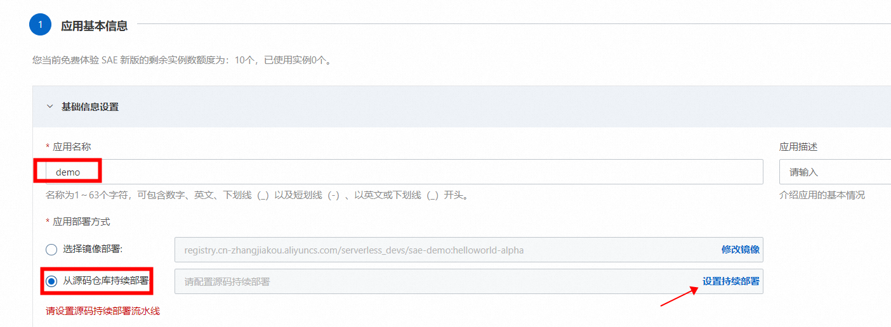

5. В разделе "Основные информационные настройки" введите задаваемое пользователем "Имя приложения" и "Описание приложения", выберите "Непрерывное развертывание из репозитория исходного кода" для поля "Метод развертывания приложения", а затем нажмите "Установить непрерывное развертывание". На панели "Настроить непрерывное развертывание" настройте соответствующую информацию, а затем нажмите "ОК". (В этом примере используется игровое приложение на Gitee).

  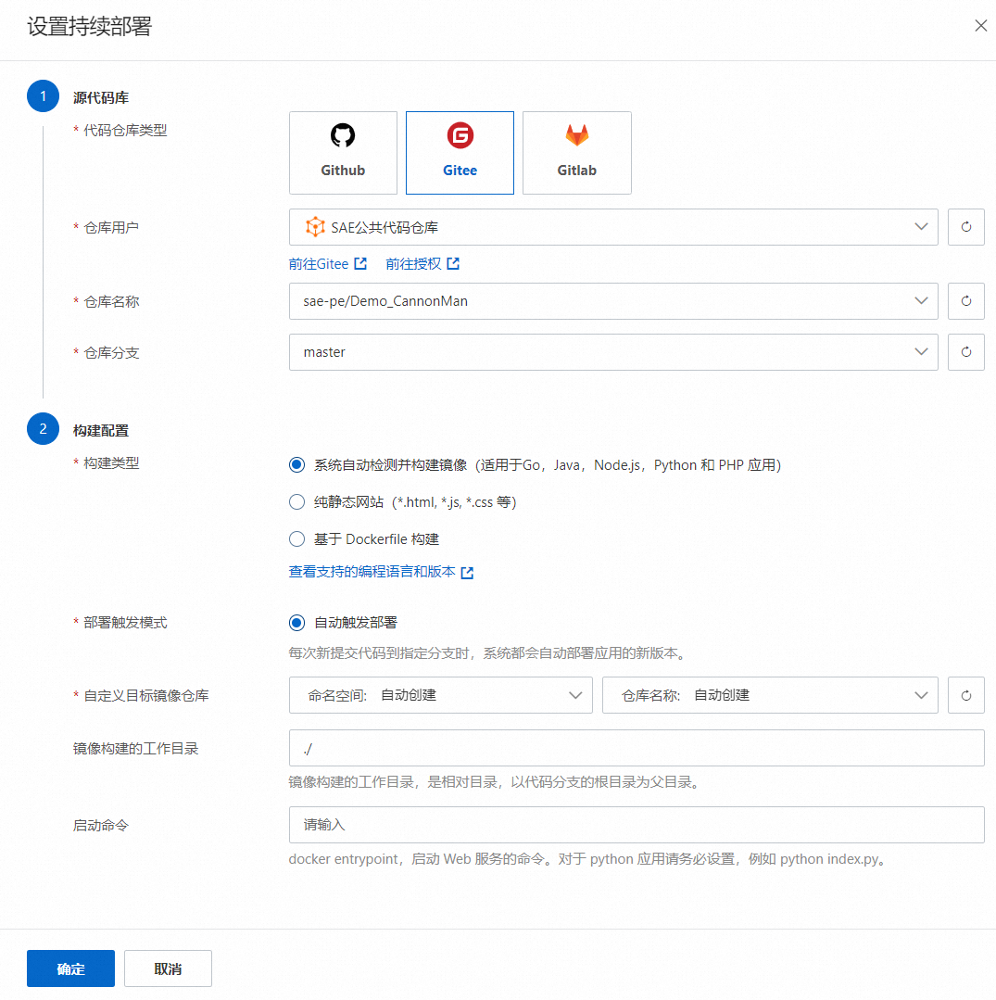

6. Настройте соответствующую информацию в области "Полное управление HTTP-трафиком".

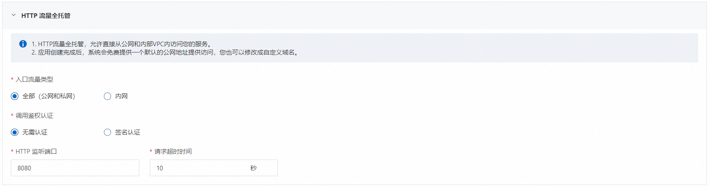

7. В разделе "Настройки емкости" настройте соответствующую информацию, а затем нажмите 'Пропустить дополнительные настройки, Создать приложение'.

> После настройки этого зеркала, когда вы будете отправлять код в репозиторий Gitee, Gitee будет автоматически синхронизировать репозиторий с GitHub.

8. После создания приложения оно будет перенаправлено на страницу "Основная информация". На этой странице вы сможете просматривать данные измерений, гибкий мониторинг приложений, информацию о приложениях, редактировать параметры доступа к трафику и другую информацию.

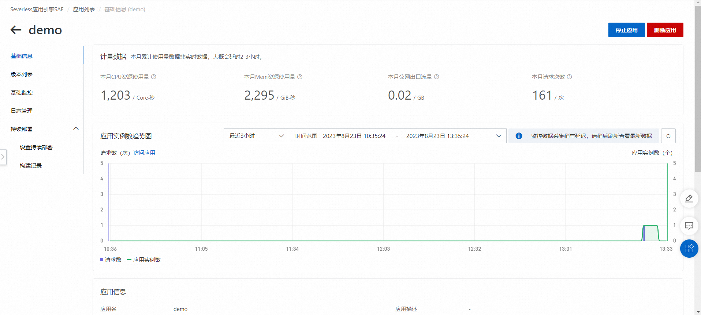

9. На странице "Основная информация" в разделе "Полностью управляемый HTTP-трафик" нажмите "Адрес общего доступа", чтобы получить доступ к нему.

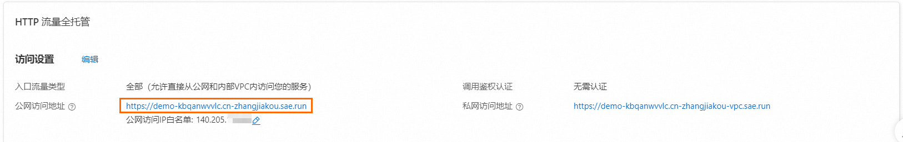

> При первом посещении SAE автоматически добавит ваш общедоступный IP-адрес в белый список. Если в дальнейшем получить доступ не удастся, обновите белый список IP-адресов.