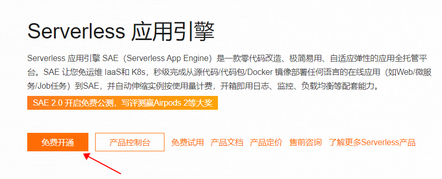

Serverless Application Engine SAE (Serverless App Engine) is a zero-code transformation, easy-to-use, and adaptive elastic application fully managed platform. SAE allows you to deploy online applications (such as Web/Microservices/Job tasks) in seconds from source code/code packages/Docker images without IaaS and K8s operations and automatically scales instances based on usage for billing. It comes with capabilities such as logs, monitoring, and load balancing out of the box.

## Core Advantages

| Features | Core Advantages |
| --- | ------ |
| Simplified experience | <ul><li>Zero modification deployment, zero learning cost, instantly create & publish applications</li>
| Open Standards | <ul><li>Build based on container standards, core capabilities open source, no vendor lock-in</li> <li>Rich platform engineering capabilities, helping to improve development and operation efficiency
| Extreme elasticity | <ul><li>Millisecond-level elastic scaling, adapting the number of application instances based on traffic</li> <li>Efficient cold start of applications, supports scaling down to 0</li></ul> |

## Use Cases

| Scenario | Features |
|:---:|:------:|
| Web application one-stop hosting | Comparable to Google CloudRun, providing a one-stop fast experience for web application deployment in the cloud:   Including maintenance-free IaaS, automatic elastic scaling, out-of-the-box web application firewall, CDN global acceleration, persistent storage with OSS, log management, load balancing, RDS database, and other capabilities, suitable for personal blogs/forums, corporate websites, multi-site deployment applications, background threads, scheduled tasks, etc. |
| Microservice Application Hosting | Just iterate each microservice application based on the Spring Cloud/Dubbo development specifications, and Alibaba Cloud SAE provides underlying resource scheduling, deployment, gray release, microservice governance, and monitoring and diagnostic capabilities. |
| Sudden Traffic Scenario | New retail/e-commerce, online education, entertainment and other industries often have unexpected spikes in traffic. SAE provides a set of highly available productized solutions to solve the problem, including precise capacity, extreme elasticity, and flow control and degradation. |

## Getting Started Guide

> Preparations: Register and log in to the Alibaba Cloud account.

1. Go to SAE product homepage (https://www.aliyun.com/product/sae).
2. Click on `Free Activation`.

    
    
3. Click on `Get Package and Open Pay-as-You-Go` and follow the prompts to pay (this package is a free trial package and no payment is required).

4. Click on `Management Console`

5. Click `Experience in Advance` to enter SAE 2.0.

6. In the pop-up dialog 'Welcome to Serverless Application Engine SAE', click on 'Confirm Creation'.

## Application deployment guide

1. Log in to the SAE console (https://sae.console.aliyun.com/#/Overview?regionId=cn-zhangjiakou), click on 'Application Management' - 'Application List', and select 'North China 3 (Zhangjiakou)' or 'South China 1 (Shenzhen)' region. (If you are already in the SAE 2.0 console, you can skip to step 3)

    

2. Click `Experience SAE 2.0 Beta` to enter the SAE2.0 console

    

3. Click 'Application Management' - 'Create Application'

4. On the 'Create Application' page, configure the relevant information. Select 'Continuous Deployment from Source Code Repository' and click on 'Set up Continuous Deployment'.

5. In the 'Basic Information Settings' section, enter a custom 'Application Name' and 'Application Description', select 'Continuous Deployment from Source Code Repository' for 'Application Deployment Method', and then click 'Set Continuous Deployment'. In the 'Set Continuous Deployment' panel, configure the relevant information, and then click 'OK'. (This example uses a game application on Gitee).

  

6. Configure the relevant information in the 'HTTP Traffic Fully Managed' area.

7. In the 'Capacity Settings' section, configure the relevant information, and then click 'Skip Advanced Settings, Create Application'.

> After configuring this mirror, when you submit code to the Gitee repository, Gitee will automatically synchronize the repository to GitHub.

8. After the application is created, it will be redirected to the 'Basic Information' page. On this page, you can view measurement data, application elastic monitoring, application information, and edit traffic access settings, and other information.

9. On the 'Basic Information' page, in the 'HTTP Traffic Fully Managed' section, click 'Public Access Address' to access it.

> On first visit, SAE will automatically add your public IP address to the whitelist. If subsequent access fails, please update the IP whitelist.