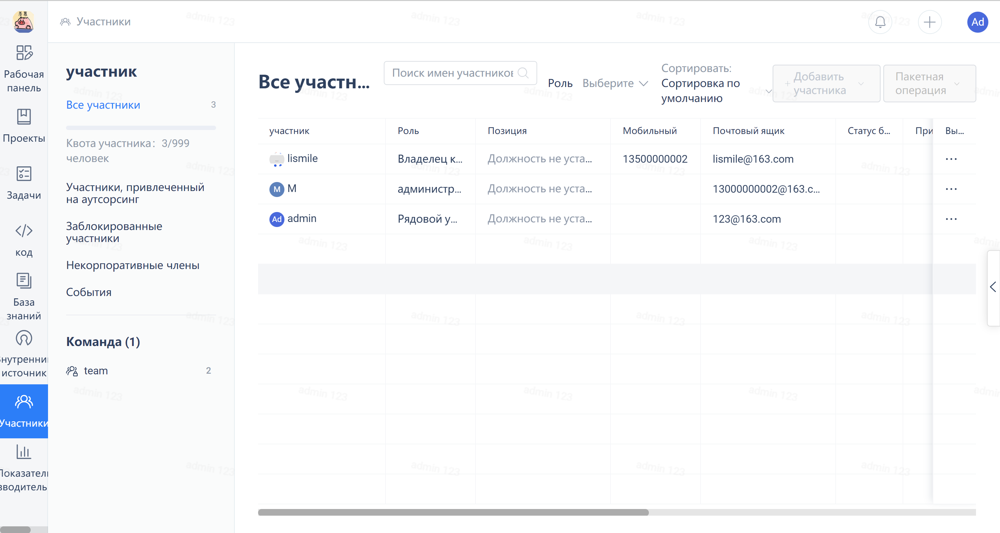
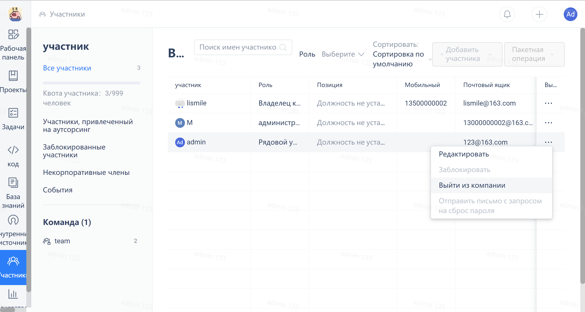

If the number of enterprise members has exceeded the current package's free quota of 5, the enterprise will enter a read-only state. Please upgrade the package to get more quota (by paying) or reduce the number of members to <= 5 to unlock. The detailed operation help is as follows:

### 1. View enterprise members

To enter the enterprise interface, select "Members" to view the current enterprise members.

Buy a package that meets the member quota

For operation details, see: <https://gitee.ru/help/articles/4160>

### 3. Delete enterprise members to meet the current package quota

Use the enterprise administrator user to go to the enterprise member list and remove members who are not needed until the current package standard is met.

