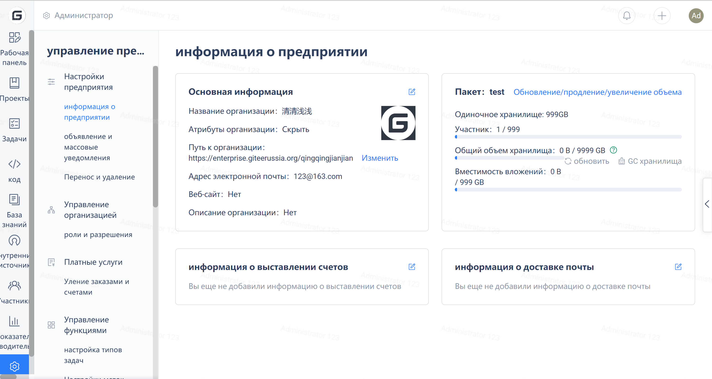
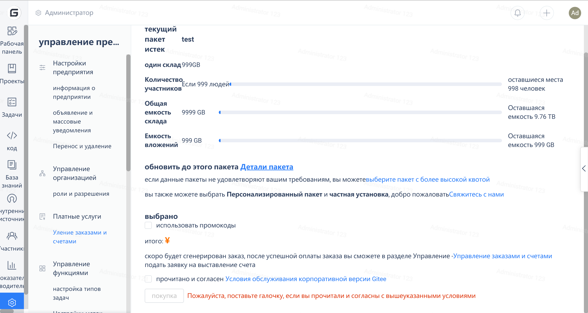

1. Сначала проверьте описание квоты для пакетов персональной/корпоративной версии и объем больших файлов в репозитории. Подробнее см. справочный документ: https://gitee.ru/help/articles/4232
2. Оптимизируйте пространство для хранения с помощью repository GC. Обратитесь к справочной документации: https://gitee.ru/help/articles/4173
3. Если используется корпоративная версия, вы можете проверить квоту пакетов текущей версии и обновить пакет, чтобы увеличить емкость репозитория.
Шаги операции:

- Войдите в учетную запись суперадминистратора предприятия (или другие учетные записи с правами управления предприятием);
- Перейдите в Корпоративное рабочее пространство -> Управление -> Обзор -> Сведения о пакете для проверки.

 - В случае необходимости увеличения емкости отдельного репозитория вы можете обновить пакет

Руководство по эксплуатации пакета обновления:
Панель мониторинга версии Enterprise - нажмите "Развернуть/обновить/возобновить" (Панель версии Enterprise - нажмите "Развернуть/обновить/возобновить")

