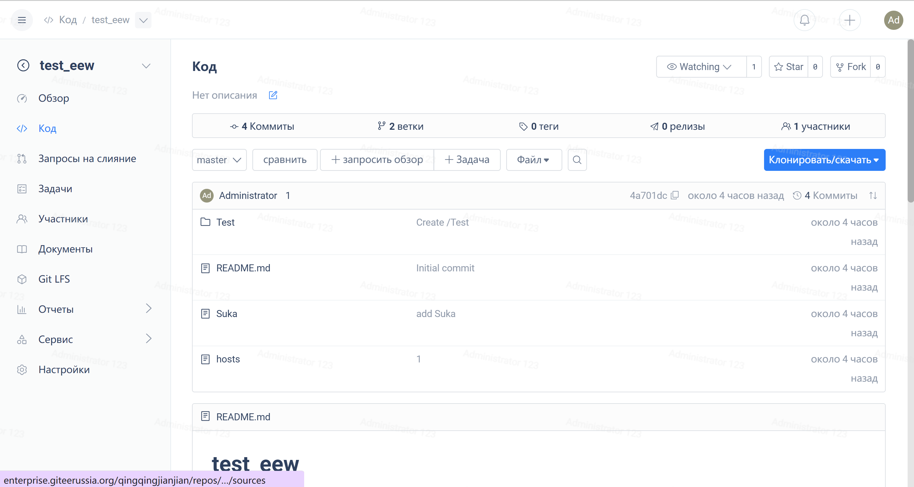
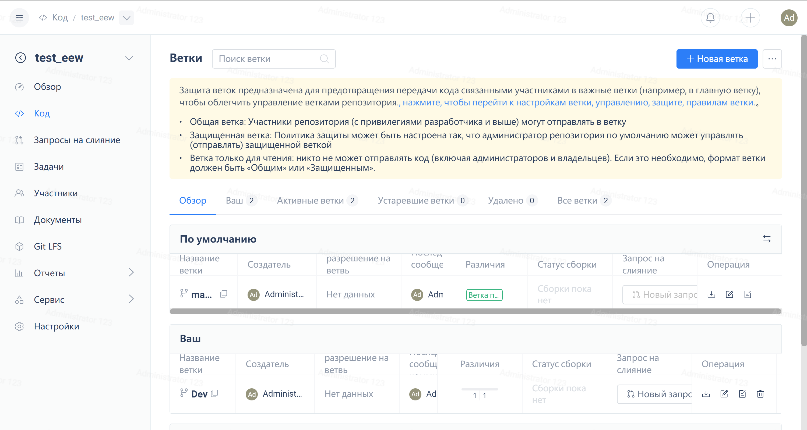

"Protected Branch" is a feature of Gitee for managing code permissions in team collaboration. It is used to protect critical branches from being damaged in order to minimize the loss caused by members' misoperations. After protection, only the repository administrator can modify, merge, and perform other operations on this branch.

To enter the repository, go to Code -> Branch -> Protected Branch to enable branch protection.

