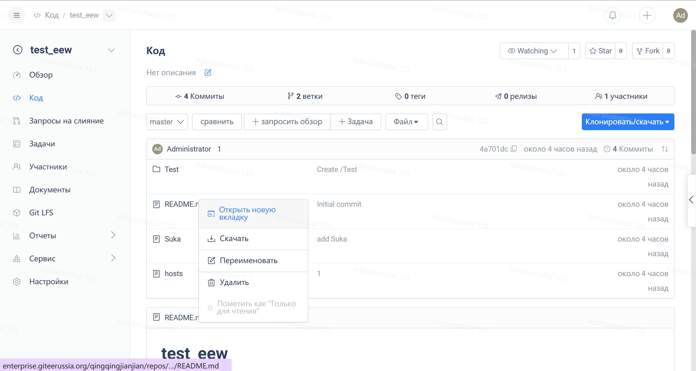
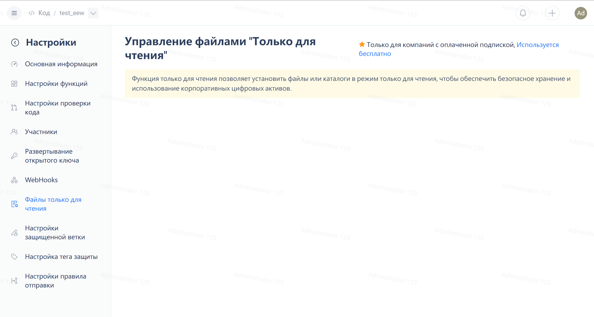

As an application project, there are usually some files to describe the configuration information in the production environment, such as service connection information and environment configuration information. However, during the local development process, these files need to be adjusted according to the local service environment. If these modifications are accidentally committed, it may directly cause the application in the production environment to fail to run properly.

So in SVN, there is a very useful feature that allows configuring certain files as read-only, not allowing modifications to be submitted.

Git itself does not have this feature. Mainstream Git platforms generally provide read-only branch functionality, but cannot implement read-only restrictions on individual files or folders.

The usage method is as follows:

1. Go to the repository page, right-click on the file or folder that you want to set as read-only, select 'Mark as read-only' (only available for repository administrators)

 
2. Enter the repository settings interface to view and manage all read-only settings of the repository.

 
3. If there are modifications to read-only files when pushing code, an error will occur

- Code submission error:

- PR merge error:

4. There are three ways to solve the read-only error.

Change the content of the read-only file back to its original state

> Modify the content of the corresponding read-only file to be consistent with the online version to push normally.

- `git reset --hard <tree-ish> command`

> Use the command `git reset --hard <tree-ish>` to discard modifications to read-only files and then push normally.

Cancel the corresponding file read-only flag (only repository administrators can perform this operation)

> Users with repository management permissions can go to the repository directory or repository settings page to remove the corresponding file's read-only flag.

This feature is currently available to paid Enterprise Edition users.