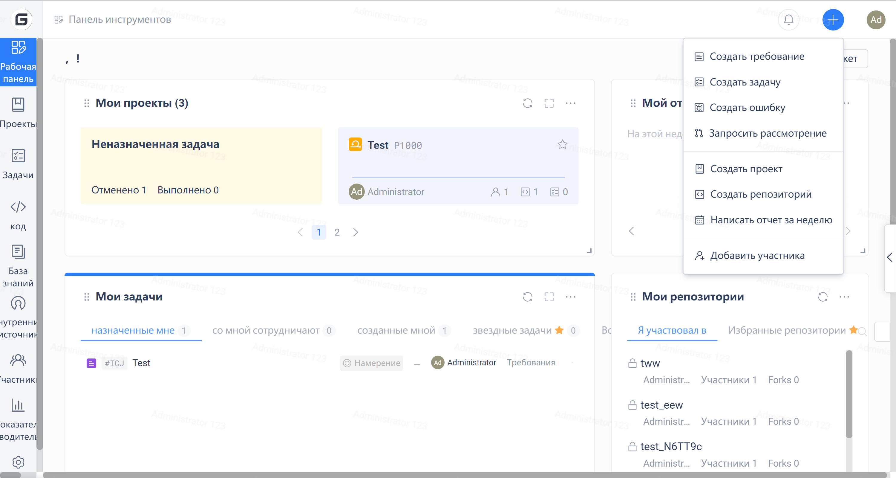

### How to create a release

After completing the registration and successfully logging in to the Gitee account, users can start creating their first repository.

 - 1. Click the "+" button in the upper right corner of the website and select "New Repository" to enter the new repository page.

 - 2. Fill in the repository information on the new repository page. The following are explanations of the relevant concepts of the repository:
    - Repository name: The name of the repository, used for repository naming
 - Ownership: The ownership of the repository, which can be an individual account/organization/enterprise. After creation, the account becomes the default owner (administrator) of the repository.
    - Path: The git access path of the repository, which is composed of the user's personalized address and the repository path name. After creating the repository, users will access the repository through this path.
    - Repository Introduction: A brief introduction to the repository
    - Is it open source: Set whether the repository is a public repository. Public repositories are visible to everyone, while private repositories are only visible to repository members.
    - Select language: The primary programming language used in the repository.
- Add .gitignore: A system-provided file template for ignoring files in git. After setting .gitignore, it will automatically ignore specified directories/files in the repository.
    - Add an open source license: If the repository is public, you can add a license to set the open source agreement for the repository, which serves as a constraint on the current project repository and derivative project repositories. The open source license determines whether the open source project is commercially friendly.
    - Readme: Project repository self-description document, usually contains software description or usage notes.
- Initialize the repository using a template file: Initialize the repository using an Issue or Pull Request file template.

 - 3. Click "Create" to create your first repository on Gitee.