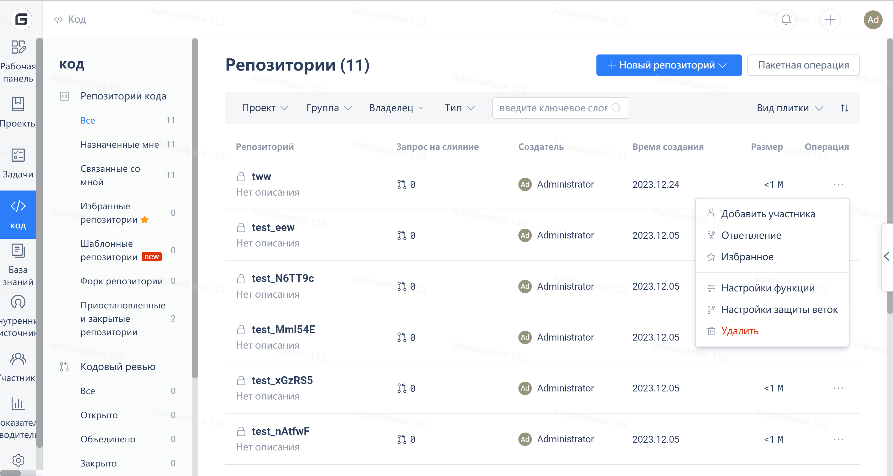

В целях предотвращения пользовательских ошибок при удалении репозитория на Gitee требуется повторная проверка. Пользователи могут перейти к списку репозиториев -> "Оператор с тремя точками" -> "Удалить".

После подтверждения операции от пользователя требуется подтверждение пароля. Как только пароль будет подтвержден, репозиторий может быть удален.

