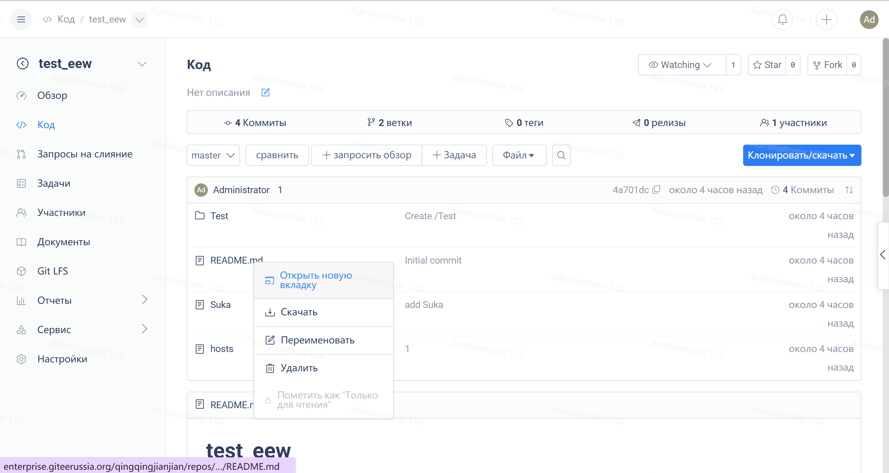
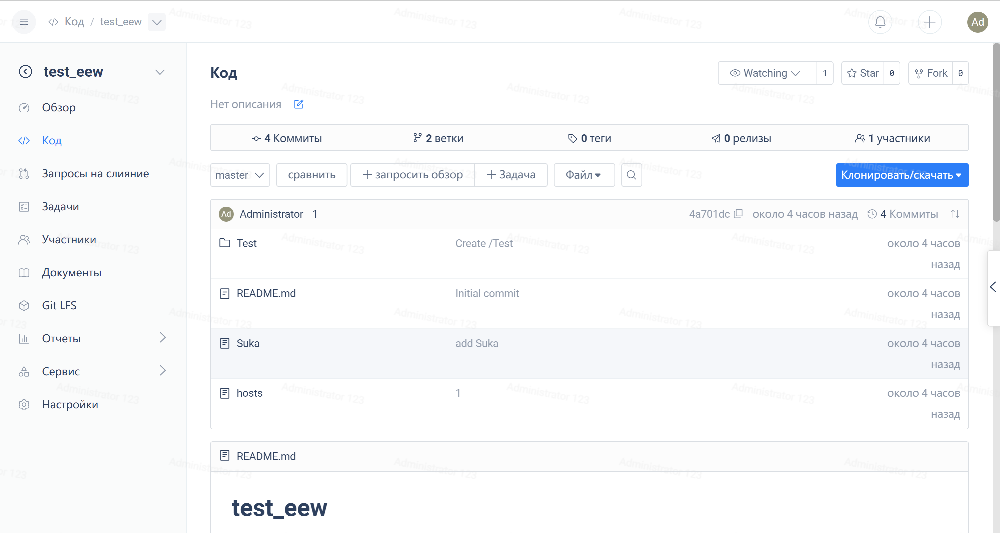

Gitee now provides three types of transfers: transferring a repository to an individual, transferring a repository to an organization, and transferring a repository to an enterprise. Users can perform repository transfers in "Manage" -> "Repository Settings" -> "Transfer Repository".

1. Transfer the repository to other members

> Confirmation from the other party is required via private message to accept the transfer

 - After the transfer is successful, the repository owner becomes the target user, and the permissions of other members remain unchanged. The source repository owner is removed from the repository but defaults to watch the public repository.

2. Transfer the repository to an organization

Repositories can be transferred to organizations created by oneself and joined by oneself

- After the transfer is successful, the owner of the repository becomes the owner of the organization, and other members' permissions remain unchanged.

### **3. Transfer repository to enterprise**

Repositories can be transferred to organizations created by oneself and joined by oneself

> To transfer to another enterprise, you need to first go to the enterprise version of the target enterprise, then go to `Repository Settings` -> `Feature Settings` -> `Transfer Repository`.

 - After successful transfer, the owner of the repository becomes the owner of the enterprise, while other members' permissions remain unchanged