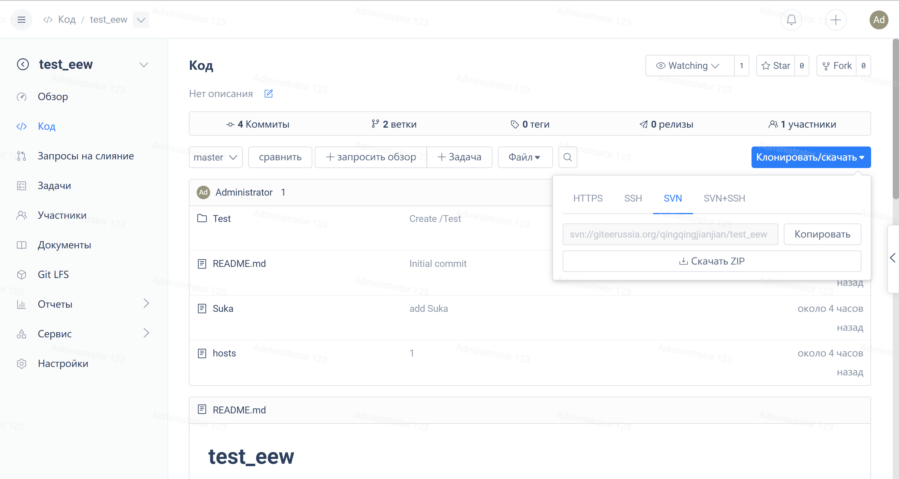

Недавно модуль Gitee SVN добавил поддержку SSH - это означает, что доступ к репозиториям кода можно получить с помощью svn+ssh. Есть два преимущества использования SSH:

- Более безопасен
- Поддержка отправки и слияния кода без пароля (с использованием сертификата)

### **Использование:**

В репозиториях Gitee по умолчанию не включена поддержка доступа SVN. Вам необходимо включить доступ SVN в интерфейсе управления проектами со следующими настройками:

После включения доступа к SVN вы можете получить доступ к нему двумя способами, взяв в качестве примера проект J2Cache:

1. svn://gitee.ru/ld/J2Cache
2. svn+ssh://gitee.ru/ld/J2Cache

Как показано на рисунке ниже:

Первый метод - это обычный рабочий адрес SVN, не поддерживающий шифрование и требующий учетной записи Gitee и пароля для отправки кода.

Второй метод объединяет SVN и SSH. Перед его использованием вам необходимо настроить сертификат. Ознакомьтесь со справочной документацией по методам настройки. Таким образом, вы сможете добиться безопасных и не защищенных паролем отправки и слияния кода.

(Обратите внимание, что использование svn+ssh, будь то отправка или слияние кода, требует, чтобы разработчик был участником репозитория для разработчиков)

Наконец, благодаря поддержке Git SVN его базовое хранилище все еще доступно, поэтому SVN от Gitee не может полностью заменить SVN. Он реализует перекрывающиеся функциональные возможности Git и SVN. Целью предоставления поддержки SVN является не замена существующих сервисов SVN, а предоставление решения для плавного перехода разработчиков SVN на Git.

Таким образом, рекомендуется использовать Git!