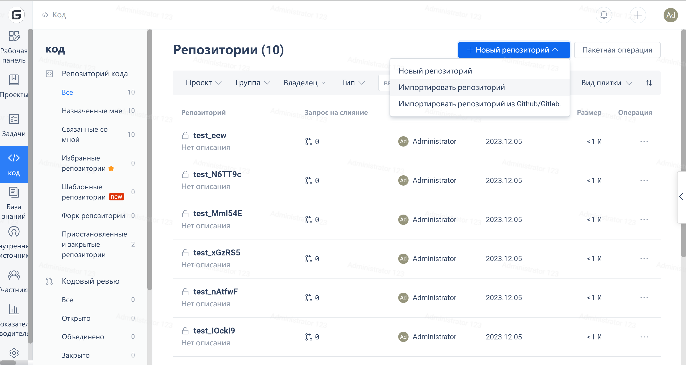
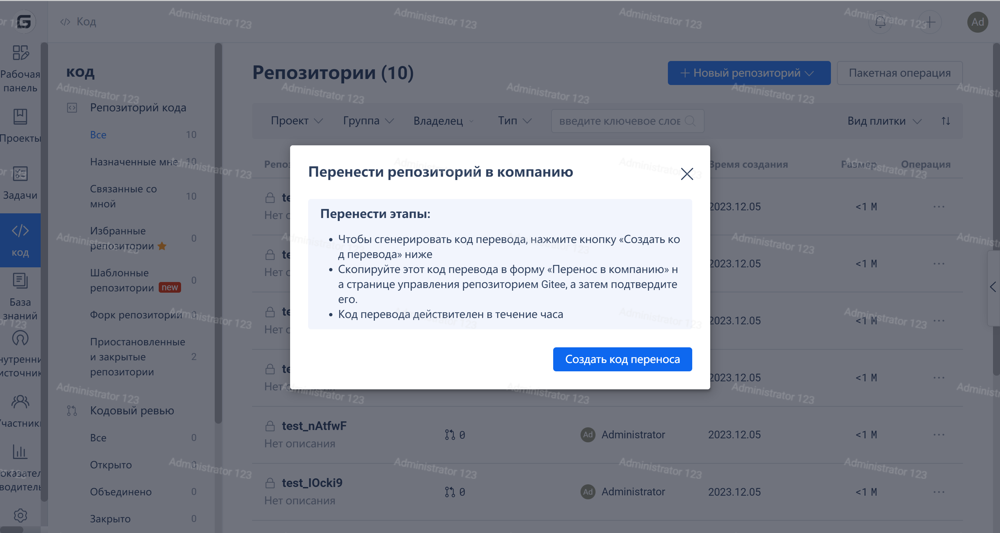
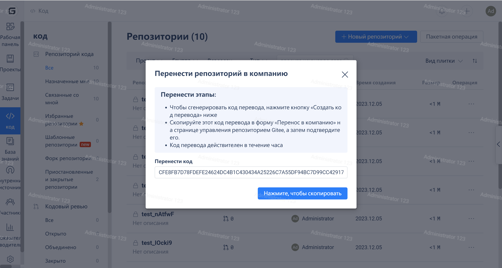

### **What is a Transfer Code**

The transfer code is a code credential used to transfer projects between Gitee Community Edition and Enterprise Edition. The transfer code is valid within one hour after it is generated.

Obtaining methods

To obtain the transfer code, go to Gitee Enterprise Backstage -> 'Repository' -> 'Create Repository' -> 'Transfer Repository' and select 'Generate Transfer Code'.

