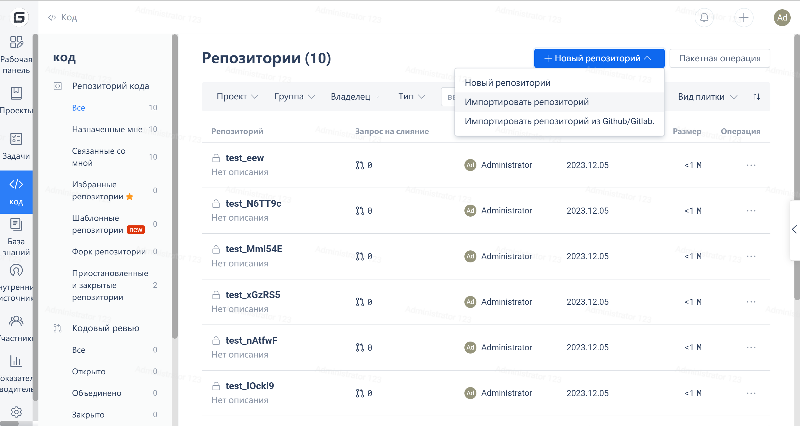
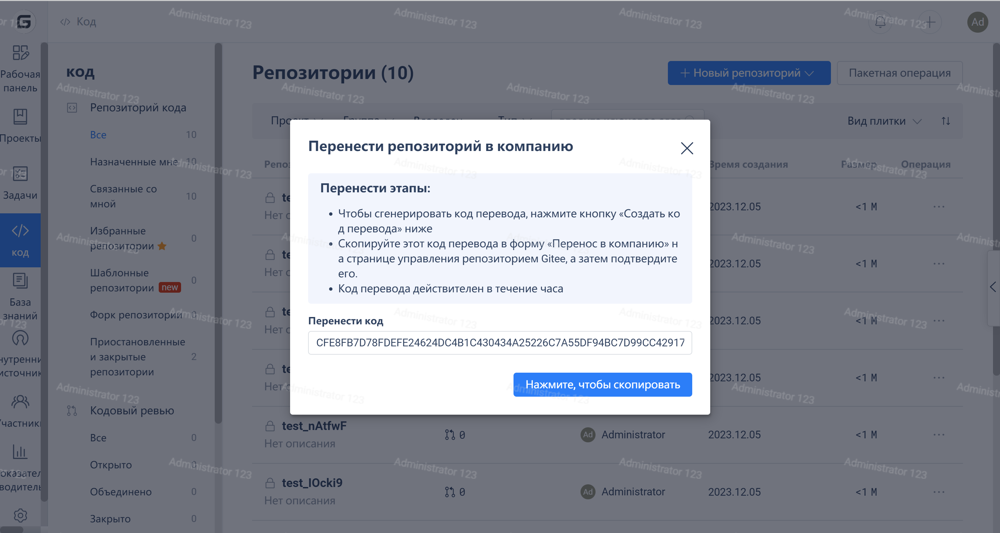
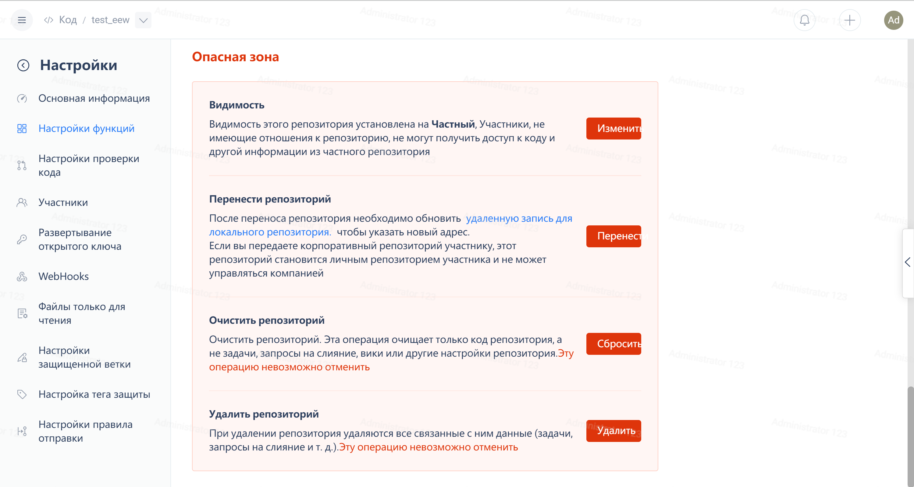

By importing the repository's address, you can migrate the repositories under members' personal accounts to the enterprise account.

You can transfer repositories under a member's personal account to an enterprise account using transfer code.

1. Click on "Code" - "New Repository" - "Transfer Repository" - "Generate Transfer Code" in the Enterprise Dashboard interface - Copy the generated transfer code:

 

2、Go to the 'Repository Settings' - 'Feature Settings' - 'Transfer Repository' of the **repository to be transferred**, paste the transfer code and confirm.

