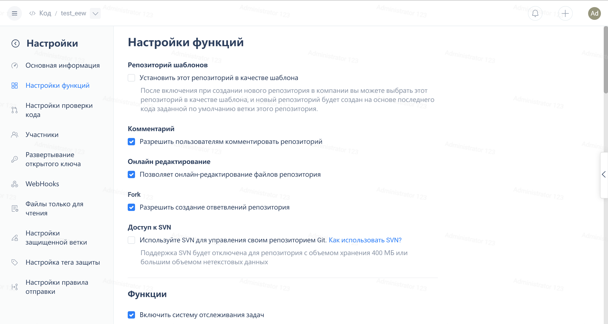
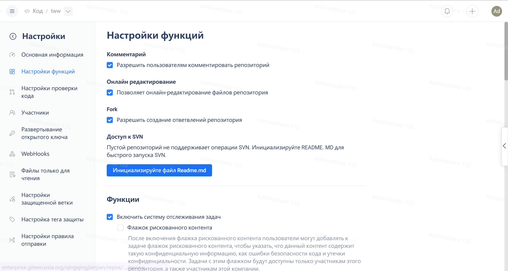

В настоящее время для работы с репозиториями Gitee поддерживает использование Subversion. Ниже приводятся руководство по использованию и меры предосторожности.

### **Меры предосторожности перед использованием**

1. Не рекомендуется использовать Subversion для репозиториев размером более 300 МБ. Когда объем репозитория достигнет 400 МБ или 300 МБ и будет содержать большое количество нетекстовых данных, поддержка Subversion для репозитория будет отключена.

2. Поскольку GIT не поддерживает создание коммитов для пустых директорий, будь то обычный репозиторий или репозиторий с включенным доступом к Subversion, он хранится как репозиторий GIT на компьютере хранения. Коммиты Subversion выполняются в репозитории git, поэтому Subversion от Gitee не поддерживает фиксацию пустых директорий.

3. При первом запуске Subversion запустите репозиторий. Если репозиторий имеет большой объем или содержит много коммитов, время отклика будет больше.

4. Механизм Subversion Hook не поддерживается, вместо него используйте WebHook.

5. Subversion не полностью поддерживает атрибуты.

6. Клиенту необходимо включить поддержку SASL, а клиенты, которые ее не поддерживают, не могут получить к ней доступ.

7. Некоторые команды svn не поддерживаются. Вы можете проверить совместимость клиента Subversion.

8. Некоторые команды svn не поддерживаются. Вы можете проверить совместимость клиента Subversion.

ПРЕДУПРЕЖДЕНИЕ:

> Git был разработан не  для рассмотрения пустых файлов [Kernel.org: Часто задаваемые вопросы по Git](https://gitee.ru/link?target=https%3A%2F%2Fgit.wiki.kernel.org%2Findex.php%2FGitFaq%23Can_I_add_empty_directories.3F)

> Наш принцип разработки - не уничтожать пользовательский репозиторий и не вносить в него активные изменения. Наш бэкенд хранит полный репозиторий git. Если мы добавим его, содержимое коммитов окажется несовместимым. При добавлении директории рекомендуется добавлять файл-заполнитель типа .keep, также допускается добавления пустого файла.

> При совместном использовании Git и SVN старайтесь не использовать принудительную отправку данных в Git. [Заметки о совместном использовании Git и SVN](https://gitee.ru/link?target=https%3A%2F%2Fgit.mydoc.io%2F%3Ft%3D122635)

### **О переработке кода**

Окончательная интерпретация функции Subversion принадлежит OSChina.NET. Правила интеграции Subversion могут измениться в следующей версии.

### **Метод активации**

1. Включите его в интерфейсе настроек проекта


2. Если это пустой репозиторий:



Руководство пользователя

Gitee поддерживает протокол svn. Для svn получение кода репозитория обычно осуществляется путем отладки. На домашней странице проекта мы обычно можем получить URL-адрес.

Адрес этого репозитория:


```bash
svn://git.oschina.net/svnserver/newos
```

### Получение кода репозитория:

```bash
svn checkout svn://git.oschina.net/svnserver/newos newos
```

**Примечание** Серверная часть интеграции SVN с Gitee реализована через репозиторий git, а правило URL - svn://domain/username/project name.

Используя вышеприведенную команду, мы получим код ветки проекта по умолчанию. И назовем локальную рабочую директорию как 'newos'.

Если в конце операции не поставть "newos", SVN по умолчанию присвоит локальной рабочей директории имя проекта.

```bash
svn checkout svn://git.oschina.net/svnserver/newos
```

Особое примечание: чтобы получить главную ветку, являющуюся главной веткой проекта, вы можете использовать следующий формат ветки

```bash
svn checkout svn://git.oschina.net/svnserver/newos/trunk newos
```

Магистральная ветка svn соответствует основной ветке. Пользователям следует стараться не использовать следующий формат.

```bash
svn checkout svn://git.oschina.net/svnserver/newos 
```

### **Инструкции по эксплуатации**

Если используется только часть проверяемого репозитория, а корневая директория репозитория содержит директории с именами веток/тегов/магистральных веток, используйте полную схему пути следующим образом:

```bash
svn://git.oschina.net/username/example/trunk/tags/hello
svn://git.oschina.net/username/example/branches/dev/trunk
svn://git.oschina.net/username/example/branches/dev/branches 
```

Если нет основной ветки, то нет и магистральной ветки. Извлеченный URL-адрес не может содержать название ветки. Например, если есть только ветка dev, вы должны использовать следующий формат, в противном случае будет выдан запрос о том, что репозиторий не существует.

```bash
svn co svn://git.oschina.net/svnserver/newos/branches/dev  svnserver_dev  
```

Откройте терминал и введите приведенную выше команду. Первый домен аутентификации - это пароль пользователя, который можно оставить пустым. Имя пользователя - это адрес электронной почты, используемый пользователем для входа в Gitee. Пароль - это пароль, используемый для входа в Gitee.

Как правило, SVN шифрует и кэширует имя пользователя и пароль, поэтому для операций с репозиторием в первый раз необходимо ввести только адрес электронной почты пользователя и пароль.

Очистите кэш паролей и файлы в папке '.subversion/auth/svn.simple' в каталоге пользователя.


На следующем рисунке показано успешное слияние кода проекта.


Просмотр информации о локальной рабочей директории:

```bash
svn info
```


```bash
cd helloworld
echo "test" > SVNReadMe.md
#svn add SVNReadMe.md
#svn add * --force is similar to git add -A
svn add * --force
svn update .
svn commit -m "first svn commit"
```

Subversion предлагает использовать обновление svn для восстановления рабочей копии перед коммитом. Это похоже на слияние git с последующей отправкой git.

Коммиты Subversion выполняются онлайн. Если компьютер отключен, коммит завершится неудачей. Этот процесс можно понять, используя подход git.

Пользователи также могут видеть динамическое отображение при использовании svn для отправки кода.

Перечислите содержимое директории в репозитории управления версиями:

```bash
svn list svn://git.net/svnserver/newos/trunk
```

Экспортируйте все файлы указанной ветки в репозиторий без информации о контроле версий:

```bash
svn export svn://git.net/svnserver/newos/trunk newos
```

## **Указание**

### **Установите клиент Subversion**

На официальном сайте Subversion фонда Apache:

[http://subversion.apache.org](https://gitee.ru/link?target=http%3A%2F%2Fsubversion.apache.org)

Страница с запросом на загрузку двоичного файла:

[http://subversion.apache.org/packages.html](https://gitee.ru/link?target=http%3A%2F%2Fsubversion.apache.org)

#### **Система Windows:**

Клиент нтеграции с управлением ресурсами: [TortoiseSVN](https://gitee.ru/link?target=http%3A%2F%2Ftortoisesvn.net%2Fdownloads.html), широко известный как "Tortoise", представляет собой установочный пакет MSI. Его можно извлечь с помощью [ExtractMSI](https://gitee.ru/link?target=http%3A%2F%2Fpan.baidu.com%2Fs%2F1szHIn).

Странно, что TortoiseSVN не рекомендован в Apache.

Кроме того, существует SlikSVN, адрес загрузки: [https://gitee.ru/link?target=https%3A%2F%2Fsliksvn.com%2Fdownload%2F]

Мы не будем представлять здесь остальные клиенты по отдельности

#### **Система Linux**

Как правило, программа управления пакетами, поставляемая с системами Linux, может установить Subversion. Если версия ниже 1.8, рекомендуется загрузить предварительно скомпилированный двоичный файл или скомпилировать Subversion самостоятельно.

#### **OS X**

Встроенная в XCode версия Subversion - 1.7.x, которая слишком старая, в то время как Gitee поддерживает только SVN-клиенты версии 1.8 и выше.

Если установлен Homebrew

```bash
brew install subversion
```

В качестве альтернативы используйте предварительно скомпилированную версию WANdisco

[http://www.wandisco.com/subversion/download#osx](https://gitee.ru/link?target=http%3A%2F%2Fwww.wandisco.com%2Fsubversion%2Fdownload%23osx)

### **Совместимость клиентов Subversion**

Мы поддерживаем Apache Subversion версии 1.8 или выше. В случае появления сообщения об ошибке "Не удалось согласовать механизм аутентификации" при установке клиента Subversion, , убедитесь, что ваш клиент поддерживает аутентификацию SASL. Например, в Ubuntu вы можете установить libsasl2-dev, а затем скомпилировать Subversion, чтобы клиент поддерживал аутентификацию SASL.

> sudo apt-get install libsasl2-dev

Когда вы используете интегрированные в IDE клиенты, такие как svnkit или Subversion JavaHL, убедитесь, что они поддерживают аутентификацию SASL.

О преобразовании между GIT и SVN

Если у пользователя есть проект, размещенный в Subversion, и он хочет перейти на Gitee, он может использовать git-svn для преобразования проекта в репозиторий на основе git, а затем отправить его в Gitee. Таким образом, вы все равно можете управлять проектом с помощью SVN. Не забудьте сначала создать на Gitee новый проект.

```bash
git svn clone http://myhost/repo -T trunk -b branches -t tags 
git remote add oscgit https://git.oschina.net/user/repo
git push -u oscgit --all
```

Обычно, если имееется локальный репозиторий SVN, вы можете:

```bash
git svn clone file:///tmp/svn-repo -T trunk -b branches -t tags 
git remote add oscgit https://git.oschina.net/user/repo
git push -u oscgit  --all
```

После переноса проекта в Gitee используйте команду svn для проверки проекта и работы с ним.

Расширенное руководство:

[http://git-scm.com/book/zh/ch8-2.html](https://gitee.ru/link?target=http%3A%2F%2Fgit-scm.com%2Fbook%2Fzh%2Fch8-2.html)

### **Установите git, git-svn**

#### **Windows**

официальный сайт msysgit [http://msysgit.github.io/](https://gitee.ru/link?target=http%3A%2F%2Fmsysgit.github.io%2F), версия относительно низкая.

Github для Windows предоставляет тот же инструмент git, что и msysgit.

Ссылка для скачивания MSYS2 git: [http://sourceforge.net/projects/msys2](https://gitee.ru/link?target=http%3A%2F%2Fsourceforge.net%2Fprojects%2Fmsys2) , затем запустите терминал и установите git, текущая версия - 2.4.3.

```bash
pacman -S git
```

Адрес для скачивания Cygwin git: [http://www.cygwin.com/](https://gitee.ru/link?target=http%3A%2F%2Fwww.cygwin.com%2F), а затем используйте программное обеспечение для управления пакетами или скачивайте напрямую

```bash
make configure
./configure --prefix=/usr/local
make 
make install 
```

#### **Linux**

Установите с помощью менеджера пакетов, если он доступен

как, наприменр, в Ubuntu

```bash
sudo apt-get install git git-svn
```

Вы также можете выполнить компиляцию вручную.

#### **Mac OSX**

Адрес для скачивания: http://git-scm.com/download/mac (https://gitee.ru/link?target=http%3A%2F%2Fwww.cygwin.com%2F)