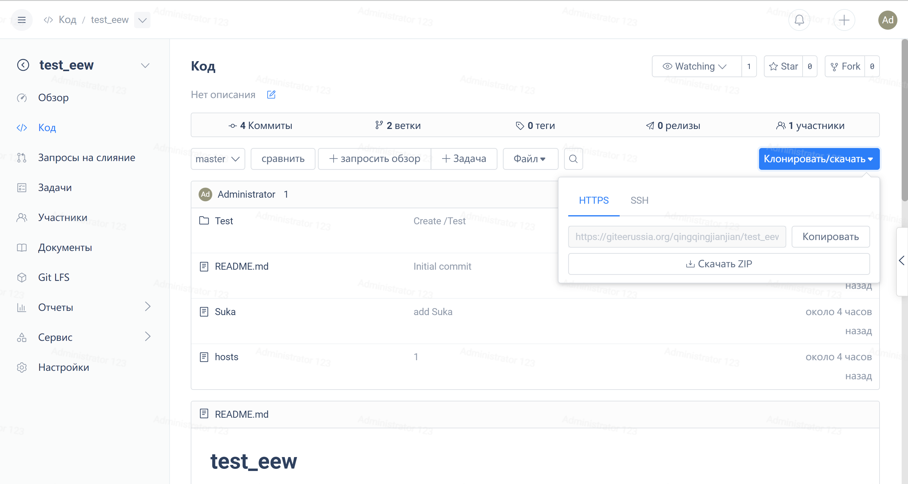
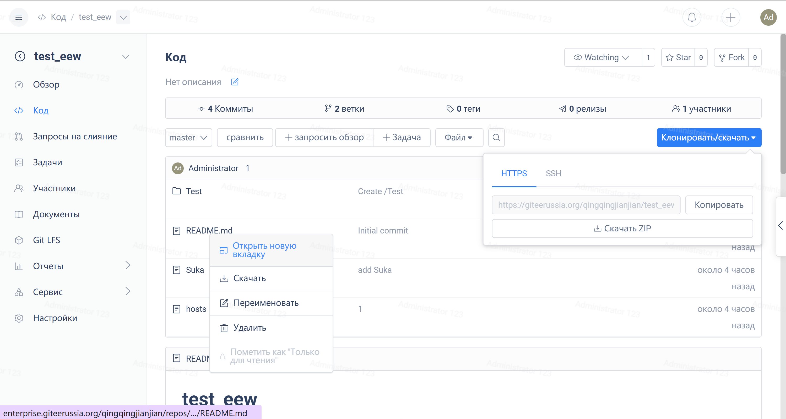

When users access the project on Gitee and need to download the project repository/code to their local machine, they can do so by cloning/downloading the ZIP.



### **Clone Repository with git clone**

> Users can find the repository address by going to the project homepage and finding "Repository Clone Address/Download Area".
Here we take the repository named HelloGitee under the user account gitee as an example. The corresponding repository URL is `https://gitee.ru/gitee/HelloGitee.git`. If the user has the permission to access the project repository code, you can clone the repository to your local machine by executing the command 'git clone' followed by the repository URL.

```bash
git clone https://gitee.ru/gitee/HelloGitee.git #Clone the remote repository to the local machine.
```

Note: During the cloning process, if the repository is a private repository, users may be prompted to enter their Gitee username and password. Follow the prompts to input the information. For specific configuration and operations, please refer to the Quick Start/Creating Your First Project Repository.

### **Download code via ZIP**

Users can find the download area on the project repository homepage (see the download button in the figure above), click 'Download ZIP', enter the verification code on the redirected verification page to confirm, and then start the download.

> Download ZIP package content for downloading the content of the current accessed branch/Commit, excluding Git version. For more details, refer to the git archive packaging command: https://git-scm.com/docs/git-archive


 