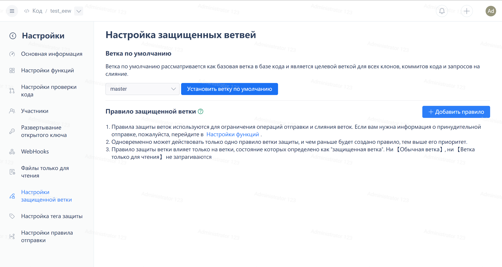
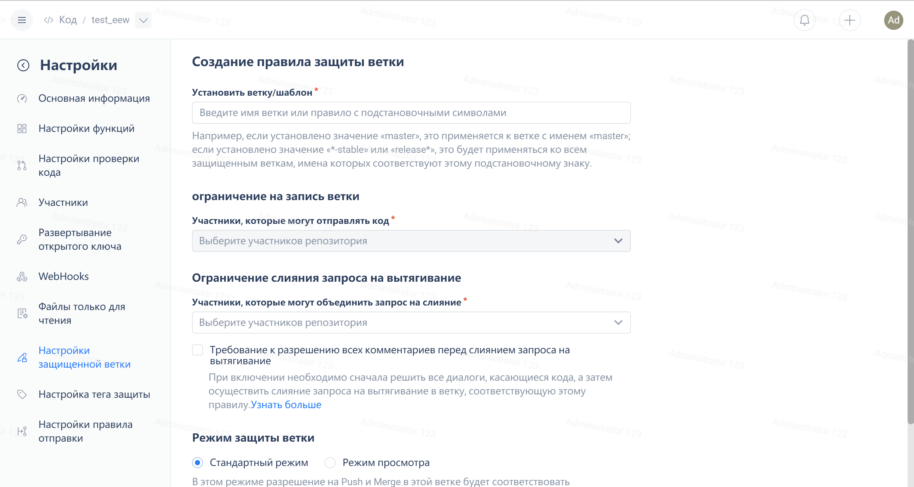
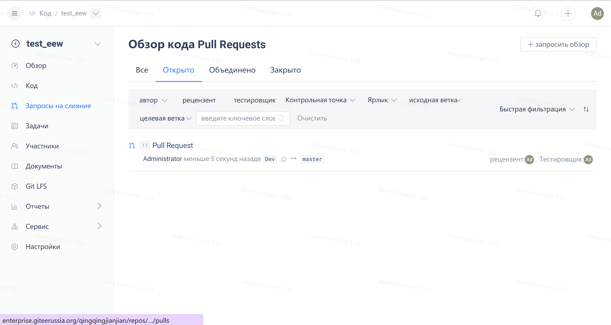
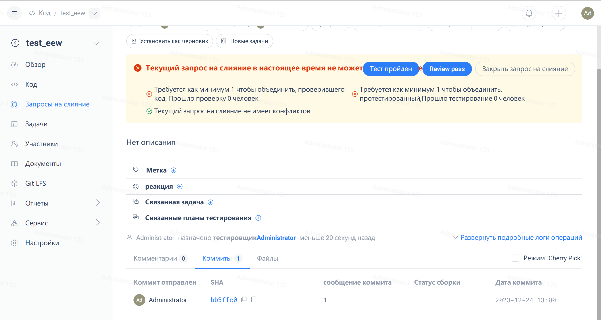

> Gitee can now set a protected branch to **Review Mode**, where any push to this branch without permission will automatically create (or update) a

I don't know if all the developers have had this experience. After receiving a task, we need to go through the following process to complete it:

1. Update the trunk locally, create and switch to a new branch based on the trunk
2. Coding...
3. Push this branch to the remote
4. Open Gitee and go to the create Pull Request page
5. Select target branch
6. Fill in Title and Description
7. Click "Submit Pull Request"

At this point, some students may find it cumbersome:

- "Why do I have to write it again when the task has already specified the changes to be made and the subsequent test cases?"
- "I have already provided detailed commit information, so there is no need to restate it."
- "Can't you automatically create a Pull Request for me if I can't push, and then automatically associate the branch-related tasks?"
- ...

So, is there a way to quickly create a Pull Request?

The answer is: **Yes!**

### **Modify the last commit**

To solve the problem of the cumbersome process of creating a Pull Request mentioned above, we have expanded the protected branch and divided it into two modes:

- Standard mode: Consistent with the original protected branch logic, strictly follows the push and merge permissions. If there is no permission, the push will be rejected.
- Review mode: The only difference from the standard mode is that if the user does not have push permissions, their push will automatically create (or update) a Pull Request.




Here, in **Repository Management - Protected Branch Settings**, I added a protected branch rule review and set it to review mode and prohibit anyone from pushing. So, no matter who (provided they are repository members) pushes code to the review branch, it will automatically create a Pull Request:


As you can see, the server has identified the review branch as a protected branch in review mode, and I don't have permission to push to this branch (because it is set to prohibit anyone from pushing). Gitee automatically created a Pull Request from my pushed commit to the review branch and provided the address for access.

If I make another commit and push again, Gitee will detect that I have already had a Pull Request automatically created on this branch, and it will automatically update the code of this Pull Request.


At this point, if we go to Gitee, we can see that the automatically created Pull Request has been updated.




Additionally, you can directly update the automatically created source branch to update the Pull Request, which is the auto-62561-review-1625833887273 branch created above. The specific steps are as follows.

```bash
git fetch 
git checkout auto-62561-review-1625833887273
// Coding...
git add {xxfile}
git commit -m "update auto pr"
git push origin auto-62561-review-1625833887273
```

### **Automatically Create & Update Pull Request Rules**

Commit pushed to the protected branch in the review mode must completely include the differences of a certain pull request.

We make the following agreements

- remote represents the remote
local represents local
- result represents the result
- 1-2-3-4 represents four commits, with the latest being 4.
- PR represents Pull Request

We assume there are four commits in the remote: `remote: 1-2-3-4`

```bash
Case1
local: 1-2-3-4-5
result: Created PR-a containing 5.

Case2
local: 1-2-3-4-5-6
result: Updated PR-a includes 5-6 (Because there is already a PR, and this version is the parent of the differences in this PR, so it can be updated).

Case3
local: 1-2-3-4-5-7 Modified submission 6 to submission 7 (revert or commit --amend operation)
result: Created PR-b includes 5-7 (The existing PR is not a subset of this version, this version does not include 6, so create a new PR)
```

### **Recommended Usage**

Although the automated Pull Request creation provided by the review mode is convenient, it can confuse developers if they keep switching branches. Therefore, two recommended ways of usage are suggested to ensure organized development while enhancing productivity.

**1. Local branch development**


**II. Local trunk development**


Come and experience it!