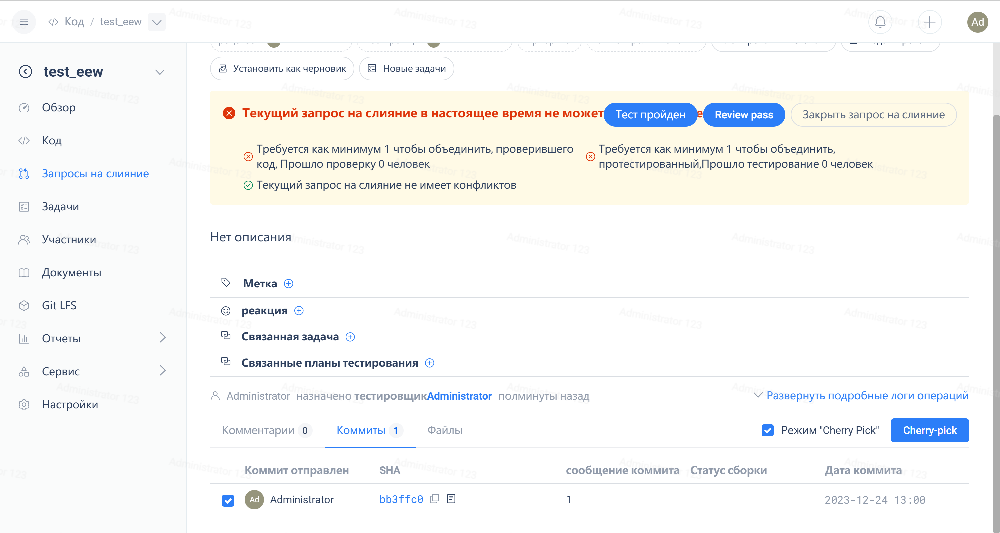
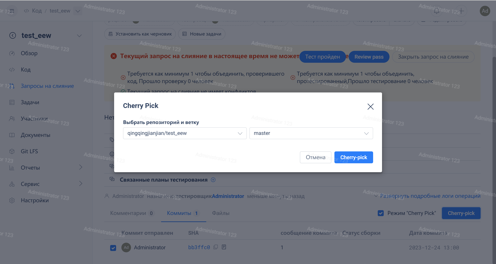

### **Справка**

В повседневной деятельности по разработке, после выполнения запроса на слияние нам иногда бывает необходимо извлечь из этого запроса на слияние один или несколько коммитов и отправить их как новый запрос на слияние, а затем объединить их в новую целевую ветку.

### **Знакомство с использованием функции Cherry Pick**

#### **1. Сначала введите запрос на слияние**

Перейдите в историю коммитов, нажмите на режим cherry-pick, выберите один или несколько коммитов, которые нужно вывести в качестве нового коммита для запроса на слияние, как показано ниже:

Выберите соответствующий коммит

#### **2. Нажмите на кнопку Cherry-pick для выбора целевой ветки**

Важно отметить, что в данном случае возможно несколько сценариев. Если создание завершится неудачей,  обратите внимание на подсказку в правом верхнем углу.

- Не удалось выполнить команду CherryPick: при выполнении операции CherryPick возникли конфликты, необходимо устранить локально.
- Не удалось выполнить команду CherryPick: целевая ветка операции CherryPick уже содержит контент выбранного коммита.
- ...

#### **3. Войдите в интерфейс создания запроса на слияние**

Заполнив информацию, нажмите "Создать".

Одновременно с этим исходный запрос на слияние оставит комментарий.