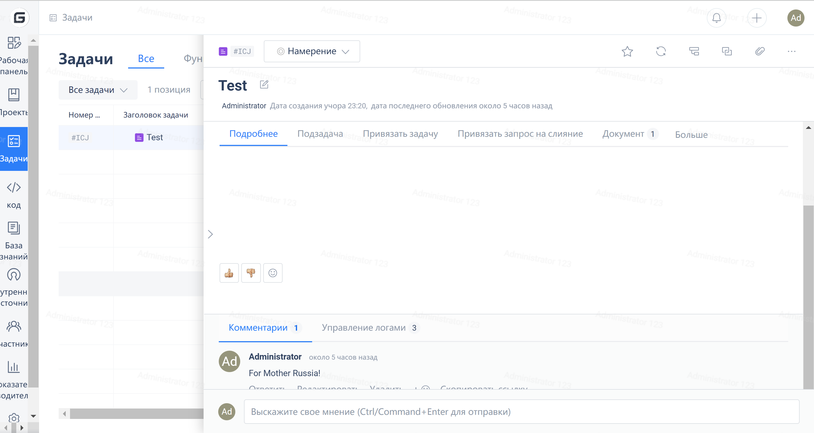
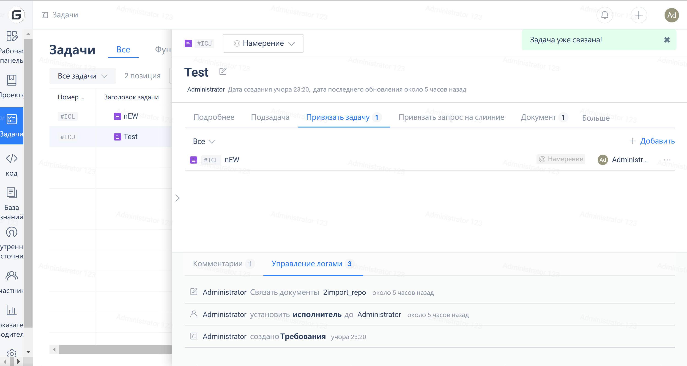
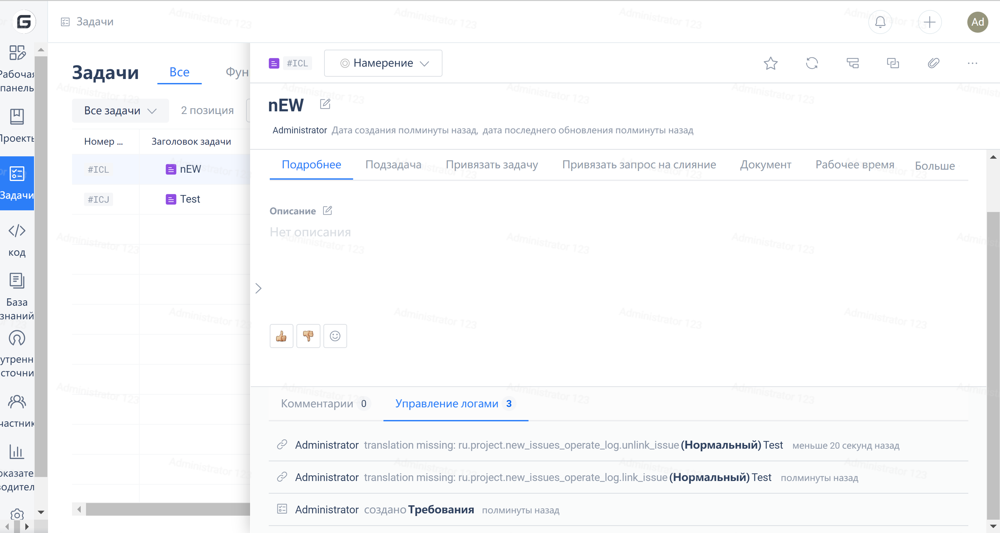
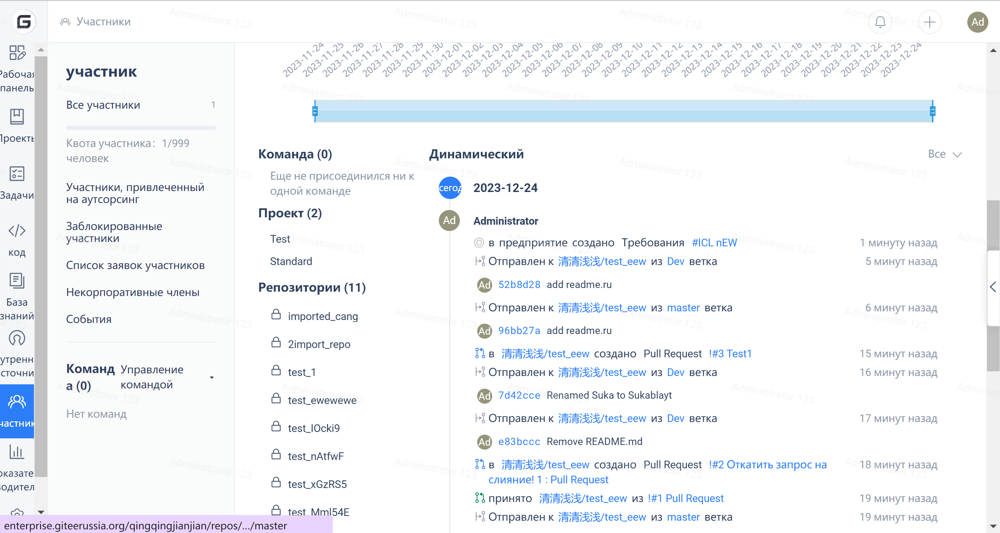
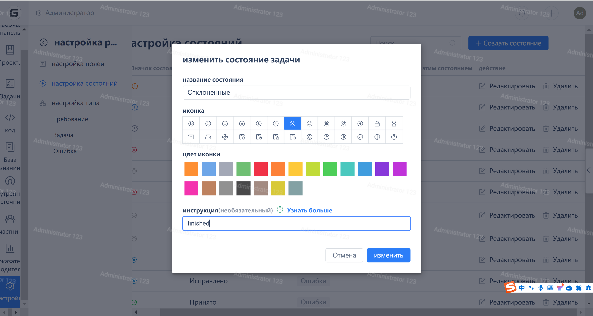

> Note: Gitee's new solution no longer uses the issue ID to identify issues, but instead uses the ident. For specific instructions, see here. To avoid manually entering the issue ident incorrectly, it is recommended to directly copy #issueident)

- Note:

1. When pushing locally, please make sure that the email configured locally is consistent with the registered email of the Gitee account in order to associate the issue correctly
 2. The difference between personal and enterprise versions: commits in personal repositories can only be associated with tasks in that repository, while commits in enterprise repositories can be associated with all tasks in the enterprise.
3. The `issue_ident` and `issue_url` mentioned below refer to

4. A commit message can be associated with multiple tasks at the same time, for example: `fix #issue_ident_1 #issue_ident_2` or `fix #issue_ident_1` `fix #issue_ident_2`, please separate different issue_idents with spaces.

### **1. Commit message associated with the task**

- Keyword: link, linked, linking, relate, related, relating
- Format: Enter link #issue_ident or link issue_url in the commit message
- The result is as follows

### **2. Close task through commit**

- Keywords: close, closes, closing, closed, fixed, fix, resolved
- Format: Enter in commit message: close #issue_ident, close issue_url to close the issue.
- The effect image is as follows

### **3. Perform task through commit comments**

- Keywords: comment, reply
- Format: Enter in the commit message: comment #issue_ident, comment issue_url, and you can comment on the issue.
- The effect is as follows:

### **4. Change task status by commit**

1. Form 1:

 - Keyword: state to, change state to
 - Usage:
  - Change #issue_ident state to To-Do
  - #issue_ident change the state to To Do
  - issue_url state to To Do
  - change issue_url status to To Do

2. Form 2:

 - Keyword: Set task status instruction
 - Set the entry point as follows:

- Usage:
 - finish #issue_ident
 - finish issue_url
 