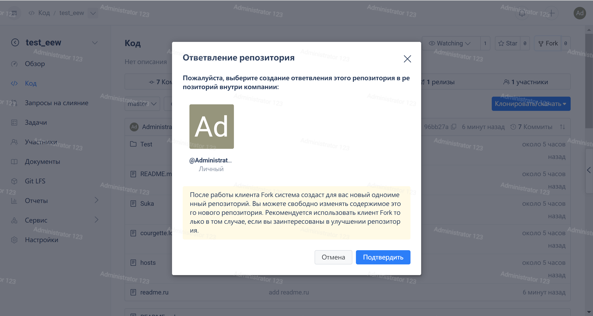
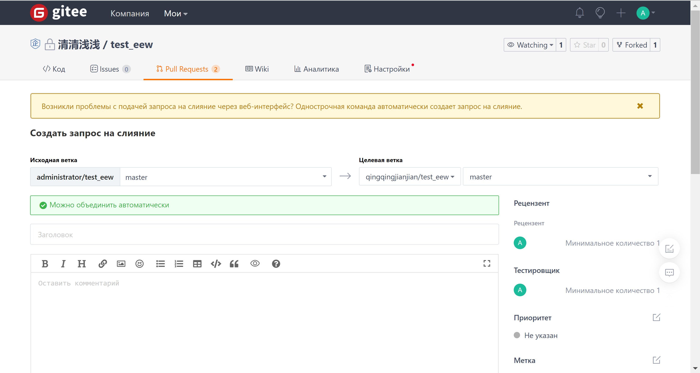
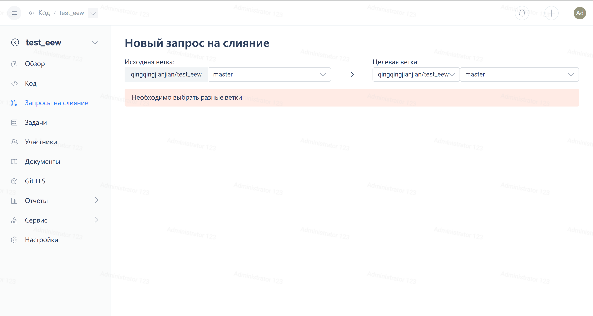
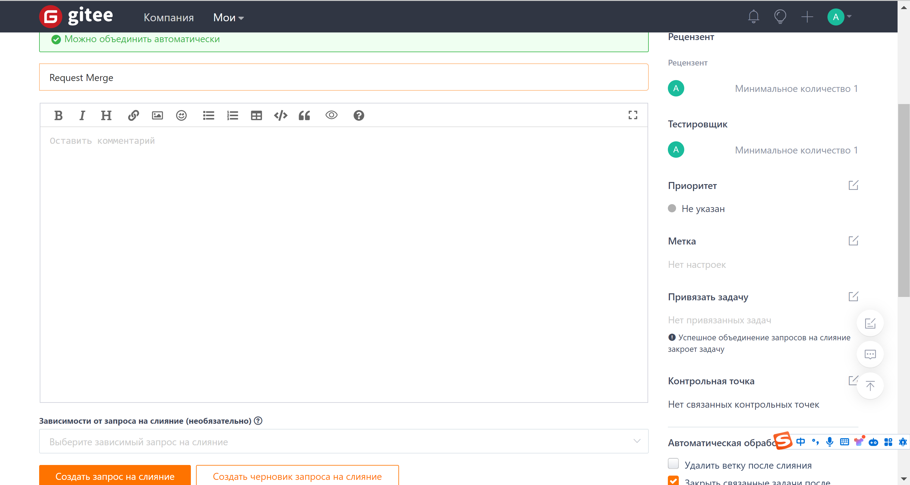
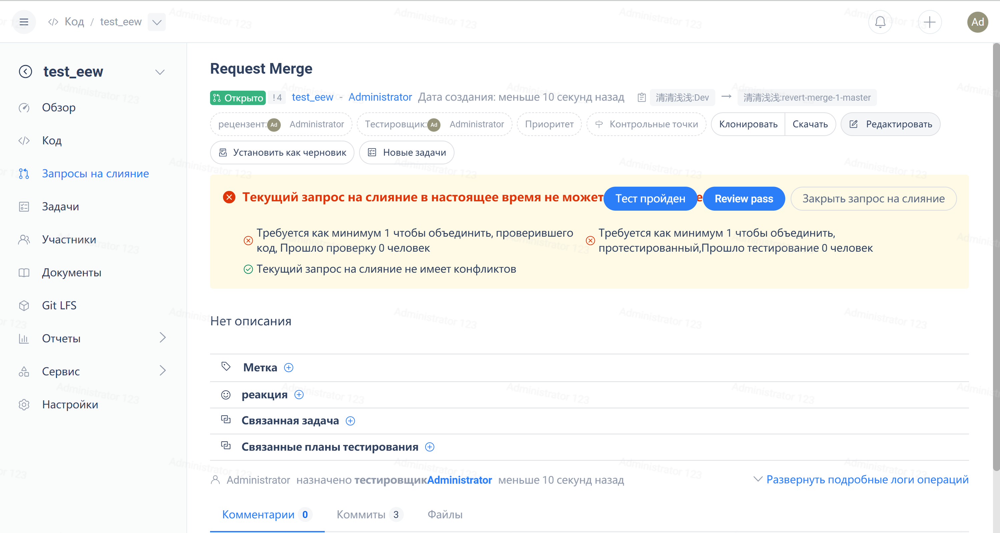

The most common and recommended way to participate in repository development on Gitee is the 'Fork + Pull' model. In the 'Fork + Pull' model, repository contributors do not need to apply for commit permissions from the repository creator. Instead, they create a fork of the repository in their own hosting space. As for the commits created in the forked repository, they can easily use Gitee's Pull Request tool to send a Pull Request to the original repository maintainer.

### **1. What is Pull Request?**

Pull Request is a way to submit changes between two repositories, usually used for submitting differences between a fork repository and the original repository. It is also a great way for team collaboration. Now, let's explain how to submit a Pull Request on the Gitee platform:

PS: Gitee platform requires a fork relationship between the source repository and the target repository for Pull Requests. Therefore, if you want to submit a Pull Request, you must first fork a repository and then submit a Pull Request to that repository. At the same time, you can submit Pull Requests to any repositories that are forked from the parent repository.

### **2. How to fork a repository**

Forking a repository is very simple. Go to the repository page, then find the fork button in the upper right corner. After clicking, select the namespace to fork to, and then click confirm. Wait for the system to complete the repository cloning operation in the background, and the fork operation is completed, as shown in the figure:

### **3. How to Submit a Pull Request**

First, there must be differences between your repository and the target repository in order to commit, like this:

If there are no differences, or if the target branch is newer than the branch you submitted the Pull Request to, you will get the following prompt:

Then, fill in the description of the Pull Request and click on 'Submit Pull Request' to submit a Pull Request, just like shown in the following figure:

### **4. How to manage existing Pull Requests**

Firstly, for an existing Pull Request, if you only have observer or reporter permissions, your access will be restricted. For specific permission restrictions, please refer to the Gitee platform's content on role permissions. The following content only applies to administrator permissions. If you find any differences, please check if you have administrator permissions or if you are the creator of the Pull Request.

### **5. How to modify an existing Pull Request**

Click on the edit button in the top right corner of the Pull Request details page to open the edit box. Modify the information you need to modify in the edit box, then click save to modify the Pull Request.

Please note that on this interface, you can assign responsible persons and testers for the Pull Request, and each operation will notify the corresponding personnel.

### **6. How to submit bug fixes for a Pull Request**

For bug fixes or any updates in the Pull Request, there is no need to submit a new Pull Request. Just push to the branch where you submitted the Pull Request, and later our backend will automatically update these commits and include them in this Pull Request.

### **7. How to handle a Pull Request that cannot be automatically merged**

After submitting a Pull Request, during the processing period of this Pull Request, it changes from being able to be automatically merged to not being able to be automatically merged. This is a very normal thing. At this time, we have two choices. One is to continue merging into the target and manually handle the conflict part. The other is to first resolve the conflict so that the Pull Request is in a mergeable state, and then use automatic merging. Generally speaking, we recommend the second option, that is, resolving the conflict first and then merging. The specific operation is as follows:

First, switch to the branch where you want to submit the pull request locally. Then, pull the target branch to your local repository. At this point, conflicts may occur. Refer to the section on how to handle code conflicts to resolve the conflicts. After resolving the conflicts, commit to the branch where the pull request is located and wait for the system to complete the update of the pull request in the background. The pull request will then be in the auto-mergeable state.

### **8. Can a mistakenly merged Pull Request be rolled back**

For merged Pull Requests that need to be reverted, we provide a rollback feature that generates a rollback XXX Pull Request. Accepting this Pull Request will complete the rollback action. Please note that a rollback is essentially submitting a completely opposite Pull Request, so you still need to perform tests to ensure integrity. Also, to avoid breaking other Pull Requests, it is recommended to only perform the rollback action when the Pull Request to be rolled back is the last merge operation and there are no further commits above it. Otherwise, please handle it manually.