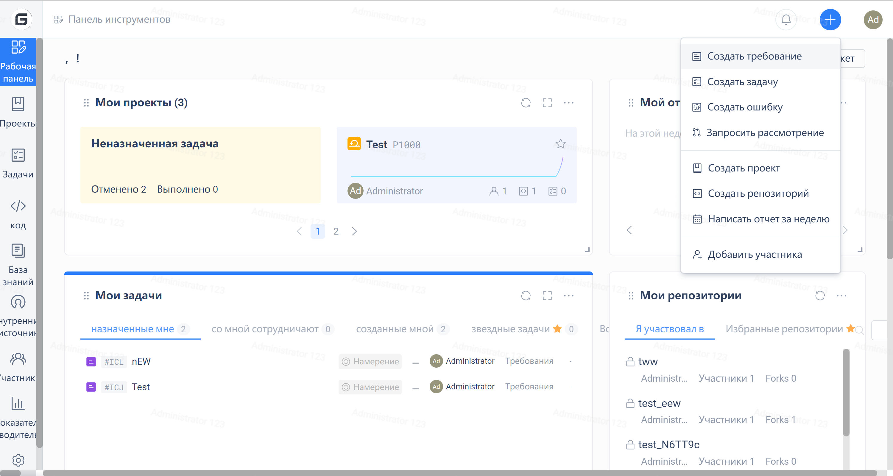
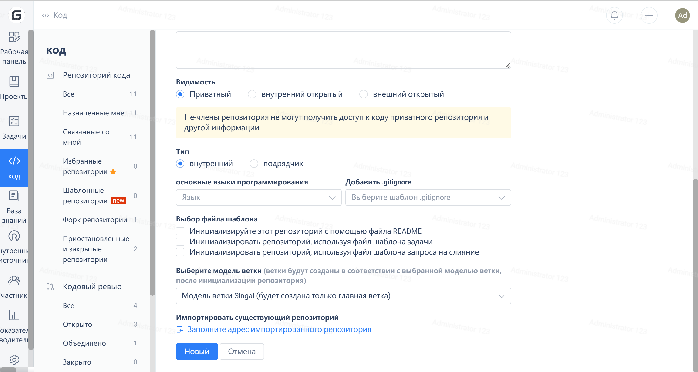

Gitee provides default issue and pull request templates to help developers use them in a standardized format. Users can use the issue template and pull request template in the following ways.

### **Select Template when Creating a Repository**

1. Create a new normal

 - When creating a new repository, checking "Use issue template" actually creates a .gitee/ISSUE_TEMPLATE.zh-CN.md file in the root directory of the repository.

2. Template repository

### **Create .gitee directory in the repository, and then add template files**

1. .gitee/ISSUE_TEMPLATE.zh-CN.md, issue Chinese template
2. .gitee/ISSUE_TEMPLATE.en.md, issue English template
3. .gitee/ISSUE_TEMPLATE.zh-TW.md, issue traditional Chinese template
4. .gitee/PULL_REQUEST_TEMPLATE.zh-CN.md, PR Chinese template
5. .gitee/PULL_REQUEST_TEMPLATE.en.md, PR English template
6. .gitee/PULL_REQUEST_TEMPLATE.zh-TW.md, PR traditional Chinese template

> Q: What is the purpose of different types of templates?
> A: For example, if there are 3 types of language issue templates in your repository and the user submitting the issue is using the English version, then when the user checks 'Use issue template', it will intelligently use the English template. If the user is using the Chinese version, it will intelligently use the Chinese issue template.