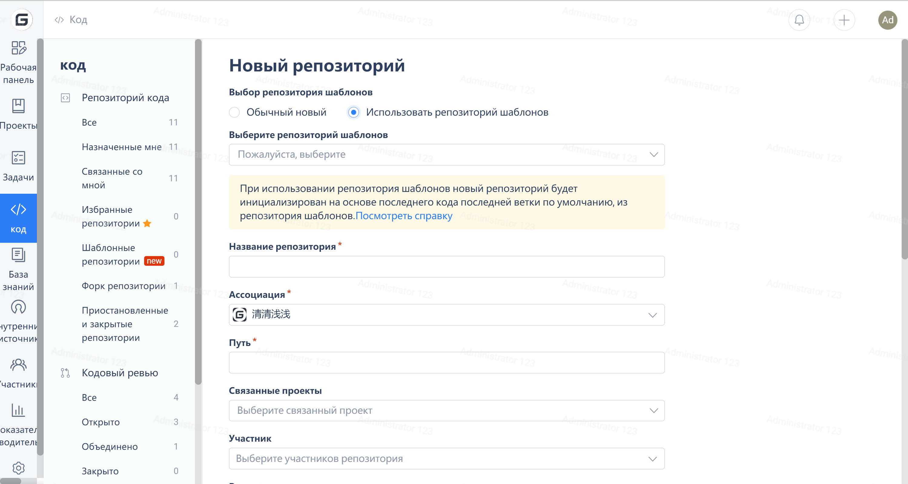

Gitee предоставляет шаблоны задачи и запроса на слияние по умолчанию, чтобы помочь разработчикам использовать их в стандартизированном формате. Пользователи могут использовать шаблон задачи и шаблон запроса на слияние следующими способами.

### **Выбор шаблона при создании репозитория**

1. Создание нового обычного

- При создании нового репозитория проверка "Использовать шаблон задачи" фактически создает файл .gitee/ISSUE_TEMPLATE.zh-CN.md в корневой директории репозитория.

2. Репозиторий шаблонов

### **Создание директории .gitee в репозитории, а затем добавьте файлы шаблонов**

1. .gitee/ISSUE_TEMPLATE.zh-CN.md, шаблон задачи на китайском языке
2. .gitee/ISSUE_TEMPLATE.en.md, шаблон задачи на английском языке
3. .gitee/ISSUE_TEMPLATE.zh-TW.md, шаблон задачи на традиционном китайском языке
4. .gitee/PULL_REQUEST_TEMPLATE.zh-CN.md, шаблон запроса на слияние на китайском языке
5. .gitee/PULL_REQUEST_TEMPLATE.en.md, шаблон запроса на слияние на английском языке
6. .gitee/PULL_REQUEST_TEMPLATE.zh-TW.md, шаблон запроса на слияние на традиционном китайском языке

> Вопрос: Каково назначение различных типов шаблонов?
> Ответ: Например, если в вашем репозитории есть 3 типа шаблонов задачи на разных языках, и пользователь, отправляющий задачу, использует английскую версию, то, когда пользователь установит флажок "Использовать шаблон задачи", система будет обоснованно использовать шаблон на английском языке. Если пользователь использует китайскую версию, он будет обоснованно использовать шаблон задачи на китайском языке.