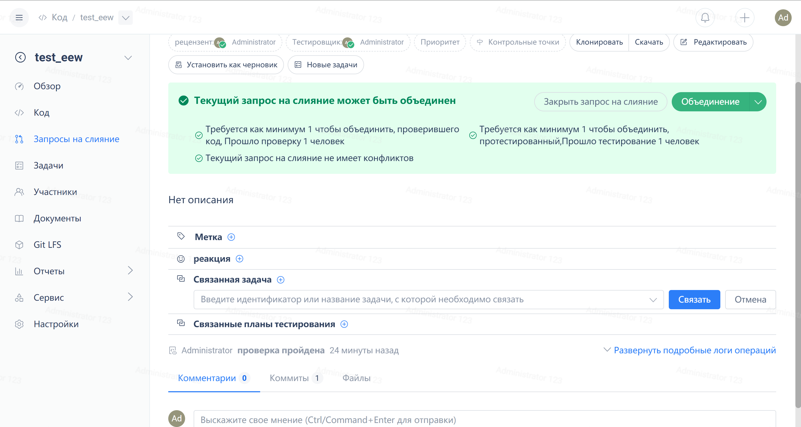
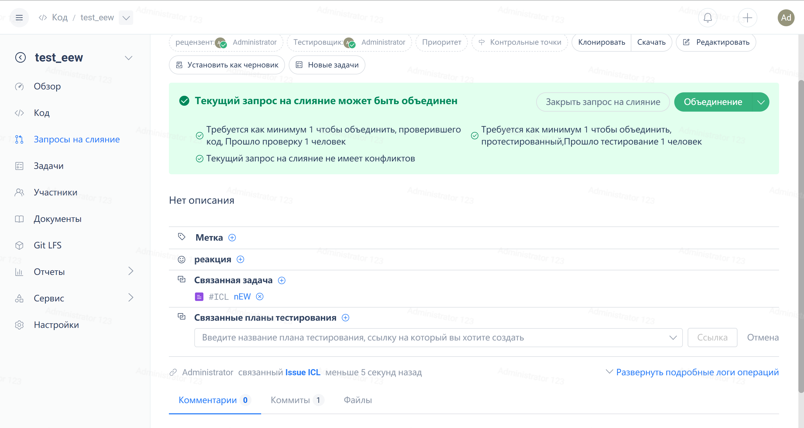

Справочный центр Gitee / Управление репозиторием / Совместная разработка / Подробная справочная информация
Запрос на слияние связан с задачей
задача с запросом на слияние
Связав задачу с запросом на слияние, пользователи могут закрыть задачу при закрытии запроса на слияние. Функция сопоставления имеет следующие характеристики:

1. Запрос на слияние может быть связан с несколькими задачами, например, с issue1 и issue2 в формате: #issue1id, #issue2id
2. После связывания запроса на слияние с задачей статус задачи автоматически изменится на "Выполняется". Когда запрос на слияние будет объединен, задача будет закрыта.
3. Разница между Personal Edition и Enterprise Edition:

- В Personal Edition запрос на слияние может быть связан только с задачами в текущем репозитории
- В Enterprise Edition запрос на слияние может быть связан с задачами всех предприятий.  

## ** Конкретные шаги для связи задачи с запросом на слияние:**

### **1. Укажите в содержании запроса на слияние идентификатор задачи, подлежащей закрытию, например:**

### **2. Вы можете увидеть связь на странице сведений о задаче**

### **3. Когда связанная с запросом на слияние задача закрывается после слияния**

