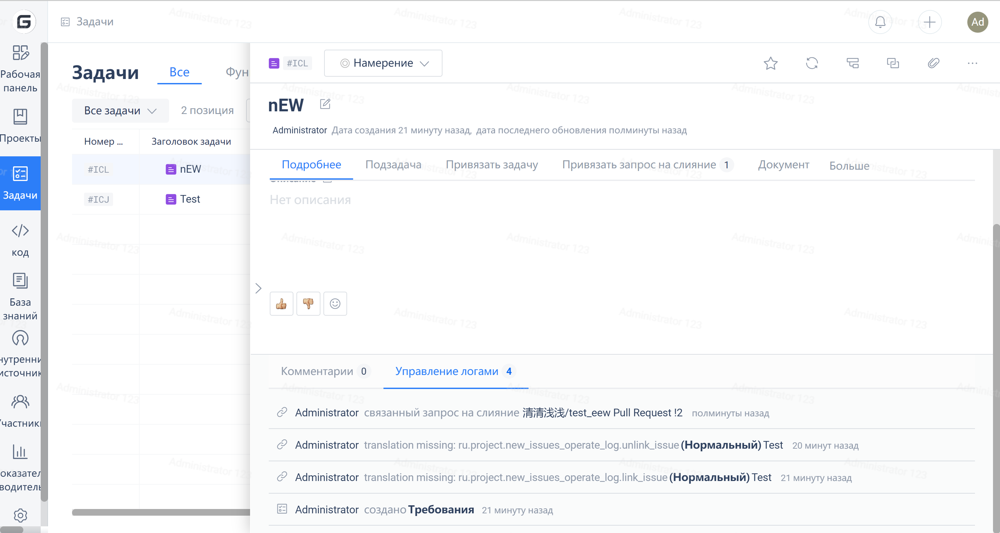

Gitee Help Center / Repository Management / Collaborative Development / Help Details
Pull Request associates with Issue
Pull Request Issue
By associating an issue with a pull request, users can close the issue when closing the pull request. The association feature has the following characteristics:

1. A PR can be associated with multiple issues, for example, associating with issue1 and issue2 in the format: #issue1id, #issue2id
2. After associating a PR with an issue, the status of the issue will automatically change to In Progress. When the PR is merged, the issue will be closed.
3. Difference between Personal Edition and Enterprise Edition:

 - Personal Edition, PR can only be associated with tasks in the current repository
 - Enterprise version, PP can associate tasks from all enterprises.

## **The specific steps to associate an issue with a pull request are as follows:**

### **1. Specify the identifier of the issue to be closed in the content of the PR, for example:**

### **2. You can see the association in the issue details page**

### **3. When the associated issue of a PR is closed after merging**

 