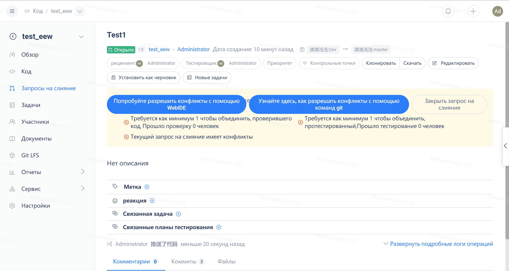
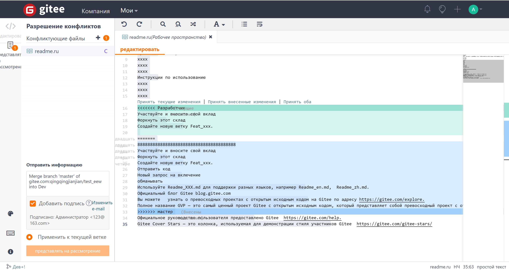
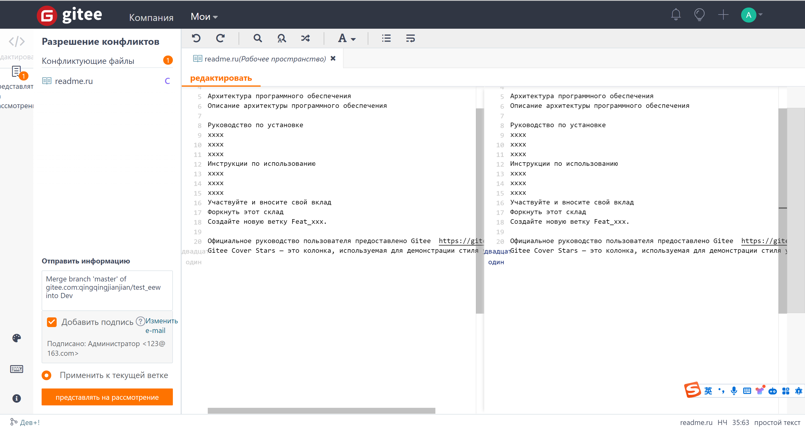

### **Function Introduction**

When encountering code conflicts during the use of Pull Request, it is often necessary to retrieve the code locally, handle the code conflicts through 'git merge', and then push it back to the repository.

Gitee provides a WebIDE solution to resolve conflicts online without the need for a client operation.

### **Resolve conflicts online through WebIDE**

1. On the PR page with code conflicts, click 'Try to resolve conflicts using WebIDE' to enter the WebIDE.

2. Select the code file with the corresponding conflict, find the conflicting code segment, and choose the appropriate code changes and accept them.

3. "Temporarily save" the modified file, then click "Submit" to submit the code with resolved conflicts to the PR source branch, go back to the Pull Request page, and resolve the code conflicts.

