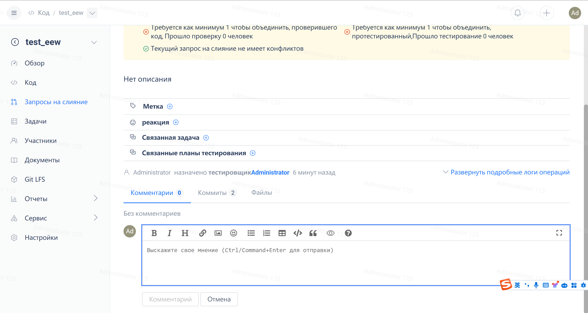

Если ваша команда использует рекомендованную Gitee модель совместной работы "Fork + Pull",  мы также рекомендуем использовать для проверки кода внутри команды функцию запроса на слияние с выполнением следующих действий:

### **Менеджер репозитория: Настройка проверки кода**

> После назначения по умолчанию для данного репозитория определенных лиц в качестве проверяющих/тестировщиков кода, всякий раз, когда создается новый запрос на слияние с целевой веткой в этом репозитории, система уведомит указанных лиц о необходимости проверки отправленного запроса на слияние (т.е. измененного содержимого кода). В то же время могут быть установлены пороговые значения для выполнения запросов на слияние (например, необходимо ли согласие всех указанных лиц перед объединением).

### **Разработчик отправляет запрос на слияние**

> Разработчики могут инициировать запрос на проверку кода, отправив запрос на слияние из форка ветки в исходную ветку репозитория или из рабочей ветки в том же репозитории в исходную ветку для обновления кода в исходной ветке.

### **Проверяющие проводят проверку/тестирование кода**

> Укажите персонал для просмотра содержимого запроса на слияние, отправленного разработчиками, и принятия решения о том, принимать ли изменения, внесенные разработчиком.

### **Администратор репозитория объединяет запрос на слияние**

После того, как будет получено согласие прверяющих, администраторы репозитория получат возможность объединить изменения файла разработчика с исходной веткой, объединив запрос на слияние.

Ниже приведена иллюстрация:

### **Менеджер репозитория: Настройка проверки кода**

- Проверка кода основана на репозиториях. Пользователи с ролями администратора репозитория или выше могут получить доступ к странице [Сведения о репозитории] - [Настройки проверки кода]
- Назначьте соответствующих проверяющих/тестировщиков кода в соответствии с требованиями.

После завершения настройки всякий раз, когда разработчик отправляет запрос на слияние в ветку репозитория, соответствующий персонал получит уведомление о начале процесса проверки кода.

### **Разработчик отправляет запрос на извлечение**

- Разработчик создает форк целевого репозитория, вносит изменения в соответствующую ветку и отправляет в свой собственный форк репозитория. Нажимает "+", а затем "Запрос на слияние" из своего собственного репозитория.

### **Проверяющие проводят проверку/тестирование кода**

В корпоративном представлении [Панель инструментов] - [Запрос на слияние] указанного проверяющего, вкладка [Назначено мне] представляет собой запрос на слияние, который проверяющему предстит проверить.

> Примечание: Ппользователи платной версии Enterprise автоматически включают сканирование дефектов кода, которое автоматически сканирует дефекты и проблемы со спецификациями в любом отправленном запросе на извлечение.

- Рецензенты могут просмотреть подробную информацию о запросе на извлечение

- Единственное отличие заключается в том, что вновь созданная директория теперь называется mygrit, все остальное остается таким же, как указано выше.

- Также поддерживаются комментарии к строкам кода в разделе "Изменения файла".

、、

- Просмотр содержимого отчета в разделах "Отчет об ошибке" и "Отчет о спецификации".

Предложения проверяющего будут доведены до сведения отправившего запрос на извлечение разработчика посредством сообщений и т.д., и разработчик может обсудить их с првоеряющим в разделе "Комментарии" в зависимости от ситуации.

### **Администратор репозитория объединяет запрос на извлечение**

После завершения проверки запроса на извлечение и соответствия правилам проверки кода, установленным администратором репозитория, участники, имеющие разрешение на объединение запросов на извлечение (обычно администраторы репозитория, обратитесь к правилам защищенной ветки для особых случаев), могут объединить запрос на извлечение в целевую ветку.

После завершения слияния изменения, внесенные разработчиком в целевую ветку, вступают в силу. В случае возникновения каких-либо других проблем обращайтесь к разделу "Как выполнить откат к предыдущей версии".