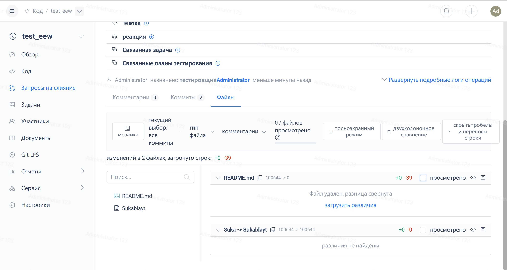

The PullRequest review function can save the progress of viewing the changed code for users, distinguishing between viewed and unviewed code.

### **How to use**

On a PR detail page, you can find the "Reviewed" functionality by checking the "Files" list of changes.

Checking 'Read' can mark the viewing status of the corresponding file. When selecting 'Read' for a file, the changed file will be automatically folded, and the number of 'Read' files will be displayed on the page.

> When there are changes in the code in the Pull Request, the system will automatically mark the corresponding changed files as 'unread'.
