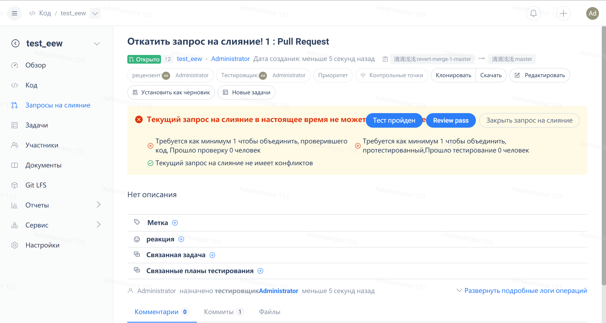

## Клонировать исходный код ветки запроса на слияние в локальный репозиторий

### **Адрес клона текущего жапроса на слияние можно найти на любой открытой странице запроса на слияние**

### **Скопируйте адрес в буфер обмена, используя функцию копирования одним щелчком мыши**

### **Для переключения на соответствующий репозиторий Git и выполнения этой команды Git создаст новую ветку на основе текущей исходной ветки запроса на извлечение и переключится на эту ветку, чтобы вы могли получить весь зафиксированный код в этой ветке**

