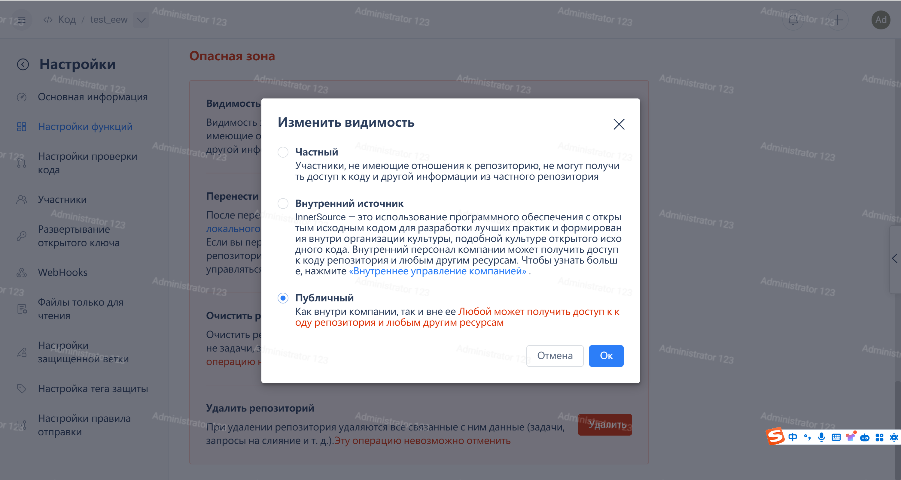
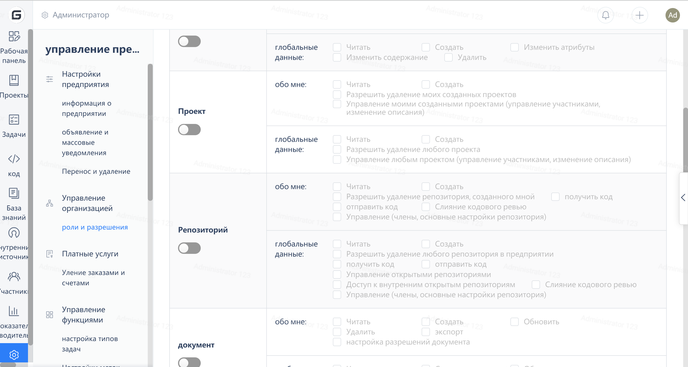

1. First, understand the explanations of private repositories, internal open-source repositories, and external open-source repositories, refer to the help document: [https://gitee.ru/help/articles/4157](https://gitee.ru/help/articles/4157)
2. Members with permission to adjust open source management in repositories can operate
3. Operation steps: Enterprise dashboard -> Code -> Repository -> Repository settings -> Feature settings -> Visibility -> Save and submit for review.

View repository open source management permission operation guide:
Operation steps: Enterprise Workspace → Settings → Role and Permission Settings → Warehouse Open Source Management.
