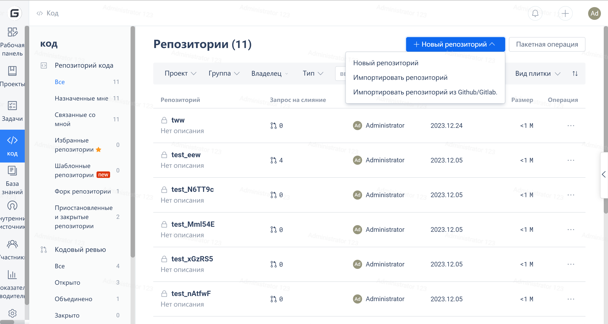
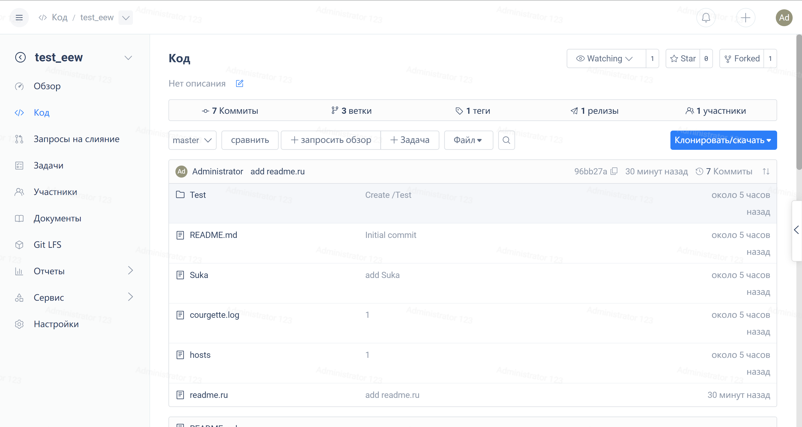
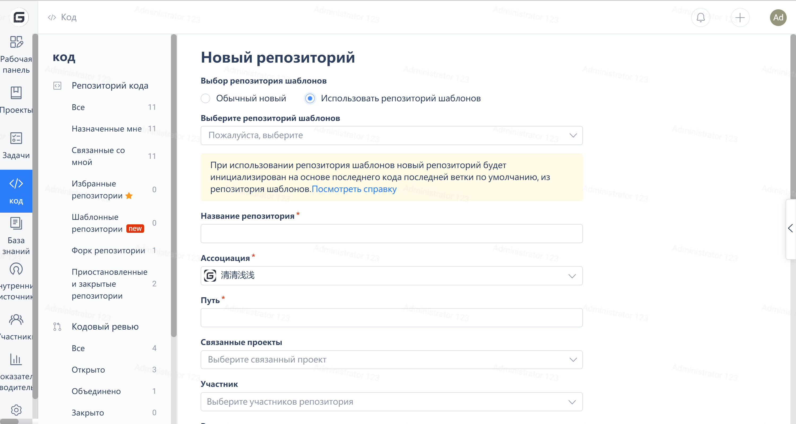
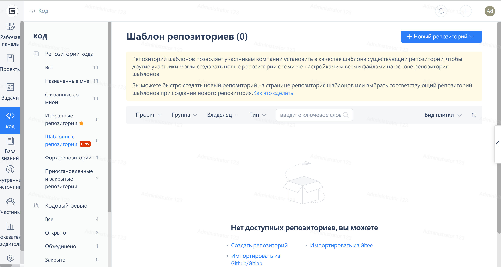
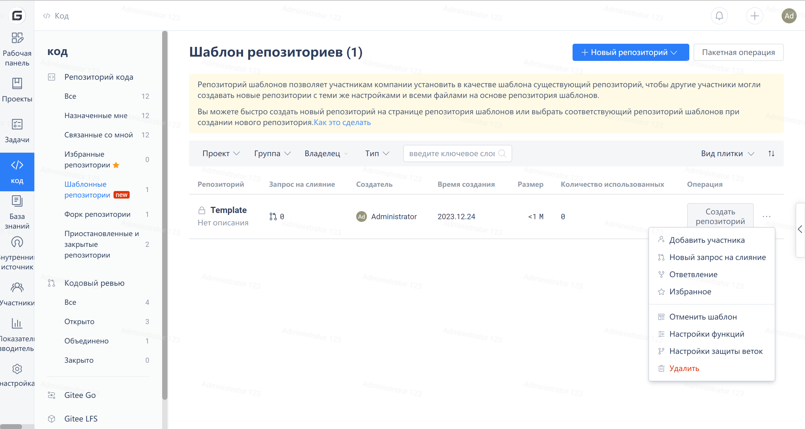

---
 Как использовать репозитории шаблонов?
origin-url: https://gitee.ru/help/articles/4348
---

### **Знакомство с функциями:**

Репозитории шаблонов позволяют корпоративным участникам устанавливать существующие репозитории в качестве шаблонов, чтобы другие участники могли создавать новые репозитории с тем же кодом на основе репозитория шаблонов.

Вы можете быстро создать новый репозиторий, используя страницу репозитория шаблонов или выбрав соответствующий репозиторий шаблонов при создании нового репозитория.

### **Инструкции по использованию:**

1. Описание разрешений: Войдите в систему с учетной записью Администратора репозитория или Администратора предприятия, чтобы установить репозиторий в качестве репозитория шаблонов

2. Шаги по созданию репозитория шаблонов:

- (1) Войдите в учетную запись Gitee и перейдите в рабочее пространство предприятия. Выберите "Код" и нажмите "Создать репозиторий". Чтобы создать репозиторий, заполните всю необходимую информацию о нем и нажмите "Создать",

- (2) После успешного создания репозитория нажмите Репозиторий -> Управление -> Настройки функций -> Репозиторий шаблонов, чтобы выбрать его. После этого репозиторий становится "Репозиторием шаблонов".

- (3) При повторном создании нового репозитория для ускорения работы вы можете использовать репозиторий шаблонов. Нажмите "Создать репозиторий" -> Выберите "Желаемый репозиторий шаблонов" -> Создайте его.

**Примечание: Если вы хотите установить исходный репозиторий в качестве репозитория шаблонов, просто перейдите в настройки репозитория, как показано ниже:**

3. Как просмотреть существующие репозитории шаблонов?

Для просмотра нажмите на Код -> Репозиторий кода -> Репозиторий шаблонов

4. Как удалить репозиторий шаблонов?

Выберите Код -> Репозиторий кода -> Репозиторий шаблонов -> Щелкните правой кнопкой мыши "Удалить репозиторий шаблонов"

