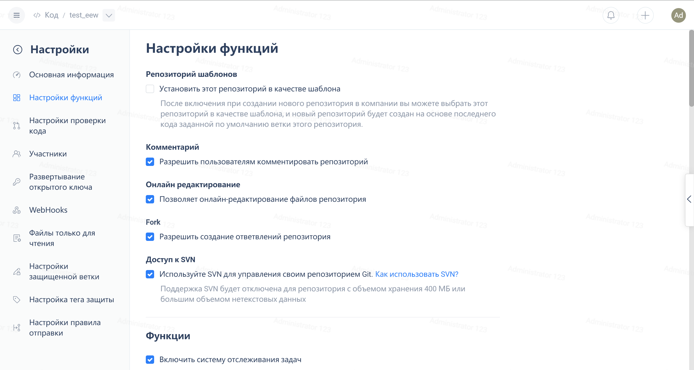

---
How to use repository templates?
origin-url: https://gitee.ru/help/articles/4348
---

### **Function Introduction:**

Template repositories support enterprise members to set existing repositories as templates, so that other members can generate new repositories with the same code based on the template repository.

You can quickly create a new repository using the template repository page or select the corresponding template repository when creating a new repository.

### **Operation Instructions:**

1. Permission Description: Log in with the role account of Repository Administrator or Enterprise Administrator to set a repository as a template repository

2. Steps to create a template repository:

- (1) Log in to the Gitee account and go to the enterprise workspace. Select 'Code' and click on 'New Repository'. Fill in the complete repository information and click on 'Create' to create it.

 - (2) After the repository is successfully created, click Repository -> Manage -> Feature Settings -> Template Repository to select it. Then, the repository becomes a "Template Repository".

- (3) When creating a new repository again, you can use the template repository for quick use. Click 'Create Repository' -> Select 'Desired Template Repository' -> Create successfully.

**Note: If you want to set the original repository as a template repository, just go to the repository settings, as shown below:**

3. How to view existing template repositories?

Click on Code -> Code Repository -> Template Repository to view

4. How to cancel the template repository?

Click Code -> Code Repository -> Template Repository -> Right-click 'Cancel Template Repository'

