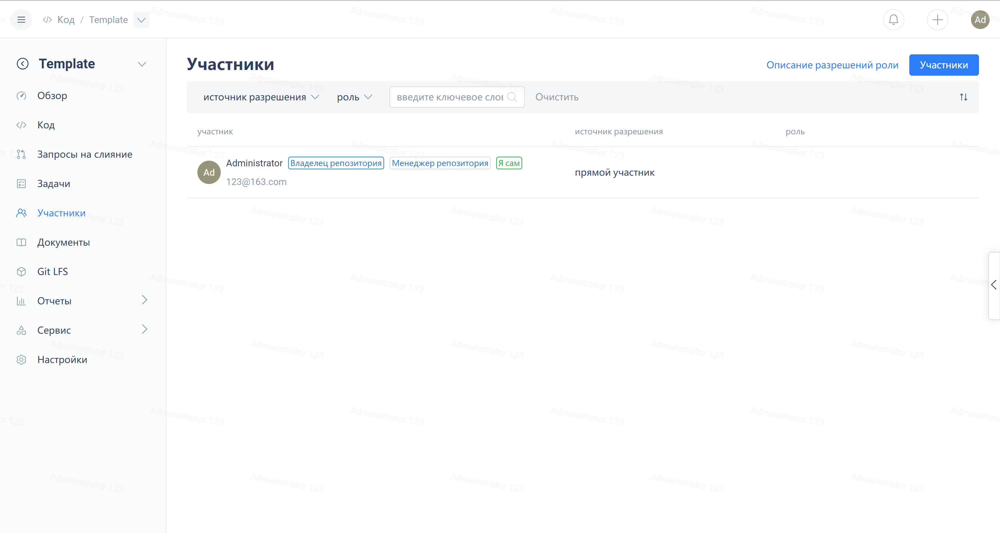

The repository owner can remove members from the repository by going to 'Repository Settings' -> 'Repository Member Management'. Once removed, the corresponding members will lose the permissions they had for that repository.

